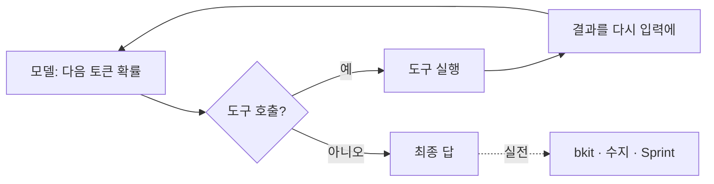

# 슬라이드 P30 생성 프롬프트

다음은 'AI 시대의 바이브코딩과 에이전트 활용법' 강연의 30페이지 슬라이드입니다. 첨부(또는 앞서 첨부)한 디자인 시스템(페르소나, 디자인 시스템 .md, 라이트/다크 모드 가이드 png)을 엄격히 준수하여 1920×1080(16:9) 슬라이드 이미지 1장을 생성해주세요.

**디자인 규칙 (첨부한 디자인 시스템 .md + 라이트/다크 가이드 png를 유일한 기준으로 엄격히 준수):**
- 배경·텍스트색·일러스트색·폰트 등 모든 색·타이포는 **첨부 디자인 시스템에 정의된 값을 정확히** 따른다. 가이드에 없는 임의 색 생성 금지.
- 방향(첨부 가이드와 동일): 배경은 순백, 텍스트는 강한 색(연한 회색·파스텔 틴트 금지), 일러스트·아이콘·도형은 쨍한 액센트 톤(파스텔·뮤트 금지), 폰트는 가이드 지정(한글 또렷).
- 스타일: flat 2.5D 에디토리얼 일러스트, 넉넉한 여백.
**필수 — 푸터/페이지번호 (이 페이지는 라이트 콘텐츠 페이지):**
- 좌하단에 푸터 텍스트를 정확히 이 문자열로 넣으세요: `주식회사 덥덥덥 · ww-w.ai` (좌측 정렬, 화면 하단 가장자리에서 약 60px 위, 작은 muted 회색, 그 위에 얇은 구분선). 가짜 도메인 생성 절대 금지 — 도메인은 오직 ww-w.ai.
- 우하단에 현재 페이지 번호 `30`만 넣으세요 (우측 정렬, 하단, 작은 muted 회색). 전체 페이지 수(/56 등) 표기 금지.
- **페이지 번호는 오직 우하단 1곳에만.** 우상단·상단·중앙 등 다른 어떤 위치에도 페이지 번호를 절대 넣지 마세요.

---
## [강연-슬라이드-구성안.md] 해당 페이지

### P30 [2부 도입] — 하네스의 핵심 3요소 (그리고 지금 뜨는 것)

- **상단 eyebrow**: "2부 · 원리에서 실전으로" — 1부 원리는 끝, 여기서부터 **실전 도구 = 하네스**(bkit·수지·Sprint).

- 이 셋은 병렬이 아니라 **2025→2026에 파도처럼 차례로 부각됐다** (강연자 관점·현장 감각):
  - **2025 — 프롬프트 엔지니어링** (한 번의 질문을 잘 짜기, P17)
  - **2026 Q1 — ① 콘텍스트 엔지니어링** (무엇을 넣고·빼고·요약·캐시할지, P18~P26)
  - **2026 Q2 — ② 멀티턴 제어·구현** (도구 호출 → 결과 → 재호출 루프를 언제 멈추고·이어가고·분기할지, P19)
  - **2026 Q3 직전, 지금 — ③ state 부여·관리** (stateless 모델에 *외부로* 상태=메모리·세션·박제·트랜스크립트를 만들어 관리, P18·P23~P27)
- 즉 **하네스를 잘 다룬다 = 이 3요소(콘텍스트·멀티턴·state)를 잘 하는 것** — 그리고 **지금은 특히 'state 관리'가 뜨는 시점.**
- 다음 Part들(bkit·수지·Sprint)이 바로 이 3요소의 실전이다.
- 한 줄: **"좋은 프롬프트 한 줄"에서 → "콘텍스트·멀티턴·state를 설계·운영하기"로.**
- 비주얼: 2025 → 26 Q1 → Q2 → Q3 타임라인 위에 3요소가 차례로 쌓이고(지금=state 강조) → Part 아이콘들(bkit·수지·Sprint)로 이어짐.

---

## [챕터 3] 하네스 시대의 개발 자율주행 — bkit  *(홀짝 페어 룰 **미적용** · 개념·데모 자유구성)*

> **확장 박제(2026-06-29)**: bkit 소스 딥리서치 + `bkit 소개 강의자료.pdf`(2026-03) 전 토픽 + 그 이후 신기능 + Claude Code 생태계 신기술(⭐)을 통합. 상세 레퍼런스 = 핸드아웃 3부작(초급/중급/고급).
> **번호 주의**: 챕터3(bkit) = **P31~P60**, 챕터4(에이전트 수지) = **P61~P78**(deep 박제 완료). Part3(Sprint) = **P79~P88** · 마무리 = **P89~P90**(연속, 공번 없음). 추후 Part3를 챕터5로 통일 시 재번호.
> **디자인 주의**: PDF는 파란 액센트(NotebookLM). 강연 디자인시스템 = **코랄 #D97757 + 아이보리**로 전부 리스타일. 숫자(스킬/에이전트)는 최신 **44/34** 기준(옛 문서 36/31은 구버전).
> ⭐ = Claude Code 생태계 신기술(bkit 외).

---
## [이미지-제작-가이드.md] 해당 페이지

### P30 하네스의 핵심 3요소 (가로 타임라인) — [생성 프롬프트·도식] · 2부 도입
- **스펙(라이트 · §13 timeline + three-column)**: 상단 eyebrow "2부 · 원리에서 실전으로"(코랄) · title "하네스의 핵심 3요소" · body=구성안 P30. (2부의 여는 슬라이드 — 원리→실전 전환)
- **메인 비주얼 = 가로 타임라인** (2025 → 26 Q1 → Q2 → Q3 직전): 각 시점 위에 단계가 차례로 쌓이는 형태 —
  - 2025 프롬프트 엔지니어링 → **Q1 ① 콘텍스트 엔지니어링** → **Q2 ② 멀티턴 제어·구현** → **Q3 직전(지금) ③ state 부여·관리**.
  - **'지금=③ state 관리'를 코랄로 강조**(현재 시점 마커). 각 단계 한 줄 설명.
- KEY MESSAGE "좋은 프롬프트 한 줄 → 콘텍스트·멀티턴·state를 설계·운영하기"(§8.4) · 하단에 → Part(bkit·수지·Sprint)로 이어짐.
- (보조) 하네스 루프 머메이드는 '멀티턴 제어' 요소의 작은 보조 일러스트로만.

→ 위 머메이드 구조를 입력으로 사용해 생성:
Render the diagram defined by the structure above as a clean editorial diagram illustration. Follow the nodes and arrows EXACTLY. Rounded node cards (corner radius ~16, inner padding ~24) on a warm ivory background, 2px rounded connector lines with filled triangle arrowheads, at most 3 hierarchy levels. Accent the single key node «모델: 다음 토큰 확률» in coral #E85C34; all other nodes neutral (soft ivory fill, light border). Render every Korean node label EXACTLY as written in the structure and add NO other words. Flat 2.5D editorial illustration (Anthropic/Claude aesthetic), warm ivory base + coral #D97757 accent, generous whitespace, premium and restrained. NOT photorealistic, NO 3D render, NO isometric, NO glassmorphism, NO neon. no watermark, no fake logos, no extra text beyond the node labels. Strict 16:9 aspect ratio, 1920×1080 landscape — NOT 4:3, NOT square.

---

## [챕터 3] 하네스 시대의 개발 자율주행 (bkit)  *(P31–P60 · 홀짝 미적용 · 코랄/아이보리)*

> **공통 스펙**: 라이트 콘텐츠 페이지(설명/도식)는 **[기초] 공통 — 라이트 2단 콘텐츠 페이지 스펙**(이 문서 위쪽)을 그대로 따른다 — 배경 `#FFFFFF`, title Pretendard 64px/700 `#1B1B1D` @x:120 y:120, body 36px/400 @좌컬럼(x:120 w:828), 우측 비주얼 contained(x:972 w:828), 마커 코랄 점 10px `#D97757`, 키워드 하이라이트 `#F8C6AE`, 강한 부정 클레이 `#BC4319`, KEY MESSAGE 박스 48px/600, 푸터 `주식회사 덥덥덥 · ww-w.ai` `#6E6D72` @x:120 y:1020 · 페이지번호 @x:1800 y:1020. 각 페이지는 *다른 점만* 명시.
> **일러스트 스타일(전 페이지 MUST)**: flat 2.5D 에디토리얼(Anthropic/Claude 톤) · warm ivory/베이지(#F0EEE6·#FFFFFF) + coral #D97757 액센트 · 매트(무광) · 금지: 3D·광택·유리/네온·사실 음영·다색 남발. 컬러 의미 구분이 본질인 곳만 절제된 다색 허용.
> **PDF 재현 주의**: 원 PDF(파란 액센트)의 레이아웃은 참고하되 **색은 전부 코랄/아이보리로 치환**. 숫자는 최신(44 스킬·34 에이전트). ⭐ = 생태계 신기술 슬라이드.
