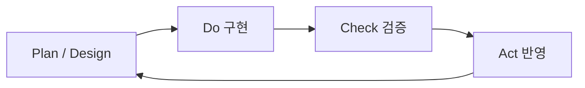

# 슬라이드 P33 생성 프롬프트

다음은 'AI 시대의 바이브코딩과 에이전트 활용법' 강연의 33페이지 슬라이드입니다. 첨부(또는 앞서 첨부)한 디자인 시스템(페르소나, 디자인 시스템 .md, 라이트/다크 모드 가이드 png)을 엄격히 준수하여 1920×1080(16:9) 슬라이드 이미지 1장을 생성해주세요.

**디자인 규칙 (첨부한 디자인 시스템 .md + 라이트/다크 가이드 png를 유일한 기준으로 엄격히 준수):**
- 배경·텍스트색·일러스트색·폰트 등 모든 색·타이포는 **첨부 디자인 시스템에 정의된 값을 정확히** 따른다. 가이드에 없는 임의 색 생성 금지.
- 방향(첨부 가이드와 동일): 배경은 순백, 텍스트는 강한 색(연한 회색·파스텔 틴트 금지), 일러스트·아이콘·도형은 쨍한 액센트 톤(파스텔·뮤트 금지), 폰트는 가이드 지정(한글 또렷).
- 스타일: flat 2.5D 에디토리얼 일러스트, 넉넉한 여백.
**필수 — 푸터/페이지번호 (이 페이지는 라이트 콘텐츠 페이지):**
- 좌하단에 푸터 텍스트를 정확히 이 문자열로 넣으세요: `주식회사 덥덥덥 · ww-w.ai` (좌측 정렬, 화면 하단 가장자리에서 약 60px 위, 작은 muted 회색, 그 위에 얇은 구분선). 가짜 도메인 생성 절대 금지 — 도메인은 오직 ww-w.ai.
- 우하단에 현재 페이지 번호 `33`만 넣으세요 (우측 정렬, 하단, 작은 muted 회색). 전체 페이지 수(/56 등) 표기 금지.
- **페이지 번호는 오직 우하단 1곳에만.** 우상단·상단·중앙 등 다른 어떤 위치에도 페이지 번호를 절대 넣지 마세요.

---
## [강연-슬라이드-구성안.md] 해당 페이지

### P33 [도식] — PDCA란? bkit이 개발에 적용한 핵심 엔진

- **PDCA = Plan(계획) → Do(실행) → Check(점검) → Act(개선)** — 제조업 품질관리의 반복 사이클. 비주얼: Plan→Do→Check→Act 순환 링 + 명령 매핑(`/pdca plan·design·do·analyze·report`).
- bkit은 이 PDCA를 **개발 절차 그 자체로** 적용 — 기획→구현→검증→반영을 명령으로 강제해 "한 번에 다 시키기"를 공정으로 쪼갠다.
- 왜 핵심인가: 감(感)으로 시키면 결과가 매번 다르지만, **공정으로 쪼개면 매번 같은 품질**(반복 가능)이 나온다.
- **Match Rate 90% 기준** — 미달이면 자동으로 개선 사이클 반복 → 모든 기능의 일관 품질 보장.

---
## [이미지-제작-가이드.md] 해당 페이지

### P33 PDCA란? bkit의 핵심 엔진 — [생성 프롬프트·도식] (개념+사이클 도식 통합)
- title 텍스트 레이어 "PDCA란? — bkit이 개발에 적용한 핵심 엔진" @x:120 y:120. 좌측 본문 불릿(코랄 점): "**PDCA = Plan → Do → Check → Act** — 제조업 품질관리의 반복 사이클" / "bkit은 이를 **개발 절차 그 자체로** 적용 — 명령으로 강제" / "감으로 시키면 매번 다른 품질 → **공정으로 쪼개면 매번 같은 품질**(반복 가능)". 우측에 PDCA 순환 도식. KEY MESSAGE "Match Rate 90% 미달이면 자동 개선 반복". 키워드 `매번 같은 품질` 하이라이트 `#F8C6AE`.

→ 위 머메이드 구조를 입력으로 사용해 생성(우측 배치): Render the diagram as a clean editorial circular PDCA loop. Follow nodes and arrows EXACTLY. Rounded node cards (radius ~16, padding ~24) on warm ivory, 2px rounded connector lines with filled arrowheads. Accent the «Plan / Design» node in coral #E85C34; others neutral ivory. Place small command-style labels near each node: "/pdca plan·design" by Plan, "/pdca do" by Do, "/code-review · /pdca analyze" by Check, "/pdca report" by Act. Add a small coral callout near Check: "Match Rate 90% 기준". Render every Korean label EXACTLY. Flat 2.5D editorial illustration, warm ivory base + coral accent, generous whitespace. NOT photorealistic, NO 3D, NO isometric, NO glassmorphism, NO neon. no watermark, no fake logos. Strict 16:9 1920×1080 — NOT 4:3, NOT square. composition: diagram contained in the RIGHT HALF, LEFT HALF for text.
