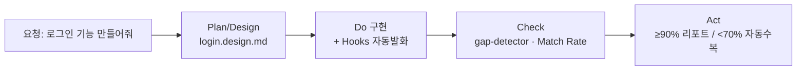

# 슬라이드 P35 생성 프롬프트

다음은 'AI 시대의 바이브코딩과 에이전트 활용법' 강연의 34페이지 슬라이드입니다. 첨부(또는 앞서 첨부)한 디자인 시스템(페르소나, 디자인 시스템 .md, 라이트/다크 모드 가이드 png)을 엄격히 준수하여 1920×1080(16:9) 슬라이드 이미지 1장을 생성해주세요.

**디자인 규칙 (첨부한 디자인 시스템 .md + 라이트/다크 가이드 png를 유일한 기준으로 엄격히 준수):**
- 배경·텍스트색·일러스트색·폰트 등 모든 색·타이포는 **첨부 디자인 시스템에 정의된 값을 정확히** 따른다. 가이드에 없는 임의 색 생성 금지.
- 방향(첨부 가이드와 동일): 배경은 순백, 텍스트는 강한 색(연한 회색·파스텔 틴트 금지), 일러스트·아이콘·도형은 쨍한 액센트 톤(파스텔·뮤트 금지), 폰트는 가이드 지정(한글 또렷).
- 스타일: flat 2.5D 에디토리얼 일러스트, 넉넉한 여백.
**필수 — 푸터/페이지번호 (이 페이지는 라이트 콘텐츠 페이지):**
- 좌하단에 푸터 텍스트를 정확히 이 문자열로 넣으세요: `주식회사 덥덥덥 · ww-w.ai` (좌측 정렬, 화면 하단 가장자리에서 약 60px 위, 작은 muted 회색, 그 위에 얇은 구분선). 가짜 도메인 생성 절대 금지 — 도메인은 오직 ww-w.ai.
- 우하단에 현재 페이지 번호 `34`만 넣으세요 (우측 정렬, 하단, 작은 muted 회색). 전체 페이지 수(/56 등) 표기 금지.
- **페이지 번호는 오직 우하단 1곳에만.** 우상단·상단·중앙 등 다른 어떤 위치에도 페이지 번호를 절대 넣지 마세요.

---
## [강연-슬라이드-구성안.md] 해당 페이지

### P35 [도식] — PDCA 실제 사례: "로그인 기능 만들어줘" 한 마디로

> 출처: bkit `scenarios/scenario-new-feature.md` (실제 동작 시나리오).

- **요청 한 줄**: 사용자가 `"로그인 기능 만들어줘"`라고 **자연어로만** 말해도 bkit이 키워드를 감지해 PDCA를 알아서 제안한다. *(명시적으로 시작하려면 `/pdca plan 로그인` — 둘 다 가능, 자연어 발동이 bkit의 포인트)*
- **P · Plan / Design** — bkit이 설계문서 유무를 먼저 확인 → 없으면 *"설계부터 만들까요?"* 제안 → `login.design.md` 자동 생성(POST `/auth/login`·`/logout`, GET `/auth/me`).
- **D · Do(구현)** — 설계를 근거로 구현. Write/Edit마다 **Hooks가 자동 발화**(설계 참조·컨벤션 주입).
- **C · Check(검증)** — 완료 후 *"Gap Analysis 돌릴까요?"* → **gap-detector**가 설계 대비 **Match Rate 측정**.
- **A · Act(반영)** — **≥90% → 리포트 생성 / <70% → 자동 수복(iterate)**. (레벨·BaaS는 자동 라우팅 — Dynamic이면 bkend.ai 인증 API로 연결)
- **결론 한 줄**: `"로그인 만들어줘"` 한 마디가 **기획→구현→검증→반영** 완결 사이클로 자동 전개 → **비개발자를 개발자처럼.**

---
## [이미지-제작-가이드.md] 해당 페이지

### P35 PDCA 실제 사례: "로그인 기능 만들어줘" — [생성 프롬프트·도식] (5단계 가로 흐름)
- title 텍스트 레이어 "PDCA 실제 사례 — \"로그인 기능 만들어줘\" 한 마디로" @x:120 y:120. 상단 좌측에 요청 말풍선 `"로그인 기능 만들어줘"`(코랄 테두리) + 그 아래 작은 회색 주석 "자연어로 발동 (명시: `/pdca plan 로그인`)". 그 아래 P→D→C→A 4단계 가로 카드, 각 카드에 로그인 예시 산출물 라벨(텍스트 레이어 권장). KEY MESSAGE 하단 "한 마디 → 기획·구현·검증·반영 완결 = 비개발자를 개발자처럼".

→ 위 머메이드 구조를 입력으로 사용해 생성: Render as a clean editorial LEFT-to-RIGHT 5-stage flow. A coral-outlined speech bubble "로그인 기능 만들어줘" starts the flow, then four rounded stage cards labeled P · Plan/Design → D · Do → C · Check → A · Act, connected by 2px rounded arrows with filled arrowheads. Under each card a small example artifact label: "login.design.md" (Plan), "Hooks 자동발화" (Do), "Match Rate 측정" (Check), "≥90% 리포트 / <70% 자동수복" (Act). Accent the speech bubble and the Act card in coral #D97757; the rest soft ivory. Render every Korean label EXACTLY. Flat 2.5D editorial illustration (Anthropic/Claude aesthetic), warm ivory base + coral accent, generous whitespace, premium and restrained. NOT photorealistic, NO 3D render, NO isometric, NO glassmorphism, NO neon. no watermark, no fake logos. Strict 16:9 aspect ratio, 1920×1080 landscape — NOT 4:3, NOT square.
