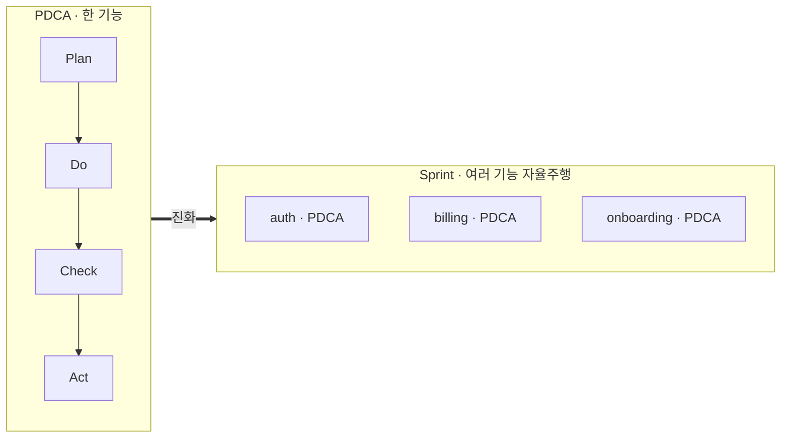

# 슬라이드 P36 생성 프롬프트

다음은 'AI 시대의 바이브코딩과 에이전트 활용법' 강연의 35페이지 슬라이드입니다. 첨부(또는 앞서 첨부)한 디자인 시스템(페르소나, 디자인 시스템 .md, 라이트/다크 모드 가이드 png)을 엄격히 준수하여 1920×1080(16:9) 슬라이드 이미지 1장을 생성해주세요.

**디자인 규칙 (첨부한 디자인 시스템 .md + 라이트/다크 가이드 png를 유일한 기준으로 엄격히 준수):**
- 배경·텍스트색·일러스트색·폰트 등 모든 색·타이포는 **첨부 디자인 시스템에 정의된 값을 정확히** 따른다. 가이드에 없는 임의 색 생성 금지.
- 방향(첨부 가이드와 동일): 배경은 순백, 텍스트는 강한 색(연한 회색·파스텔 틴트 금지), 일러스트·아이콘·도형은 쨍한 액센트 톤(파스텔·뮤트 금지), 폰트는 가이드 지정(한글 또렷).
- 스타일: flat 2.5D 에디토리얼 일러스트, 넉넉한 여백.
**필수 — 푸터/페이지번호 (이 페이지는 라이트 콘텐츠 페이지):**
- 좌하단에 푸터 텍스트를 정확히 이 문자열로 넣으세요: `주식회사 덥덥덥 · ww-w.ai` (좌측 정렬, 화면 하단 가장자리에서 약 60px 위, 작은 muted 회색, 그 위에 얇은 구분선). 가짜 도메인 생성 절대 금지 — 도메인은 오직 ww-w.ai.
- 우하단에 현재 페이지 번호 `35`만 넣으세요 (우측 정렬, 하단, 작은 muted 회색). 전체 페이지 수(/56 등) 표기 금지.
- **페이지 번호는 오직 우하단 1곳에만.** 우상단·상단·중앙 등 다른 어떤 위치에도 페이지 번호를 절대 넣지 마세요.

---
## [강연-슬라이드-구성안.md] 해당 페이지

### P36 [도식] — Sprint 개념 ①: PDCA → Sprint 진화 (메타 컨테이너)

> 출처: bkit `scenarios/scenario-sprint.md` (Sprint v2.1.13 GA).

- PDCA = **한 기능 한 사이클**. 진짜 **개발 자율주행**은 여러 기능을 *한 번에* 굴리는 것.
- 그래서 PDCA가 **Sprint 스킬**로 진화 — 여러 기능을 **공유 범위·예산·일정**으로 묶는 **메타 컨테이너**(각 기능 내부는 그대로 PDCA가 돈다).
- **PRD 단계가 새로 붙는다**(단일 PDCA엔 없음): Plan 앞에서 **문제정의·JTBD·페르소나·성공지표·Pre-mortem·이해관계자**를 먼저 못박음 = *왜·누구를 위해.* (무인일수록 기획을 더 단단히)
- 수명주기: `prd→plan→design→do→iterate→qa→report→archived`. **Trust L0~L4** = "어디까지 사람 없이 갈지" 다이얼.
- = 이 챕터 제목 그대로 **"개발 자율주행."**

---
## [이미지-제작-가이드.md] 해당 페이지

### P36 Sprint 개념 ①: PDCA → Sprint 진화 (메타 컨테이너) — [생성 프롬프트·도식]
- title 텍스트 레이어 "Sprint 개념 ① — PDCA → Sprint 진화 (메타 컨테이너)" @x:120 y:120. 좌측에 단일 PDCA 루프, 큰 코랄 화살표("진화") → 우측에 Sprint 컨테이너(여러 기능 PDCA를 감싼 박스, **컨테이너 선두에 "PRD" 단계 칩** = 단일 PDCA엔 없던 추가). 하단 명령 라벨 `/sprint init … --trust L3` + Trust L0~L4 다이얼. KEY MESSAGE "여러 기능을 한 컨테이너로 — PRD로 왜·누구를 못박고, Trust로 무인 범위 정한다".

→ 위 머메이드 구조를 입력으로 사용해 생성: LEFT side = a single small circular PDCA loop (Plan→Do→Check→Act). A large coral (#D97757) arrow labeled "진화" points RIGHT to a rounded container box labeled "Sprint" that holds three stacked mini PDCA-loop cards labeled "auth", "billing", "onboarding" — conveying "PDCA evolves into Sprint: many features run autonomously under one container". Below, a small command label "/sprint init … --trust L3  →  /sprint start" and a tiny dial marked L0–L4. Accent the big arrow and the Sprint container in coral; loops/cards soft ivory. Render every Korean/label EXACTLY. Flat 2.5D editorial illustration (Anthropic/Claude aesthetic), warm ivory base + coral accent, generous whitespace, premium and restrained. NOT photorealistic, NO 3D render, NO isometric, NO glassmorphism, NO neon. no watermark, no fake logos. Strict 16:9 aspect ratio, 1920×1080 landscape — NOT 4:3, NOT square.
