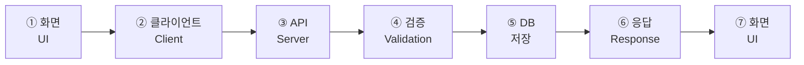

# 슬라이드 P38 생성 프롬프트

다음은 'AI 시대의 바이브코딩과 에이전트 활용법' 강연의 38페이지 슬라이드입니다. 첨부(또는 앞서 첨부)한 디자인 시스템(페르소나, 디자인 시스템 .md, 라이트/다크 모드 가이드 png)을 엄격히 준수하여 1920×1080(16:9) 슬라이드 이미지 1장을 생성해주세요.

**디자인 규칙 (첨부한 디자인 시스템 .md + 라이트/다크 가이드 png를 유일한 기준으로 엄격히 준수):**
- 배경·텍스트색·일러스트색·폰트 등 모든 색·타이포는 **첨부 디자인 시스템에 정의된 값을 정확히** 따른다. 가이드에 없는 임의 색 생성 금지.
- 방향(첨부 가이드와 동일): 배경은 순백, 텍스트는 강한 색(연한 회색·파스텔 틴트 금지), 일러스트·아이콘·도형은 쨍한 액센트 톤(파스텔·뮤트 금지), 폰트는 가이드 지정(한글 또렷).
- 스타일: flat 2.5D 에디토리얼 일러스트, 넉넉한 여백.
- 조각·항목 구분이 필요하면 **코랄 농담(#D97757) + 뉴트럴(아이보리 톤)만** 쓴다(틸·옐로 등 잡색 X).
**필수 — 푸터/페이지번호 (이 페이지는 라이트 콘텐츠 페이지):**
- 좌하단에 푸터 텍스트를 정확히 이 문자열로 넣으세요: `주식회사 덥덥덥 · ww-w.ai` (좌측 정렬, 화면 하단 가장자리에서 약 60px 위, 작은 muted 회색, 그 위에 얇은 구분선). 가짜 도메인 생성 절대 금지 — 도메인은 오직 ww-w.ai.
- 우하단에 현재 페이지 번호 `38`만 넣으세요 (우측 정렬, 하단, 작은 muted 회색). 전체 페이지 수(/56 등) 표기 금지.
- **페이지 번호는 오직 우하단 1곳에만.** 우상단·상단·중앙 등 다른 어떤 위치에도 페이지 번호를 절대 넣지 마세요.

---
## [강연-슬라이드-구성안.md] 해당 페이지

### P38 [신규·도식] — 7-Layer dataFlow QA (S1 게이트, 기능 간 통합 흐름)

> 출처: bkit Sprint `sprint-qa-flow` (7-Layer dataFlowIntegrity / S1 게이트).

- **matchRate는 기능 하나가 설계대로냐**, 이건 **기능들이 이어졌을 때** 데이터가 끝까지 흐르냐 — 통합 검증.
- **7 hop**: ① 화면(UI) → ② 클라이언트(Client) → ③ API(Server) → ④ 검증(Validation) → ⑤ DB(저장) → ⑥ 응답(Response) → ⑦ 화면(UI). 양 끝(화면)이 시작·도착점.
- **한 hop이라도 새면 실패**: 7개 구간 중 하나만 어긋나도 무결성 100% 미만 → 자율주행이 멈춘다(S1 게이트).
- **한 줄**: 부분은 되는데 이어보면 깨진다 — 그걸 막는 통합 흐름 검증. 목표는 100%.

---
## [이미지-제작-가이드.md] 해당 페이지

### P38 Sprint 개념 ③: 7-Layer dataFlow QA — [생성 프롬프트·도식]
> **현행 제작 방식 = 하이브리드**: 아래 전체 이미지를 1회 생성해 두고, **1~7단계 아이콘 글리프만 crop**(투명 배경 `assets/P38-ic1~7.png`)해 HTML 노드에 삽입. 제목·번호·라벨·노트·KEY MESSAGE는 전부 HTML(crisp·디자인가이드 정합). 아래 프롬프트는 아이콘 소스 생성/재생성용.
- title 텍스트 레이어 "Sprint 개념 ③ — 7-Layer dataFlow QA" @x:120 y:120 (subtitle "기능 간 데이터가 새지 않는가 — 눌러서 DB 저장, 다시 화면까지 전 구간을 훑는다") · subtitle "화면에서 눌러 → DB 저장 → 다시 화면까지, 정해진 전 구간을 훑는다" @x:120 y:216. 중앙 = **7노드 좌→우 흐름 레일**(①화면→②클라이언트→③API→④검증→⑤DB→⑥응답→⑦화면), 양 끝 화면 노드만 코랄 강조·나머지 뉴트럴, 노드 사이 코랄 화살표. 아래 = **노트 2칸**(기능 하나 vs 기능들이 이어질 때 / 한 hop이라도 새면 실패). KEY MESSAGE "부분은 되는데 이어보면 깨진다 — 통합 흐름 검증, 목표 100%".

→ 위 머메이드 구조를 입력으로 사용해 생성: A clean editorial slide showing a 7-node LEFT-TO-RIGHT data-flow rail as a single horizontal track. Seven equal rounded node cards connected by coral (#D97757) arrows, each card with a circled number badge on top and a two-line label: "① 화면 / UI", "② 클라이언트 / Client", "③ API / Server", "④ 검증 / Validation", "⑤ DB / 저장", "⑥ 응답 / Response", "⑦ 화면 / UI". Accent ONLY the two END cards (①화면 and ⑦화면) in coral #D97757 soft fill (they are the start and finish of the round-trip); all middle cards neutral soft-ivory fill with light borders. The rail conveys "one request travels the whole loop: screen → DB → back to screen". Below the rail, two small note cards: "기능 하나 vs 기능들이 이어질 때" and "한 hop이라도 새면 실패". Render every Korean label EXACTLY as written; the numbers must be circled ①②③④⑤⑥⑦. Flat 2.5D editorial illustration (Anthropic/Claude aesthetic), warm ivory/white base + coral #D97757 accent, soft simple shapes, clear even spacing, generous whitespace, premium and restrained. NOT photorealistic, NO 3D render, NO isometric, NO glassmorphism, NO neon, NO rainbow/multi-hue. no watermark, no fake logos, no extra text beyond the labels. Strict 16:9 aspect ratio, 1920×1080 landscape — NOT 4:3, NOT square.
- **bake-first**: 위처럼 라벨 포함 생성(1순위 — 레이아웃 레퍼런스 겸용). **한글이 깨지거나 노드 정렬이 어긋나면** 슬라이드 텍스트(노드 라벨)만 제거한 배경/일러스트로 두고, 노드 라벨·화살표·제목·KEY MESSAGE를 `html/P38.html`의 HTML 도식/텍스트 레이어로 복원(현행 순수 HTML 도식이 그 복원본이므로 그대로 오버레이 가능).
- 복원용 좌표(현행 HTML 기준): title 64px @x:120 y:120 · subtitle 40px @top:216 · 7노드 flow @left:120 top:320 w:1680 (노드 w:196, 코랄 화살표) · 노트 2칸 @top:566 · KEY MESSAGE 하단 밴드 · footer `주식회사 덥덥덥 · ww-w.ai` / pagenum `38`.
