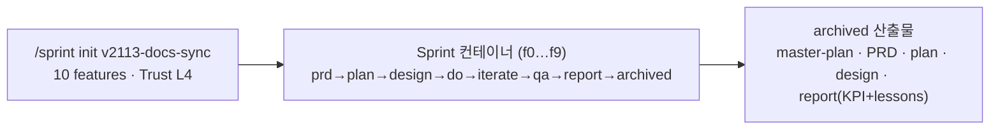

# 슬라이드 P41 생성 프롬프트

다음은 'AI 시대의 바이브코딩과 에이전트 활용법' 강연의 37페이지 슬라이드입니다. 첨부(또는 앞서 첨부)한 디자인 시스템(페르소나, 디자인 시스템 .md, 라이트/다크 모드 가이드 png)을 엄격히 준수하여 1920×1080(16:9) 슬라이드 이미지 1장을 생성해주세요.

**디자인 규칙 (첨부한 디자인 시스템 .md + 라이트/다크 가이드 png를 유일한 기준으로 엄격히 준수):**
- 배경·텍스트색·일러스트색·폰트 등 모든 색·타이포는 **첨부 디자인 시스템에 정의된 값을 정확히** 따른다. 가이드에 없는 임의 색 생성 금지.
- 방향(첨부 가이드와 동일): 배경은 순백, 텍스트는 강한 색(연한 회색·파스텔 틴트 금지), 일러스트·아이콘·도형은 쨍한 액센트 톤(파스텔·뮤트 금지), 폰트는 가이드 지정(한글 또렷).
- 스타일: flat 2.5D 에디토리얼 일러스트, 넉넉한 여백.
**필수 — 푸터/페이지번호 (이 페이지는 라이트 콘텐츠 페이지):**
- 좌하단에 푸터 텍스트를 정확히 이 문자열로 넣으세요: `주식회사 덥덥덥 · ww-w.ai` (좌측 정렬, 화면 하단 가장자리에서 약 60px 위, 작은 muted 회색, 그 위에 얇은 구분선). 가짜 도메인 생성 절대 금지 — 도메인은 오직 ww-w.ai.
- 우하단에 현재 페이지 번호 `37`만 넣으세요 (우측 정렬, 하단, 작은 muted 회색). 전체 페이지 수(/56 등) 표기 금지.
- **페이지 번호는 오직 우하단 1곳에만.** 우상단·상단·중앙 등 다른 어떤 위치에도 페이지 번호를 절대 넣지 마세요.

---
## [강연-슬라이드-구성안.md] 해당 페이지

### P41 [도식] — Sprint 실제 사례: bkit이 자기 문서를 자율주행으로 만들다 (dogfooding)

> 출처: bkit `scenarios/scenario-sprint.md` — v2.1.13 자가 적용(self-validation) 사례. 개념·측정 디테일은 P36·P40.

- **한 명령**: `/sprint init v2113-docs-sync --features f0-baseline … f9-real-use-validation --trust L4` — **10개 기능**, Trust **L4 완전자동**(archive까지 끝까지).
- **dogfooding**: bkit이 *자기 자신의 v2.1.13 문서 동기화*를 bkit Sprint로 수행 — **도구가 도구를 만든 자가 검증.**
- **무인 연쇄**: `prd→plan→design→do→iterate→qa→report→archived`를 **사람 개입 없이** 10개 기능 완주.
- **증거가 남는다**: master plan · PRD · plan · design · **최종 리포트(KPI + lessons)**가 전부 자동 생성·아카이브됨.
- **한 줄**: "기능 목록만 줬더니, **bkit이 자기 자신을 무인으로 릴리스**했다."

> **displaced**: 기존 "보이지 않는 2층(Hooks·Skills)" 슬라이드는 자율주행 재구성으로 밀려남 → 재배치 결정 대기.

---
## [이미지-제작-가이드.md] 해당 페이지

### P41 Sprint 실제 사례: bkit이 자기 문서를 자율주행으로 (dogfooding) — [생성 프롬프트·도식]
- title 텍스트 레이어 "Sprint 실제 사례 — bkit이 자기 문서를 자율주행으로 만들다" @x:120 y:120. 상단 명령 라벨 `/sprint init v2113-docs-sync --features f0…f9 --trust L4` + 작은 배지 "10 features · Trust L4 완전자동". 본문: 10개 기능(f0~f9)을 묶은 Sprint 컨테이너가 `prd→plan→design→do→iterate→qa→report→archived`를 무인 완주 → 우측에 **아카이브된 산출물 묶음 아이콘**(master-plan·PRD·plan·design·report). "자리 비움(무인)" 아이콘. dogfooding 모티프(bkit이 bkit을 가리키는 순환 화살표). KEY MESSAGE "기능 목록만 줬더니 bkit이 자기 자신을 무인으로 릴리스했다". 하단 캡션 "도구가 도구를 만든 자가 검증".

→ 위 머메이드 구조를 입력으로 사용해 생성: A clean editorial slide conveying "bkit builds its own docs autonomously (dogfooding)". TOP: a command bar "/sprint init v2113-docs-sync … --trust L4" with a small badge "10 features · L4". CENTER: a large rounded "Sprint" container holding a row of ten tiny feature chips (f0…f9), with the phase path "prd→plan→design→do→iterate→qa→report→archived" running through it LEFT to RIGHT, unattended (small person-away icon). RIGHT: an "archived" output bundle stack labeled "master-plan · PRD · plan · design · report". Add a subtle circular arrow motif where a small bkit logo points back at itself (self-validation). Convey "the tool built itself, hands-off, and left full evidence". Accent the command bar, the container outline, and the archived bundle in coral #D97757; feature chips soft ivory. Render every label EXACTLY. Flat 2.5D editorial illustration (Anthropic/Claude aesthetic), warm ivory base + coral accent, generous whitespace, premium and restrained. NOT photorealistic, NO 3D render, NO isometric, NO glassmorphism, NO neon. no watermark, no fake logos. Strict 16:9 aspect ratio, 1920×1080 landscape — NOT 4:3, NOT square.
