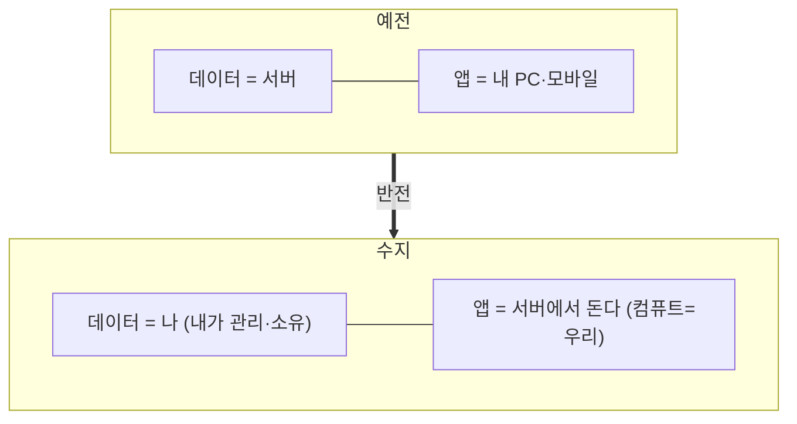

# 슬라이드 P64 생성 프롬프트

다음은 'AI 시대의 바이브코딩과 에이전트 활용법' 강연의 60페이지 슬라이드입니다. 첨부(또는 앞서 첨부)한 디자인 시스템(페르소나, 디자인 시스템 .md, 라이트/다크 모드 가이드 png)을 엄격히 준수하여 1920×1080(16:9) 슬라이드 이미지 1장을 생성해주세요.

**디자인 규칙 (첨부한 디자인 시스템 .md + 라이트/다크 가이드 png를 유일한 기준으로 엄격히 준수):**
- 배경·텍스트색·일러스트색·폰트 등 모든 색·타이포는 **첨부 디자인 시스템에 정의된 값을 정확히** 따른다. 가이드에 없는 임의 색 생성 금지.
- 방향(첨부 가이드와 동일): 배경은 순백, 텍스트는 강한 색(연한 회색·파스텔 틴트 금지), 일러스트·아이콘·도형은 쨍한 액센트 톤(파스텔·뮤트 금지), 폰트는 가이드 지정(한글 또렷).
- 스타일: flat 2.5D 에디토리얼 일러스트, 넉넉한 여백.
**필수 — 푸터/페이지번호 (이 페이지는 라이트 콘텐츠 페이지):**
- 좌하단에 푸터 텍스트를 정확히 이 문자열로 넣으세요: `주식회사 덥덥덥 · ww-w.ai` (좌측 정렬, 화면 하단 가장자리에서 약 60px 위, 작은 muted 회색, 그 위에 얇은 구분선). 가짜 도메인 생성 절대 금지 — 도메인은 오직 ww-w.ai.
- 우하단에 현재 페이지 번호 `60`만 넣으세요 (우측 정렬, 하단, 작은 muted 회색). 전체 페이지 수(/56 등) 표기 금지.
- **페이지 번호는 오직 우하단 1곳에만.** 우상단·상단·중앙 등 다른 어떤 위치에도 페이지 번호를 절대 넣지 마세요.

---
## [강연-슬라이드-구성안.md] 해당 페이지

### P64 [설명] — 새로운 세계관: 데이터는 내가, 앱은 서버가

> 출처: 파운더 레터(반대가 됐다 · 데이터 주권) + 백서(AI 기억은 흩어진다 · 영속 도서관) + 데이터주권 로드맵("컴퓨트=우리/데이터=유저").

- 출발점(백서): **"AI의 기억은 대화가 끝나면 흩어지도록 만들어져 있다."** ChatGPT에 적은 걸 Claude는 모른다 → 수지 = 그 사이에 놓인 **영속(永續) 도서관**. *"하나의 도서관을 모든 AI가 공유한다 — 도구를 바꿔도 지식은 사라지지 않는다."*
- 세계관의 핵심 뒤집기(파운더 레터 원문): *"예전엔 데이터가 서버에 있고 앱이 내 PC·모바일에서 돌았다. 수지는 완전히 반대다 — 데이터는 내가 관리하고, 앱이 오히려 서버에서 돈다."*
- 코드로 실현(데이터주권 로드맵): **컴퓨트는 우리, 데이터는 유저.** 이래야 데이터 주권을 지키면서도 24시간 깨어 있는 에이전트가 가능. 설치 0 · 노트북을 닫아도 깨어 있음.
- 한 줄(파운더 레터): **"이것이 바로 AI 시대의 새로운 세계관이라고 생각합니다."**

---
## [이미지-제작-가이드.md] 해당 페이지

### P64 새로운 세계관: 데이터는 내가, 앱은 서버가 — [생성 프롬프트·도식]
- title 텍스트 레이어 "새로운 세계관 — 데이터는 내가, 앱은 서버가" @x:120 y:120. 좌 body=구성안 P64(AI 기억은 흩어진다·영속 도서관 / 핵심 뒤집기 / 컴퓨트=우리·데이터=유저). 우측 = **반전(inversion) 도식** + "컴퓨트=우리 / 데이터=유저" 라벨. 강조 "데이터는 내가 관리, 앱이 서버에서 돈다" 코랄.

→ 위 머메이드 구조를 입력으로 사용해 생성: A clean editorial inversion diagram on WHITE (#FFFFFF). TOP row labeled "예전": "데이터 = 서버" and "앱 = 내 PC·모바일". A big coral (#D97757) arrow labeled "반전" points DOWN to the BOTTOM row labeled "수지": "데이터 = 나 (내가 관리·소유·영속)" and "앱 = 서버에서 돈다 (컴퓨트=우리)". Add a small always-on moon icon "노트북을 닫아도 깨어 있음" and a tiny caption "AI의 기억은 흩어진다 → 영속 도서관". Accent the bottom NEW row and the arrow in coral; the OLD row soft ivory. Render every Korean label EXACTLY. Flat 2.5D editorial illustration (Anthropic/Claude aesthetic), warm ivory base + coral accent, generous whitespace, premium and restrained. NOT photorealistic, NO 3D render, NO isometric, NO glassmorphism, NO neon. no watermark, no fake logos. Strict 16:9 aspect ratio, 1920×1080 landscape — NOT 4:3, NOT square.
