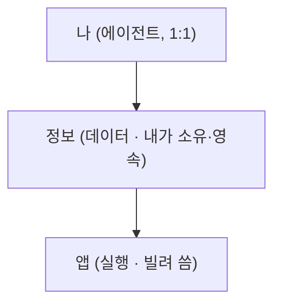

# 슬라이드 P66 생성 프롬프트

다음은 'AI 시대의 바이브코딩과 에이전트 활용법' 강연의 62페이지 슬라이드입니다. 첨부(또는 앞서 첨부)한 디자인 시스템(페르소나, 디자인 시스템 .md, 라이트/다크 모드 가이드 png)을 엄격히 준수하여 1920×1080(16:9) 슬라이드 이미지 1장을 생성해주세요.

**디자인 규칙 (첨부한 디자인 시스템 .md + 라이트/다크 가이드 png를 유일한 기준으로 엄격히 준수):**
- 배경·텍스트색·일러스트색·폰트 등 모든 색·타이포는 **첨부 디자인 시스템에 정의된 값을 정확히** 따른다. 가이드에 없는 임의 색 생성 금지.
- 방향(첨부 가이드와 동일): 배경은 순백, 텍스트는 강한 색(연한 회색·파스텔 틴트 금지), 일러스트·아이콘·도형은 쨍한 액센트 톤(파스텔·뮤트 금지), 폰트는 가이드 지정(한글 또렷).
- 스타일: flat 2.5D 에디토리얼 일러스트, 넉넉한 여백.
**필수 — 푸터/페이지번호 (이 페이지는 라이트 콘텐츠 페이지):**
- 좌하단에 푸터 텍스트를 정확히 이 문자열로 넣으세요: `주식회사 덥덥덥 · ww-w.ai` (좌측 정렬, 화면 하단 가장자리에서 약 60px 위, 작은 muted 회색, 그 위에 얇은 구분선). 가짜 도메인 생성 절대 금지 — 도메인은 오직 ww-w.ai.
- 우하단에 현재 페이지 번호 `62`만 넣으세요 (우측 정렬, 하단, 작은 muted 회색). 전체 페이지 수(/56 등) 표기 금지.
- **페이지 번호는 오직 우하단 1곳에만.** 우상단·상단·중앙 등 다른 어떤 위치에도 페이지 번호를 절대 넣지 마세요.

---
## [강연-슬라이드-구성안.md] 해당 페이지

### P66 [도식] — 수지란: 나를 아는 한 존재의 다섯 얼굴 (3층 세계관)

> 출처: 비전 §★ 3층 모델 + README. *기능 나열이 아니라 — 세계관이 어떤 얼굴로 나타나나.*

- 세계관이 일상에서 입는 **다섯 얼굴**: **① 지식 사서**(나를 아는 평생 서재) · **② 실세계 앱스토어**(세상에 닿는 손) · **③ 시간 비서**(닫아도 도는 운영) · **④ 어디서나 같은 수지**(내 곁의 자비스) · **⑤ 페르소나 진화**(당신을 개선).
- 이 다섯을 떠받치는 **3층 세계관**: **나(에이전트, 1:1)** → **정보(데이터, 내가 소유·영속)** → **앱(실행, 빌려 씀)**.
- 핵심 원리: *"정보가 앱에 속하는 게 아니라, 앱이 정보를 빌려 쓴다."* — 이 분리가 있어야 무한조합·데이터 주권·멀티조직이 *동시에* 성립.
- 비주얼: 좌측 다섯 얼굴 칩, 우측 3층 세로 스택(나→정보→앱).

---
## [이미지-제작-가이드.md] 해당 페이지

### P66 수지란: 다섯 얼굴 + 3층 세계관 — [생성 프롬프트·도식]
- title 텍스트 레이어 "수지란 — 나를 아는 한 존재의 다섯 얼굴" @x:120 y:120. 좌측 = 다섯 얼굴 칩(사서=평생 서재 · 앱스토어=세상에 닿는 손 · 시간=닫아도 도는 운영 · 편재=내 곁의 자비스 · 페르소나=당신을 개선). 우측 = **3층 모델 세로 스택**(나 → 정보 → 앱). KEY MESSAGE "정보가 앱에 속하는 게 아니라, 앱이 정보를 빌려 쓴다".

→ 위 머메이드 구조를 입력으로 사용해 생성: A clean editorial slide on WHITE (#FFFFFF). LEFT half: five small labeled face-chips for Sooji's roles — "① 지식 사서 — 나를 아는 평생 서재", "② 실세계 앱스토어 — 세상에 닿는 손", "③ 시간 비서 — 닫아도 도는 운영", "④ 어디서나 같은 수지 — 내 곁의 자비스", "⑤ 페르소나 진화 — 당신을 개선". RIGHT half: a vertical 3-layer stack following the structure EXACTLY — top "나 (에이전트, 1:1)", middle "정보 (데이터·내가 소유·영속)", bottom "앱 (실행·빌려 씀)" — connected top-to-bottom by 2px arrows; a small coral callout "앱이 정보를 빌려 쓴다". Accent the "정보" layer and the callout in coral #D97757; other layers soft ivory. Render every Korean label EXACTLY. Flat 2.5D editorial illustration (Anthropic/Claude aesthetic), warm ivory base + coral accent, generous whitespace, premium and restrained. NOT photorealistic, NO 3D render, NO isometric, NO glassmorphism, NO neon. no watermark, no fake logos. Strict 16:9 aspect ratio, 1920×1080 landscape — NOT 4:3, NOT square.
