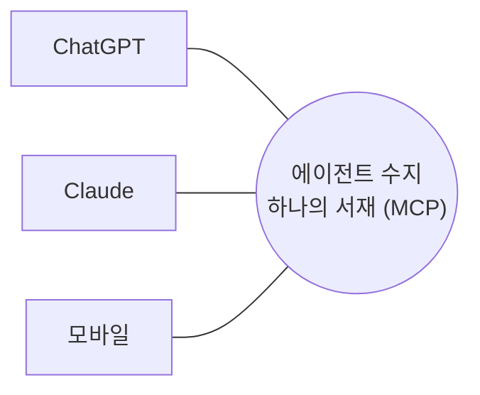

# 슬라이드 P70 생성 프롬프트

다음은 'AI 시대의 바이브코딩과 에이전트 활용법' 강연의 66페이지 슬라이드입니다. 첨부(또는 앞서 첨부)한 디자인 시스템(페르소나, 디자인 시스템 .md, 라이트/다크 모드 가이드 png)을 엄격히 준수하여 1920×1080(16:9) 슬라이드 이미지 1장을 생성해주세요.

**디자인 규칙 (첨부한 디자인 시스템 .md + 라이트/다크 가이드 png를 유일한 기준으로 엄격히 준수):**
- 배경·텍스트색·일러스트색·폰트 등 모든 색·타이포는 **첨부 디자인 시스템에 정의된 값을 정확히** 따른다. 가이드에 없는 임의 색 생성 금지.
- 방향(첨부 가이드와 동일): 배경은 순백, 텍스트는 강한 색(연한 회색·파스텔 틴트 금지), 일러스트·아이콘·도형은 쨍한 액센트 톤(파스텔·뮤트 금지), 폰트는 가이드 지정(한글 또렷).
- 스타일: flat 2.5D 에디토리얼 일러스트, 넉넉한 여백.
**필수 — 푸터/페이지번호 (이 페이지는 라이트 콘텐츠 페이지):**
- 좌하단에 푸터 텍스트를 정확히 이 문자열로 넣으세요: `주식회사 덥덥덥 · ww-w.ai` (좌측 정렬, 화면 하단 가장자리에서 약 60px 위, 작은 muted 회색, 그 위에 얇은 구분선). 가짜 도메인 생성 절대 금지 — 도메인은 오직 ww-w.ai.
- 우하단에 현재 페이지 번호 `66`만 넣으세요 (우측 정렬, 하단, 작은 muted 회색). 전체 페이지 수(/56 등) 표기 금지.
- **페이지 번호는 오직 우하단 1곳에만.** 우상단·상단·중앙 등 다른 어떤 위치에도 페이지 번호를 절대 넣지 마세요.

---
## [강연-슬라이드-구성안.md] 해당 페이지

### P70 [도식] — ④ 어디서나 같은 수지 = 내 곁의 자비스 (편재성)

> 출처: README(MCP 서버) + 비전 ⑦(편재성 = 자비스의 본질).

- 세계관: **MCP = 편재의 linchpin.** 수지는 앱이 아니라 *MCP 네이티브* → ChatGPT든 Claude든 폰이든, **어느 창문을 열어도 같은 수지**가 거기 있다.
- *"호스트는 창문일 뿐, 수지는 모든 창문 뒤의 지속하는 존재."* 상태는 클라우드(수지)에 있으니 기기를 바꿔도 *같은 수지가 나를 일관되게 안다.*
- 무료 시작(파운더 레터): 유료 가입도 되지만 *클로드·챗GPT에 MCP로 붙여 무료로* 시작 가능(서버·토큰 많이 드는 일부 기능 제외).
- 한 줄: "**언제 어디서나 나를 아는 한 존재 — 그게 자비스의 본질.**"

---
## [이미지-제작-가이드.md] 해당 페이지

### P70 ④ 어디서나 같은 수지 = 내 곁의 자비스 (편재성) — [생성 프롬프트·도식]
- title 텍스트 레이어 "④ 어디서나 같은 수지 — 내 곁의 자비스" @x:120 y:120. 중앙 = 수지(하나) → 둘레로 ChatGPT·Claude·모바일이 같은 한 곳을 바라봄. KEY MESSAGE "호스트는 창문일 뿐, 수지는 모든 창문 뒤의 지속하는 존재".

→ 위 머메이드 구조를 입력으로 사용해 생성: A clean editorial hub-and-spoke diagram on WHITE (#FFFFFF). A central coral (#D97757) hub node "에이전트 수지 — 하나의 서재 (MCP 서버)"; three host nodes around it — "ChatGPT", "Claude", "모바일" — all connected to the SAME central hub, conveying "open it anywhere, it's the same Sooji". Add a small caption "호스트는 창문일 뿐, 수지는 그 뒤의 지속하는 존재" and a tiny "무료로 시작 (MCP로 붙여서)" tag. Accent the central hub in coral; host nodes soft ivory. Render every Korean label EXACTLY. Flat 2.5D editorial illustration (Anthropic/Claude aesthetic), warm ivory base + coral accent, generous whitespace, premium and restrained. NOT photorealistic, NO 3D render, NO isometric, NO glassmorphism, NO neon. no watermark, no fake logos. Strict 16:9 aspect ratio, 1920×1080 landscape — NOT 4:3, NOT square.
