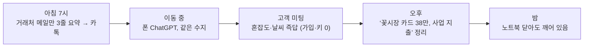

# 슬라이드 P73 생성 프롬프트

다음은 'AI 시대의 바이브코딩과 에이전트 활용법' 강연의 69페이지 슬라이드입니다. 첨부(또는 앞서 첨부)한 디자인 시스템(페르소나, 디자인 시스템 .md, 라이트/다크 모드 가이드 png)을 엄격히 준수하여 1920×1080(16:9) 슬라이드 이미지 1장을 생성해주세요.

**디자인 규칙 (첨부한 디자인 시스템 .md + 라이트/다크 가이드 png를 유일한 기준으로 엄격히 준수):**
- 배경·텍스트색·일러스트색·폰트 등 모든 색·타이포는 **첨부 디자인 시스템에 정의된 값을 정확히** 따른다. 가이드에 없는 임의 색 생성 금지.
- 방향(첨부 가이드와 동일): 배경은 순백, 텍스트는 강한 색(연한 회색·파스텔 틴트 금지), 일러스트·아이콘·도형은 쨍한 액센트 톤(파스텔·뮤트 금지), 폰트는 가이드 지정(한글 또렷).
- 스타일: flat 2.5D 에디토리얼 일러스트, 넉넉한 여백.
**필수 — 푸터/페이지번호 (이 페이지는 라이트 콘텐츠 페이지):**
- 좌하단에 푸터 텍스트를 정확히 이 문자열로 넣으세요: `주식회사 덥덥덥 · ww-w.ai` (좌측 정렬, 화면 하단 가장자리에서 약 60px 위, 작은 muted 회색, 그 위에 얇은 구분선). 가짜 도메인 생성 절대 금지 — 도메인은 오직 ww-w.ai.
- 우하단에 현재 페이지 번호 `69`만 넣으세요 (우측 정렬, 하단, 작은 muted 회색). 전체 페이지 수(/56 등) 표기 금지.
- **페이지 번호는 오직 우하단 1곳에만.** 우상단·상단·중앙 등 다른 어떤 위치에도 페이지 번호를 절대 넣지 마세요.

---
## [강연-슬라이드-구성안.md] 해당 페이지

### P73 [도식] — 사례 ①: 1인 사업자의 어느 하루 (백서 시나리오)

> 출처: 백서 11장 페르소나(꽃집 사장·프리랜서·쇼핑몰) 실제 인용을 하루 흐름으로 엮음.

- **아침 7시** — 자고 있어도 수지가 *"거래처에서 온 메일만 골라 세 줄 요약"*해 카톡으로 보내둔다. 백서: **"출근 전에 상황 파악이 끝나는 거죠."**
- **이동 중** — 폰의 ChatGPT를 열자 **같은 수지**가 있다. 어제 막힌 제안서 건을 기억하고 먼저 챙긴다.
- **고객 미팅** — 미팅 장소 **혼잡도·날씨** 즉답(가입·키 없이). 회사 자료는 회사 칸에·개인 메모는 금고에.
- **오후(가계부)** — *"가계부에 사업 지출 하나. 오늘 꽃시장에서 카드로 38만 원, 사입한 거야."* → 사업 지출·사입 분류로 정리(개인/사업 칸 분리).
- **밤** — *"노트북을 닫아도 수지는 깨어 있다."* (예약된 운영이 무인으로 돈다)
- 비주얼: 아침→이동→미팅→오후→밤 가로 타임라인, 각 시점에 실제 위임 말풍선.

---
## [이미지-제작-가이드.md] 해당 페이지

### P73 사례 ①: 1인 사업자의 어느 하루 — [생성 프롬프트·도식]
- title 텍스트 레이어 "사례 ① — 1인 사업자의 어느 하루" @x:120 y:120. 가로 타임라인(아침 7시→이동→고객 미팅→오후(가계부)→밤), 각 시점에 백서 위임 말풍선. KEY MESSAGE "노트북을 닫아도 수지는 깨어 있다".

→ 위 머메이드 구조를 입력으로 사용해 생성: A clean editorial LEFT-to-RIGHT day timeline on WHITE (#FFFFFF) for a SOLO FOUNDER, five rounded stage cards following the structure EXACTLY: "아침 7시 — 거래처 메일만 골라 3줄 요약을 카톡으로 (자고 있어도)", "이동 중 — 폰 ChatGPT, 같은 수지가 어제 막힌 제안서를 챙긴다", "고객 미팅 — 장소 혼잡도·날씨 즉답 (가입·키 없이)", "오후 — ‘꽃시장 카드 38만 원, 사업 지출’ 가계부 정리 (개인/사업 분리)", "밤 — 노트북 닫아도 깨어 있음". Connected by 2px rounded arrows. A small sun→moon arc above. Accent the last card "밤" in coral #D97757; others soft ivory. Render every Korean label EXACTLY. Flat 2.5D editorial illustration (Anthropic/Claude aesthetic), warm ivory base + coral accent, generous whitespace, premium and restrained. NOT photorealistic, NO 3D render, NO isometric, NO glassmorphism, NO neon. no watermark, no fake logos. Strict 16:9 aspect ratio, 1920×1080 landscape — NOT 4:3, NOT square.
