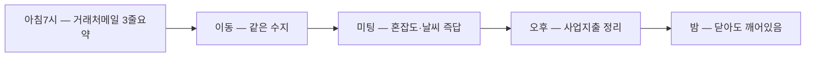

# 슬라이드 P73 생성 프롬프트

다음은 'AI 시대의 바이브코딩과 에이전트 활용법' 강연의 69페이지 슬라이드입니다. 첨부(또는 앞서 첨부)한 디자인 시스템(페르소나, 디자인 시스템 .md, 라이트/다크 모드 가이드 png)을 엄격히 준수하여 1920×1080(16:9) 슬라이드 이미지 1장을 생성해주세요.

**디자인 규칙 (첨부한 디자인 시스템 .md + 라이트/다크 가이드 png를 유일한 기준으로 엄격히 준수):**
- 배경·텍스트색·일러스트색·폰트 등 모든 색·타이포는 **첨부 디자인 시스템에 정의된 값을 정확히** 따른다. 가이드에 없는 임의 색 생성 금지.
- 방향(첨부 가이드와 동일): 배경은 순백, 텍스트는 강한 색(연한 회색·파스텔 틴트 금지), 일러스트·아이콘·도형은 쨍한 액센트 톤(파스텔·뮤트 금지), 폰트는 가이드 지정(한글 또렷).
- 스타일: flat 2.5D 에디토리얼 일러스트, 넉넉한 여백.
**필수 — 푸터/페이지번호 (이 페이지는 라이트 콘텐츠 페이지):**
- 좌하단에 푸터 텍스트를 정확히 이 문자열로 넣으세요: `주식회사 덥덥덥 · ww-w.ai` (좌측 정렬, 화면 하단 가장자리에서 약 60px 위, 작은 muted 회색, 그 위에 얇은 구분선). 가짜 도메인 생성 절대 금지 — 도메인은 오직 ww-w.ai.
- 우하단에 현재 페이지 번호 `69`만 넣으세요 (우측 정렬, 하단, 작은 muted 회색). 전체 페이지 수(/56 등) 표기 금지.
- **페이지 번호는 오직 우하단 1곳에만.** 우상단·상단·중앙 등 다른 어떤 위치에도 페이지 번호를 절대 넣지 마세요.

---
## [강연-슬라이드-구성안.md] 해당 페이지 (= 서사 소스, 대부분 구두 멘트)

### P73 [도식] — 사례 ①: 1인 사업자의 어느 하루 (백서 시나리오)

> 출처: 백서 11장 페르소나(꽃집 사장·프리랜서·쇼핑몰) 실제 인용을 하루 흐름으로 엮음.

- **[구두]** 아침 7시 — 자고 있어도 거래처 메일만 골라 3줄 요약해 카톡. "출근 전에 상황 파악이 끝난다."
- **[구두]** 이동 — 폰 ChatGPT 열면 같은 수지, 어제 막힌 제안서를 먼저 챙긴다.
- **[구두]** 미팅 — 장소 혼잡도·날씨 즉답(가입·키 0). 회사 자료는 회사 칸에·개인 메모는 금고에.
- **[구두]** 오후 — "꽃시장 카드 38만, 사업 지출" → 개인/사업 칸 분리 정리.
- **[구두]** 밤 — 노트북 닫아도 예약 운영이 무인으로 돈다.

---
## [이미지-제작-가이드.md] 해당 페이지 — 하이브리드(도식) 권고

### P73 사례 ①: 1인 사업자의 어느 하루 — [생성 프롬프트·도식]
- title 텍스트 레이어 "사례 ① — 1인 사업자의 어느 하루" @x:120 y:120.
- **E(하이브리드): 가로 타임라인 커넥터·해→달 아크·카드 도형 = 이미지, 제목·카드 라벨·키 = HTML 오버레이(crisp).** 괄호부연·"자고 있어도" 등은 구두.
- 각 카드 = **시각 + ≤12자 액션**(문장 금지). 5카드.

→ 위 머메이드 구조를 입력으로 사용해 생성: A clean editorial LEFT-to-RIGHT day timeline on WHITE (#FFFFFF) for a SOLO FOUNDER, five rounded stage cards connected by 2px rounded arrows, with a small sun→moon arc above. The card shapes and connectors are the IMAGE; card labels/title/key are a crisp HTML overlay (do NOT bake sentence-length Korean — bake at most the short card labels if needed). Card labels (short, ≤12 Korean chars each): "아침7시 — 거래처메일 3줄요약", "이동 — 같은 수지", "미팅 — 혼잡도·날씨 즉답", "오후 — 사업지출 정리", "밤 — 닫아도 깨어있음". Key line (HTML overlay) "노트북을 닫아도 수지는 깨어 있다". Accent the last card "밤" in coral #D97757; others soft ivory. Flat 2.5D editorial illustration (Anthropic/Claude aesthetic), warm ivory base + coral accent, generous whitespace, premium and restrained. NOT photorealistic, NO 3D render, NO isometric, NO glassmorphism, NO neon. no watermark, no fake logos. Strict 16:9 aspect ratio, 1920×1080 landscape — NOT 4:3, NOT square.
