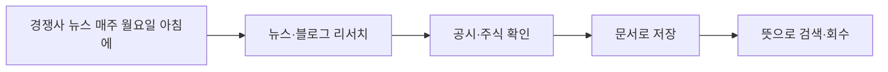

# 슬라이드 P74 생성 프롬프트

다음은 'AI 시대의 바이브코딩과 에이전트 활용법' 강연의 70페이지 슬라이드입니다. 첨부(또는 앞서 첨부)한 디자인 시스템(페르소나, 디자인 시스템 .md, 라이트/다크 모드 가이드 png)을 엄격히 준수하여 1920×1080(16:9) 슬라이드 이미지 1장을 생성해주세요.

**디자인 규칙 (첨부한 디자인 시스템 .md + 라이트/다크 가이드 png를 유일한 기준으로 엄격히 준수):**
- 배경·텍스트색·일러스트색·폰트 등 모든 색·타이포는 **첨부 디자인 시스템에 정의된 값을 정확히** 따른다. 가이드에 없는 임의 색 생성 금지.
- 방향(첨부 가이드와 동일): 배경은 순백, 텍스트는 강한 색(연한 회색·파스텔 틴트 금지), 일러스트·아이콘·도형은 쨍한 액센트 톤(파스텔·뮤트 금지), 폰트는 가이드 지정(한글 또렷).
- 스타일: flat 2.5D 에디토리얼 일러스트, 넉넉한 여백.
**필수 — 푸터/페이지번호 (이 페이지는 라이트 콘텐츠 페이지):**
- 좌하단에 푸터 텍스트를 정확히 이 문자열로 넣으세요: `주식회사 덥덥덥 · ww-w.ai` (좌측 정렬, 화면 하단 가장자리에서 약 60px 위, 작은 muted 회색, 그 위에 얇은 구분선). 가짜 도메인 생성 절대 금지 — 도메인은 오직 ww-w.ai.
- 우하단에 현재 페이지 번호 `70`만 넣으세요 (우측 정렬, 하단, 작은 muted 회색). 전체 페이지 수(/56 등) 표기 금지.
- **페이지 번호는 오직 우하단 1곳에만.** 우상단·상단·중앙 등 다른 어떤 위치에도 페이지 번호를 절대 넣지 마세요.

---
## [강연-슬라이드-구성안.md] 해당 페이지 (= 서사 소스, 대부분 구두 멘트)

### P74 [도식] — 사례 ②: 시장·경쟁사 모니터링을 위임 (리서치 → 내 서재 자산)

> 출처: 백서(경쟁사 뉴스 매주 월요일·블로그 리서치·DART 공시) + 사서 저장.

- 한 마디(백서 원문): *"우리 분야 경쟁사 뉴스를 매주 월요일 아침에 모아서 보내줘."*
- **[구두]** 흐름: 네이버 뉴스·블로그 리서치(최대 100건) → 전자공시(DART)·주식으로 사실확인 → 문서로 저장 → 다음에 "저번 리서치 꺼내줘" 하면 뜻으로 검색·회수.
- 차별점(백서): 새 소식 없는 주엔 "이번 주 새 동향 없음"이라고 분명히 — 조용히 건너뛰지 않는다.
- 한 줄: **"리서치 외주 없이도 — '시장 조사 담당자' 한 명."**

---
## [이미지-제작-가이드.md] 해당 페이지 — 하이브리드(도식) 권고

### P74 사례 ②: 시장·경쟁사 모니터링을 위임 — [생성 프롬프트·도식]
- title 텍스트 레이어 "사례 ② — 시장·경쟁사 모니터링을 위임" @x:120 y:120.
- **E(하이브리드): 가로 흐름 커넥터·카드·말풍선 도형 = 이미지, 제목·버블·카드 라벨·note·키 = HTML 오버레이(crisp).**
- 버블 1개(짧게) + 4카드(각 ≤12자) + note 1줄 축약 + 캡션 1개.

→ 위 머메이드 구조를 입력으로 사용해 생성: A clean editorial LEFT-to-RIGHT flow on WHITE (#FFFFFF). A coral-outlined speech bubble starts the flow, then four rounded stage cards connected by 2px rounded arrows. Shapes and connectors are the IMAGE; bubble/card labels/title/note/key are a crisp HTML overlay (do NOT bake sentence-length Korean — bake at most short card labels if needed). Bubble (short): "경쟁사 뉴스 매주 월요일 아침에". Card labels (≤12 chars each): "뉴스·블로그 리서치" → "공시·주식 확인" → "문서로 저장" → "뜻으로 검색·회수". Note (1 line, HTML overlay): "새 소식 없어도 ‘이번 주 새 동향 없음’ 남긴다". Caption (HTML overlay): "리서치 외주 없이 ‘시장 조사 담당자’ 한 명". Accent the speech bubble and the "문서로 저장" card in coral #D97757; others soft ivory. Flat 2.5D editorial illustration (Anthropic/Claude aesthetic), warm ivory base + coral accent, generous whitespace, premium and restrained. NOT photorealistic, NO 3D render, NO isometric, NO glassmorphism, NO neon. no watermark, no fake logos. Strict 16:9 aspect ratio, 1920×1080 landscape — NOT 4:3, NOT square.
