> ⚠️ LEGACY-BAKED 버전 (회귀용) — 텍스트를 이미지에 생성. 활성 버전 = 상위 폴더(스크립트 합성).

# 이미지 제작 가이드 (슬라이드 홀수 페이지용)

## 텍스트 정책 (BAKED 버전 — 회귀용)

> **이 버전은 텍스트를 이미지에 직접 생성(baked)하는 방식이다.** (스크립트 합성 버전이 잘 안 될 때의 폴백.)
> - 짧은 제목·라벨은 생성 프롬프트에 실제 문구를 넣어 함께 생성. "배경 먼저 → 텍스트 레이어" 프레이밍으로 품질↑.
> - 한글 오타가 나면 재생성하거나, 슬라이드 툴에서 해당 텍스트만 오버레이로 교정.
> - 활성(스크립트 합성) 버전은 상위 폴더의 `이미지-제작-가이드.md` 참조.

---

> 각 이미지 페이지를 3가지로 분류:
> - **[Mermaid]** — flow/graph. 아래 코드를 그대로 사용(GitHub·대부분 마크다운에서 렌더). 발표 덱엔 렌더 후 캡처.
> - **[생성 프롬프트]** — 개념도/비유. 생성 AI에 넣어 직접 제작. **이미지 안에 글자(text) 없이** 생성(홀수=텍스트 없는 사진 규칙).
> - **[스크린샷]** — 실제 화면/코드 캡처(생성 X).

## 생성 AI 공통 스타일 프리픽스 (개념도에 붙여 쓰기)

> 디자인 시스템(`슬라이드-디자인-시스템.md` §9) 팔레트에 맞춘 프리픽스.
> **텍스트 정책(BAKED)**: 짧은 제목·라벨은 이미지에 포함해 생성(레이어드 지시). 오타 시 재생성/오버레이 교정. (상세=위 배너.)

```
Clean minimalist editorial illustration, Anthropic/Claude aesthetic,
warm ivory and charcoal palette (ivory #F0EEE6, warm charcoal #211E1B, coral clay accent #D97757),
soft diffused studio lighting, generous negative space, cinematic, high resolution, 16:9 framing,
cohesive warm color grading, premium and restrained,
no watermark, no garbled extra text, no fake logos.
```

**포토 전용 프리픽스 (사진 = 실사, 팔레트 톤 강제 X)** — P3·P5·P7 등 사진 페이지는 이걸 쓴다:
```
Natural photorealistic photograph, realistic lighting and true-to-life colors
(no stylized color grading, no warm tone overlay, no filter), high resolution,
16:9 full bleed, no watermark, no garbled extra text, no fake logos.
```
> 사진엔 시스템 팔레트 색보정을 입히지 않는다. 시스템 색(아이보리/차콜/코랄)은 스크림·텍스트 레이어에만.
> **푸터 = 반드시 정확히 `주식회사 덥덥덥 · ww-w.ai`** — 생성기가 가짜 도메인(예: d3corp.com)을 지어내지 않게 프롬프트에 명시·강조하거나 슬라이드 툴 텍스트 레이어로 직접. 도메인은 오직 `ww-w.ai`.
> **페이지번호 = 현재 페이지 번호만**(전체 수 X — `07 / 66` 형식 금지, 전체 수가 계속 바뀜). **항상 2자리 zero-pad `07`·`08`로 통일**(한 자리도 앞에 0). 우하단 @x:1800 y:1020 right-align, 색=푸터와 동일. 표지(P1)는 생략.
> 푸터가 배경색과 비슷하면 **적응형 색**(secondary → 근접 보색, 생성형이라 가능). 프롬프트 예: `the footer "주식회사 덥덥덥 · ww-w.ai" must stay legible; if the background tone is similar, switch its color to a contrasting secondary or a fitting near-complementary color. Do not invent any domain.` 대비 ≥4.5:1.

---

## [챕터 1 · 오프닝]  *(홀짝 페어 룰 적용 — 디자인 시스템 §11 매핑)*

> 모드 표기: 표지=포토+다크오버레이 / divider=다크 / 홀수사진=포토 풀블리드 / 짝수설명=라이트(보통 이미지 없음).

### P1 표지 — [생성 프롬프트] · 포토+다크오버레이 · 컨셉="혼자서 팀처럼"
```
A single founder standing confidently and FACING THE CAMERA straight on, calm
assured expression with a confident warm smile, direct eye contact, positioned on the RIGHT side of the frame.
Behind and around them, their light and shadow fan out into several translucent,
softly glowing AI-agent silhouettes, each busy with a different task, so one person
reads as a whole team. Warm ivory and
charcoal scene, soft coral/amber rim light, cinematic depth (foreground founder →
mid translucent agents → soft background). Subject occupies the RIGHT 30-40%; keep
the LOWER-LEFT and BOTTOM thirds quiet and darker for the title.
Compose the background first, then add ONLY these texts as a clean separate
typographic layer in the lower-left (warm off-white, generous spacing):
title line "1인 창업자 분들을 위한 바이브코딩과 에이전트 활용법",
then on two smaller lines "KAIST OverEdge" and "2026.07.07 · 덥덥덥 대표이사 김태형".
Do NOT render any other words, labels, captions or the concept name in the image.
(스타일 프리픽스).
```
- 텍스트는 위처럼 함께 생성하거나 슬라이드 툴 오버레이로 얹어도 됨. 좌표: title.cover 본명조 96px `#FBFAF6` @x:120 y:760(2~3줄) · 메타 2줄 body 36px @x:120 y:908("KAIST OverEdge") / y:952("2026.07.07 · 덥덥덥 대표이사 김태형") · `photo.scrim.full` · 페이지번호 생략.
- 대안 컨셉(자유 각색 가능): 1인 관제실 / AI 인프라 위에 선 사람 / 새벽 출항+에이전트 별자리. 모두 좌하단 비우기 + 피사체 우측 30~40% 동일 골격.

### P2 챕터 divider — [배경 옵션] · 다크
- 기본은 **이미지 없이** 다크 그라디언트 단색(`linear-gradient(160deg,#262320,#211E1B,#1A1715)`) + number/제목 텍스트만. 분위기를 더하려면 아래 *아주 은은한* 배경 생성:
```
Extremely subtle abstract dark texture, warm charcoal (#211E1B), faint soft
grain and a single dim coral glow in one corner, almost solid color, very low
contrast (must not compete with overlaid title). (스타일 프리픽스).
```
- 오버레이: number "1" 200px `#E08862` @x:120 y:560 · title.divider "AI 시대, 관점의 전환" 본명조 120px `#F4F1EA` @x:120 y:760.

### P3 시대의 이름 — [생성 프롬프트] · 포토(3분할)
```
A triptych split into three equal vertical panels, full bleed, photorealistic:
left = the internet era (90s-2000s desktop web, cables, server rooms);
middle = the mobile era (smartphones, apps, people on phones);
right = the AI era (a modern AI/agent workspace, screens with subtle holographic UI).
Natural realistic colors in each panel (no stylized tone overlay).
Separate the three panels with thin clean ivory (#F0EEE6) dividing lines.
Keep the bottom 25% simpler/darker for a text scrim. (포토 프리픽스).
Then add a single short line "당신은 무슨 시대에 살고 있나요?" as a clean typographic
layer, BOTTOM-CENTER, warm off-white over a bottom scrim.
```
- 패널 구분선(§8.8): 오버레이 6px `#F0EEE6` @x:640/1280 (3분할 경계) 권장.
- 텍스트 레이어(옵션, 이 페이지는 사용): "당신은 무슨 시대에 살고 있나요?" — title/subtitle 56px/600 `#FBFAF6` 가운데 정렬, baseline y:980, `photo.scrim.bottom`. (텍스트 빼고 사진만 가도 됨.)

### P4 설명 — 라이트 (텍스트 레이어 중심, 기본 이미지 없음)
- **레이아웃**: `layout.two-column` 아닌 단일 본문(라이트 모드, 배경 `#F0EEE6`). 카피 원문 = 구성안 P4.
- **텍스트 레이어 (좌표/타이포 — 디자인시스템 §3.2·§5)**:
  - title "AI 위에 사업을 올려라" — Pretendard 64px/700 `#26221E` @x:120 y:120
  - body 불릿 3개(+서브 2개) — Pretendard 36px/400 `#26221E`, 서브불릿 body.sm 30px @BODY BOX(x:120 y:360 w:1680), 항목간격 20px, 마커 코랄 점 10px `#D97757`. 서브불릿은 들여쓰기·30px로 위계 분리.
  - "사고의 전환" 줄은 **NO/YES 대비 강조**: "AI 기능을 붙인 앱"=muted/취소 느낌, "AI 인프라 위에 설계한 사업"=코랄 강조.
  - 키워드 하이라이트(≤2): "경쟁자가 아니라 인프라", "서비스는 우리가 더 잘 만든다" → 형광 배경 `#F4D9CB`(§8.2)
  - 푸터 `주식회사 덥덥덥 · ww-w.ai` `#8B8377` @x:120 y:1020 (임의 도메인 생성 금지) · 페이지번호=현재 번호만 @x:1800 y:1020(전체 수 X)
- (옵션) 우상단 소형 액센트 일러스트가 필요하면(본문 영역 침범 금지, x≥1000 상단):
```
A small minimal flat illustration of a service running ON TOP of an infrastructure
layer (a structure built upon a solid base/platform), coral (#D97757) key element
on warm ivory (#F0EEE6), contained in the upper-right, lots of whitespace. (스타일 프리픽스).
```

### P5 새 생활권 — [생성 프롬프트] · 포토(4분할)
```
Four equal vertical panels, full bleed, photorealistic, showing the evolution of
mobility: walking → bicycle → automobile → airplane. Consistent realistic style,
natural true-to-life colors (no tone overlay), sense of expanding range/scale.
Separate the four panels with thin clean ivory (#F0EEE6) dividing lines.
(포토 프리픽스).
```
- 패널 구분선(§8.8): 오버레이 6px `#F0EEE6` @x:480/960/1440 (4분할 경계) 권장.
- 텍스트 레이어(옵션): 필요하면 짧은 한 줄(상/하 × 좌/센터) + 그 모서리에만 스크림. 없으면 사진만(큰 다크 밴드 X). 푸터/페이지번호는 작은 로컬 스크림(`photo.scrim.footer`)으로.

### P6 설명 — 라이트 (텍스트 레이어 중심, 이미지 없음)
- **레이아웃**: 단일 본문(라이트). 카피 원문 = 구성안 P6.
- **텍스트 레이어**:
  - title "새 생활권 = 새 사업 기회" — 64px/700 `#26221E` @x:120 y:120
  - body 불릿 3개 — 36px @BODY BOX(x:120 y:360 w:1680), 항목간격 20px, 마커 코랄
  - 핵심 질문 "걷기 시대엔 불가능했지만, 자동차 시대엔 되는 사업은?" → §8.4 KEY MESSAGE 박스(48px/600 가운데 or 좌측 강조) 하단 배치, 또는 클레이 강조 `#B85C3C`
  - 푸터 `주식회사 덥덥덥 · ww-w.ai` `#8B8377` @x:120 y:1020 (임의 도메인 생성 금지) · 페이지번호=현재 번호만 @x:1800 y:1020(전체 수 X)

### P7 자율주행 — [생성 프롬프트] · 포토 풀블리드
```
Interior of a self-driving electric car, driver relaxed with hands off the wheel,
car confidently heading toward a destination on an open road, autopilot vibe,
photorealistic, natural true-to-life colors. (포토 프리픽스). no dashboard numbers.
```
- 텍스트 레이어(옵션): 없으면 사진만.

### P8 설명 — 라이트 (텍스트 레이어 중심, 이미지 없음)
- **레이아웃**: 단일 본문(라이트). 카피 원문 = 구성안 P8.
- **텍스트 레이어**:
  - title "자율주행은 '내 일하는 방식'이다" — 64px/700 `#26221E` @x:120 y:120
  - body 불릿 4개 — 36px @BODY BOX(x:120 y:360 w:1680), 항목간격 20px, 마커 코랄
  - 키워드 하이라이트(≤1): "내가 자리를 비워도" → `#F4D9CB`
  - 푸터 `주식회사 덥덥덥 · ww-w.ai` `#8B8377` @x:120 y:1020 (임의 도메인 생성 금지) · 페이지번호=현재 번호만 @x:1800 y:1020(전체 수 X)

### P9 자비스 — [생성 프롬프트] · 포토 풀블리드
```
A futuristic personal AI assistant as a glowing holographic interface in a dim
room — floating translucent panels, ambient data, a calm omnipresent helper
attending to tasks on its own. Photorealistic cinematic render, natural colors
(the hologram itself glows warm amber; no overall tone filter on the room).
Full bleed 16:9. (포토 프리픽스).
```
- 텍스트 레이어(옵션): 없으면 사진만. 푸터 `주식회사 덥덥덥 · ww-w.ai`만(작은 `photo.scrim.footer` 위, 적응형 색). 페이지번호=현재 번호만 @x:1800 y:1020(전체 수 X).
- ⚠️ 특정 영화 IP(아이언맨/JARVIS 상표·디자인) 직접 묘사 금지 — **일반적인 "홀로그램 AI 비서"** 컨셉으로만 생성.

### P10 설명 — 라이트 (텍스트 레이어 중심 + 옵션 아이콘 3개)
- **레이아웃**: `layout.three-column`(라이트). 카피 원문 = 구성안 P10.
- **텍스트 레이어 (좌표/타이포)**:
  - title "이제 곧, 1인 창업가의 자비스" — 64px/700 `#26221E` @x:120 y:120
  - 리드문(자비스 정의 1~2줄) — subtitle 40px/500 `#544E45` @x:120 y:300
  - 3 레버 3분할 컬럼 @x:120 / 688 / 1256, 각 w:544, same top y:460:
    · 컬럼 라벨 "① 만들기 → bkit" / "② 자동화 → 수지" / "③ 자율주행 → Sprint" — subtitle 40px/500, 번호는 코랄 `#D97757`
    · 각 컬럼 설명 — body.sm 30px/400 `#544E45`, 라벨 아래 16px 갭
  - 한 줄 메시지 "인프라 위에서, 혼자 팀처럼 — 오늘 당신의 자비스를 만든다." → §8.4 KEY MESSAGE 박스 하단(y:900 부근)
  - 푸터 `주식회사 덥덥덥 · ww-w.ai` `#8B8377` @x:120 y:1020 (임의 도메인 생성 금지) · 페이지번호=현재 번호만 @x:1800 y:1020(전체 수 X)
- (옵션) 컬럼 상단용 **심플 아이콘 3종**(동일 스타일로 1장에 나란히 생성 후 분리, 각 컬럼 라벨 위 x:120/688/1256 @y:380):
```
Three minimal line icons in a row, identical style, coral (#D97757) on warm ivory
(#F0EEE6): (1) building/creating an app, (2) automating an operations workflow,
(3) an autopilot/steering-wheel-released self-driving symbol. Flat, iconic, even
spacing, lots of whitespace. (스타일 프리픽스).
```

---

## [기초] LLM 원리

### P11 한 토큰씩 — [생성 프롬프트]
```
A chain of small glowing beads/tiles being threaded one by one into a continuous
line that forms into flowing sentences/code in the distance — emphasizing
"one piece at a time becomes a whole". Abstract, elegant. (스타일 프리픽스). NO text.
```

### P13 토큰 생성 6단계 — [Mermaid]
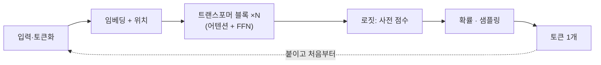

### P15 채팅의 진짜 모습 (특수 토큰) — [스크린샷/코드블록]
- 생성·머메이드 아님. 아래 코드블록을 스타일링해 그대로 한 화면 가득:
```
<|system|>     ...규칙 · 페르소나...   <|end|>
<|user|>       ...질문...             <|end|>
<|assistant|>  ...답변...             <|end|>
```

### P17 토큰의 종류 — [생성 프롬프트]
```
Four distinct piles of colored tokens/coins (input, output, cache, thinking),
each pile with a small blank price tag, conveying "different prices". Clean
product-shot style. (스타일 프리픽스). NO text on tags.
```

### P19 씽킹 모드 — [생성 프롬프트]
```
A figure with a large thought bubble swirling with reasoning, but the bubble is
behind a frosted/hidden panel (private), while only a small clean final answer
emerges in front. (스타일 프리픽스). NO text.
```

### P21 페르소나/관점 주입 — [생성 프롬프트]
```
The same robot/AI head shown three times, each wearing a different professional
hat (doctor, lawyer, marketer), each producing a visibly different colored output
stream. (스타일 프리픽스). NO text.
```

### P23 모든 게 프롬프트로 합쳐진다 — [Mermaid]
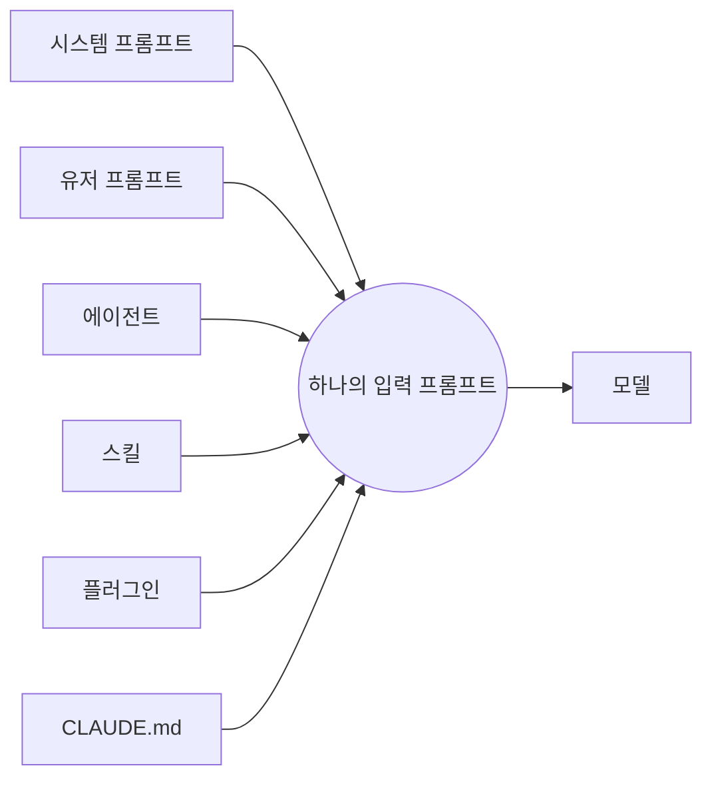

### P25 보이지 않는 중간 과정 — [생성 프롬프트]
```
An iceberg: above the waterline a small chat bubble (what users see); below the
surface a huge mass of gears, tool calls, intermediate steps. (스타일 프리픽스). NO text.
```

### P27 컨텍스트 윈도우 — [생성 프롬프트]
```
A glass container slowly filling up with stacking message blocks, getting heavier
and fuller over time, conveying growing weight/cost. (스타일 프리픽스). NO text.
```

### P29 트랜스크립트 — [스크린샷]
- 실제 `.jsonl` 트랜스크립트 일부를 캡처(민감정보 마스킹). 예시 형태:
```jsonl
{"type":"user","content":"..."}
{"type":"assistant","content":"...","usage":{"input_tokens":1234,"output_tokens":567}}
{"type":"tool_use","name":"Read","input":{...}}
```

### P31 claude-code-token-saver — [스크린샷]
- 실제 repo 화면 또는 토큰 절감 대시보드/statusline 캡처. (생성 X)

---

## [Part 1] bkit

### P33 바닐라의 한계 — [Mermaid] (변동성 그래프) / 안 되면 생성
```mermaid
xychart-beta
  title "같은 요청, 매번 다른 품질"
  x-axis [1회, 2회, 3회, 4회, 5회]
  y-axis "품질" 0 --> 100
  line [80, 35, 70, 40, 85]
```
- xychart 렌더 안 되는 환경이면 → [생성 프롬프트]:
```
A jagged, unstable line graph going up and down erratically, three inconsistent
output blocks of varying quality beside it. (스타일 프리픽스). NO text.
```

### P35 PDCA를 코딩에 — [Mermaid]
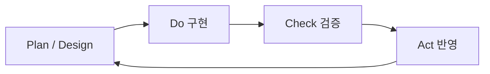

### P37 프레임워크 레벨 — [Mermaid]
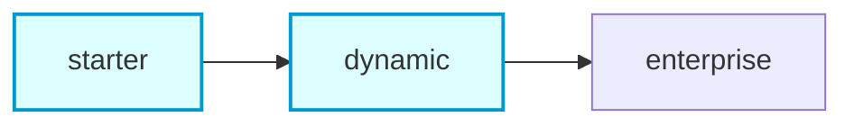
- (개인·소규모 = starter~dynamic 강조: 앞 두 노드 하이라이트)

### P39 이중검증 — [Mermaid]
```mermaid
xychart-beta
  title "이중검증 전후 품질"
  x-axis [검증없음, 이중검증]
  y-axis "품질(%)" 0 --> 100
  bar [30, 89]
```

### P41 모델 라우팅 — [Mermaid]
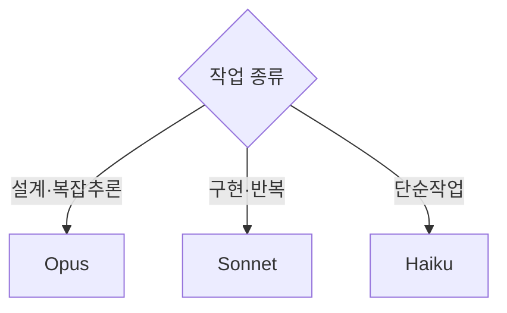

### P43 실습 1 — [스크린샷]
- 터미널에서 `/pdca-wf` 입력 장면 클로즈업 캡처. (생성 X)

---

## [Part 2] 에이전트 수지

### P45 개발만 빨라진 함정 — [생성 프롬프트]
```
A fast sports car (labeled by visual metaphor only) speeding ahead, but tethered
and held back by a huge pile of paperwork/admin tasks behind it. (스타일 프리픽스). NO text.
```

### P47 MCP = 실세계 단자 — [Mermaid]
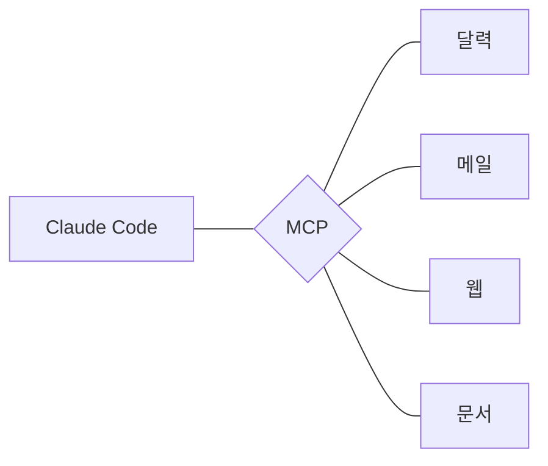

### P49 수지가 하는 일 — [Mermaid] (mindmap)
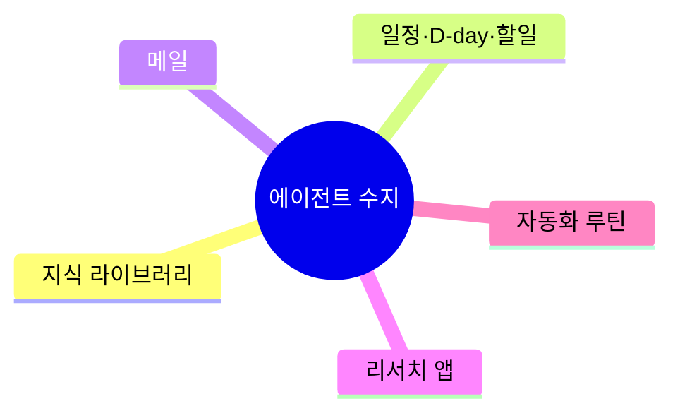

### P51 아침 루틴 시나리오 — [Mermaid]
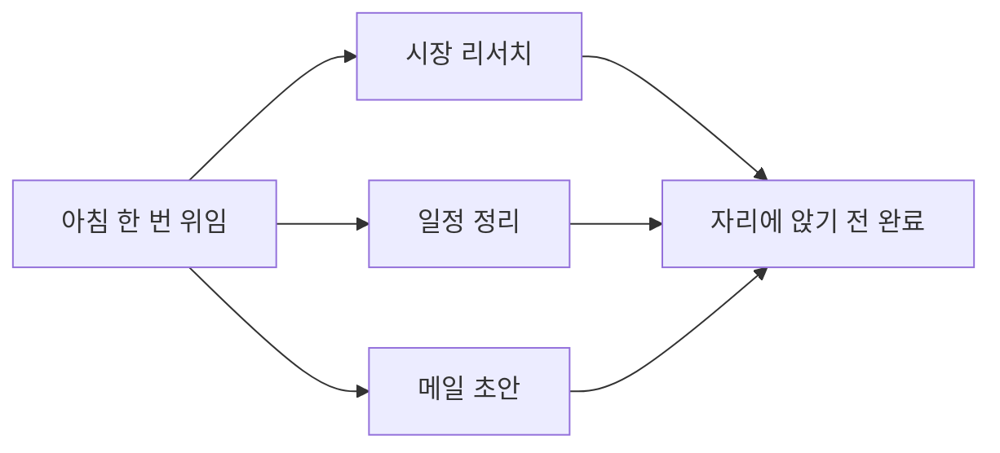

### P53 실습 2 — [스크린샷]
- `sooji_start` 호출 화면 캡처. (생성 X)

---

## [Part 3] Sprint

### P55 한 기능 vs 연쇄 — [Mermaid]
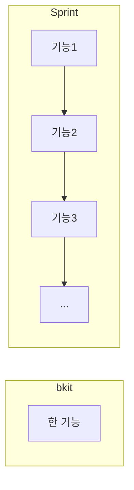

### P57 자율주행 3대 조건 — [Mermaid]
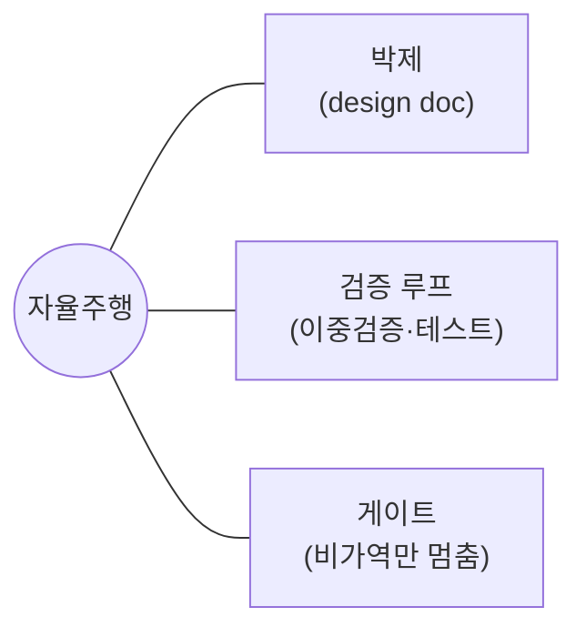

### P59 운영 원리 — [Mermaid]
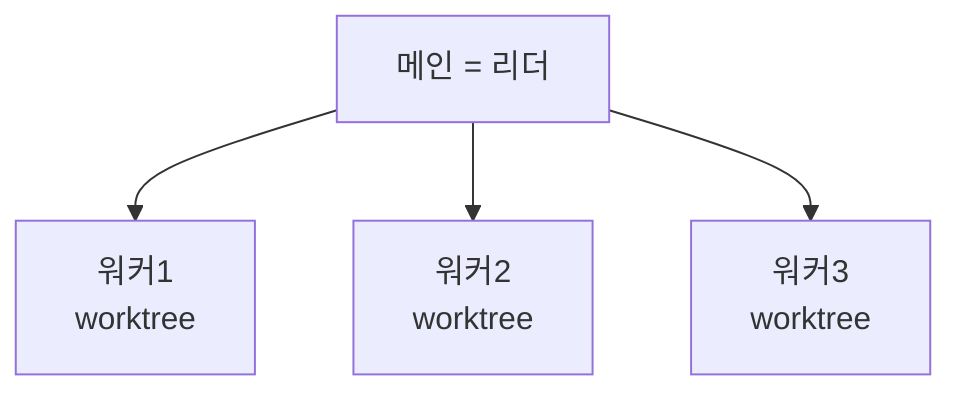

### P61 수 시간 노하우 — [생성 프롬프트]
```
A sleek mission-control dashboard with gauges: a context fuel gauge, a cache
timer, a token budget meter, a loop/resume indicator — conveying "keep it running
for hours". (스타일 프리픽스). NO readable text/numbers (use abstract dials).
```

### P63 라이브 데모 — [스크린샷]
- 진행 중인 sprint 대시보드 화면 + LIVE 표시 캡처. (생성 X)

---

## [마무리]

### P65 3 레버 종합 — [Mermaid]
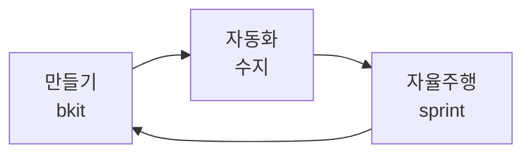

---

## 요약 (제작 방식별)
- **[Mermaid] 14장**: P13, P23, P33, P35, P37, P39, P41, P47, P49, P51, P55, P57, P59, P65
- **[생성 프롬프트] 13장(필수)**: P1, P3, P5, P7, **P9(자비스)**, P11, P17, P19, P21, P25, P27, P45, P61
- **[생성 프롬프트] 옵션 4장**: P2(은은한 다크 배경), P4·P10(라이트 액센트 일러스트/아이콘), — 없어도 타이포만으로 성립.
- **[스크린샷] 6장**: P15, P29, P31, P43, P53, P63
- **라이트 설명(텍스트 전용, 이미지 불필요)**: P4, P6, P8, P10 등 짝수 설명 페이지.

> 오프닝 변경(2026-06-27): 구 P2(약속·설명)→**P2 챕터 divider(다크)**, 구 P9(3 레버 이미지)→**P9 자비스 + P10에 3 레버를 텍스트 컬럼으로**. 스타일 프리픽스를 디자인 시스템 팔레트로 교체.
