# 이미지 제작 가이드 (슬라이드 홀수 페이지용)

> 각 이미지 페이지를 3가지로 분류:
> - **[Mermaid]** — flow/graph. 아래 코드를 그대로 사용(GitHub·대부분 마크다운에서 렌더). 발표 덱엔 렌더 후 캡처.
> - **[생성 프롬프트]** — 개념도/비유. 생성 AI에 넣어 직접 제작. **이미지 안에 글자(text) 없이** 생성(홀수=텍스트 없는 사진 규칙).
> - **[스크린샷]** — 실제 화면/코드 캡처(생성 X).

## 생성 AI 공통 스타일 프리픽스 (개념도에 붙여 쓰기)
```
Clean, minimalist editorial illustration, Apple keynote aesthetic, high contrast,
soft studio lighting, lots of negative space, 16:9, high resolution,
NO text, NO letters, NO numbers, NO logos.
```

---

## [오프닝]

### P1 표지 — [생성 프롬프트]
```
A long empty road stretching to the horizon at dawn, cinematic, sense of a new
journey beginning. (스타일 프리픽스 적용). 표지엔 타이틀 텍스트를 슬라이드 툴에서 별도 오버레이.
```

### P3 시대의 이름 — [생성 프롬프트] (3분할)
```
A triptych split into three equal vertical panels, full bleed:
left = the internet era (90s-2000s desktop web, cables, server rooms);
middle = the mobile era (smartphones, apps, people on phones);
right = the AI era (abstract neural/agent visualization, glowing nodes).
Cohesive color grading across all three. (스타일 프리픽스). NO text.
```

### P5 새 생활권 — [생성 프롬프트] (4분할)
```
A 2x2 or 4-panel grid, full bleed, showing the evolution of mobility:
walking → bicycle → automobile → airplane. Consistent illustration style,
sense of expanding range/scale across panels. (스타일 프리픽스). NO text.
```

### P7 자율주행 — [생성 프롬프트]
```
Interior of a self-driving electric car, driver relaxed with hands off the wheel,
car confidently heading toward a destination on an open road, autopilot vibe.
(스타일 프리픽스). NO text, NO dashboard numbers.
```

### P9 3 레버 — [생성 프롬프트]
```
Three large industrial levers / toggle switches on a clean panel, each in the ON
position, symbolizing build / automate / autopilot. Minimal, iconic.
(스타일 프리픽스). NO text labels on the levers.
```

---

## [기초] LLM 원리

### P11 한 토큰씩 — [생성 프롬프트]
```
A chain of small glowing beads/tiles being threaded one by one into a continuous
line that forms into flowing sentences/code in the distance — emphasizing
"one piece at a time becomes a whole". Abstract, elegant. (스타일 프리픽스). NO text.
```

### P13 토큰 생성 6단계 — [Mermaid]


### P15 채팅의 진짜 모습 (특수 토큰) — [스크린샷/코드블록]
- 생성·머메이드 아님. 아래 코드블록을 스타일링해 그대로 한 화면 가득:
```
<|system|>     ...규칙 · 페르소나...   <|end|>
<|user|>       ...질문...             <|end|>
<|assistant|>  ...답변...             <|end|>
```

### P17 토큰의 종류 — [생성 프롬프트]
```
Four distinct piles of colored tokens/coins (input, output, cache, thinking),
each pile with a small blank price tag, conveying "different prices". Clean
product-shot style. (스타일 프리픽스). NO text on tags.
```

### P19 씽킹 모드 — [생성 프롬프트]
```
A figure with a large thought bubble swirling with reasoning, but the bubble is
behind a frosted/hidden panel (private), while only a small clean final answer
emerges in front. (스타일 프리픽스). NO text.
```

### P21 페르소나/관점 주입 — [생성 프롬프트]
```
The same robot/AI head shown three times, each wearing a different professional
hat (doctor, lawyer, marketer), each producing a visibly different colored output
stream. (스타일 프리픽스). NO text.
```

### P23 모든 게 프롬프트로 합쳐진다 — [Mermaid]
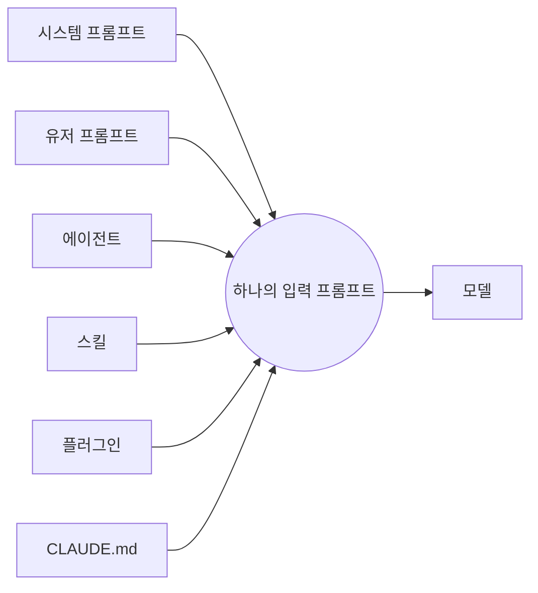

### P25 보이지 않는 중간 과정 — [생성 프롬프트]
```
An iceberg: above the waterline a small chat bubble (what users see); below the
surface a huge mass of gears, tool calls, intermediate steps. (스타일 프리픽스). NO text.
```

### P27 컨텍스트 윈도우 — [생성 프롬프트]
```
A glass container slowly filling up with stacking message blocks, getting heavier
and fuller over time, conveying growing weight/cost. (스타일 프리픽스). NO text.
```

### P29 트랜스크립트 — [스크린샷]
- 실제 `.jsonl` 트랜스크립트 일부를 캡처(민감정보 마스킹). 예시 형태:
```jsonl
{"type":"user","content":"..."}
{"type":"assistant","content":"...","usage":{"input_tokens":1234,"output_tokens":567}}
{"type":"tool_use","name":"Read","input":{...}}
```

### P31 claude-code-token-saver — [스크린샷]
- 실제 repo 화면 또는 토큰 절감 대시보드/statusline 캡처. (생성 X)

---

## [Part 1] bkit

### P33 바닐라의 한계 — [Mermaid] (변동성 그래프) / 안 되면 생성
```mermaid
xychart-beta
  title "같은 요청, 매번 다른 품질"
  x-axis [1회, 2회, 3회, 4회, 5회]
  y-axis "품질" 0 --> 100
  line [80, 35, 70, 40, 85]
```
- xychart 렌더 안 되는 환경이면 → [생성 프롬프트]:
```
A jagged, unstable line graph going up and down erratically, three inconsistent
output blocks of varying quality beside it. (스타일 프리픽스). NO text.
```

### P35 PDCA를 코딩에 — [Mermaid]
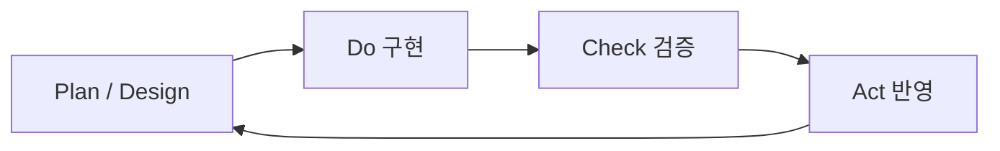

### P37 프레임워크 레벨 — [Mermaid]
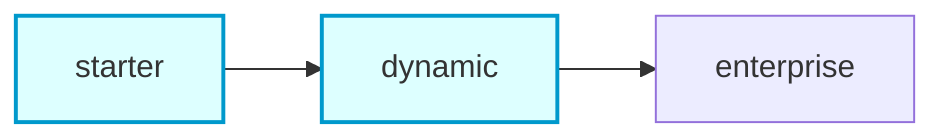
- (개인·소규모 = starter~dynamic 강조: 앞 두 노드 하이라이트)

### P39 이중검증 — [Mermaid]
```mermaid
xychart-beta
  title "이중검증 전후 품질"
  x-axis [검증없음, 이중검증]
  y-axis "품질(%)" 0 --> 100
  bar [30, 89]
```

### P41 모델 라우팅 — [Mermaid]
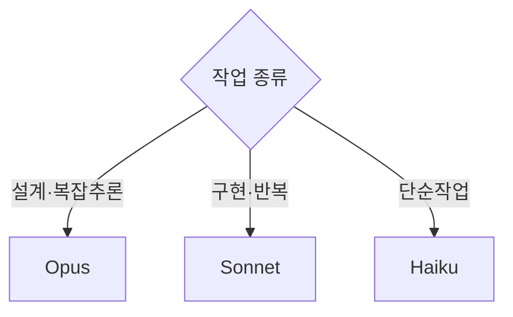

### P43 실습 1 — [스크린샷]
- 터미널에서 `/pdca-wf` 입력 장면 클로즈업 캡처. (생성 X)

---

## [Part 2] 에이전트 수지

### P45 개발만 빨라진 함정 — [생성 프롬프트]
```
A fast sports car (labeled by visual metaphor only) speeding ahead, but tethered
and held back by a huge pile of paperwork/admin tasks behind it. (스타일 프리픽스). NO text.
```

### P47 MCP = 실세계 단자 — [Mermaid]
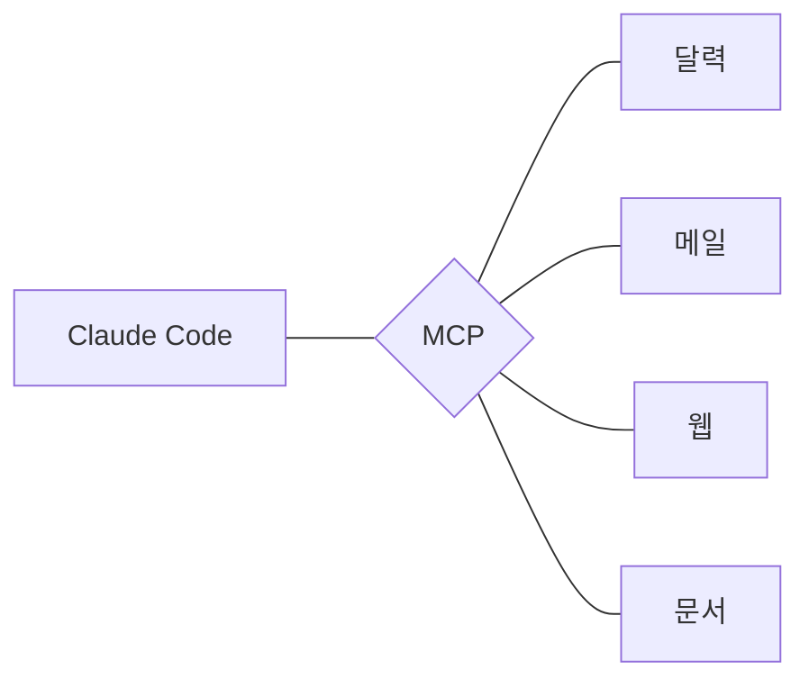

### P49 수지가 하는 일 — [Mermaid] (mindmap)
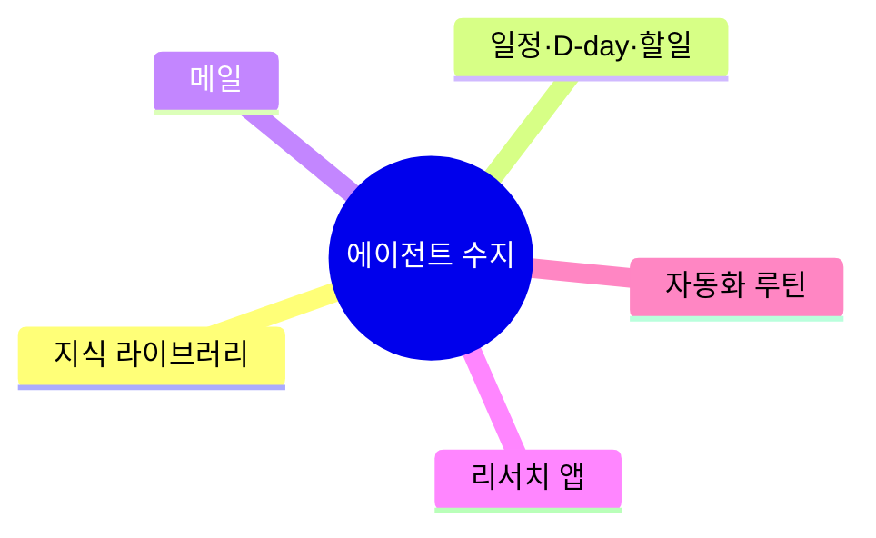

### P51 아침 루틴 시나리오 — [Mermaid]
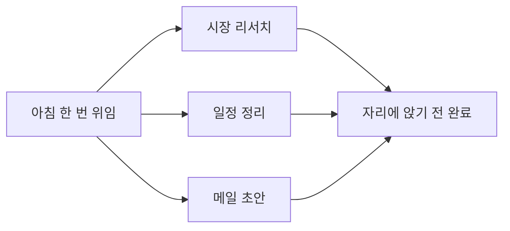

### P53 실습 2 — [스크린샷]
- `sooji_start` 호출 화면 캡처. (생성 X)

---

## [Part 3] Sprint

### P55 한 기능 vs 연쇄 — [Mermaid]
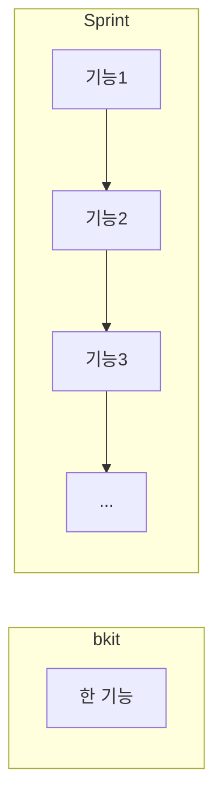

### P57 자율주행 3대 조건 — [Mermaid]
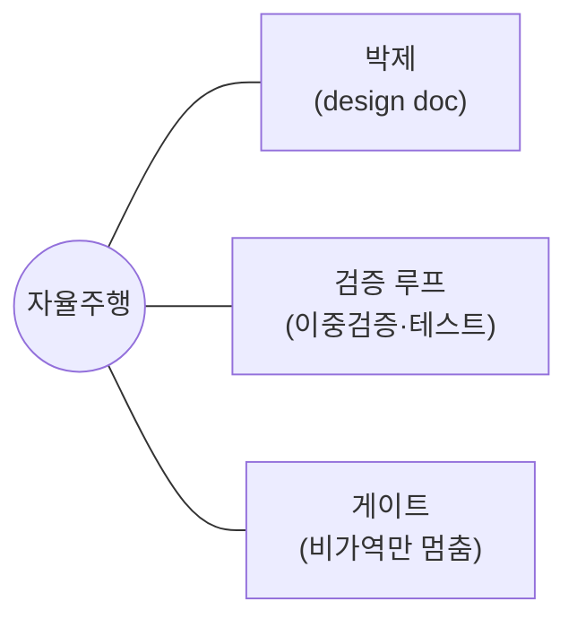

### P59 운영 원리 — [Mermaid]
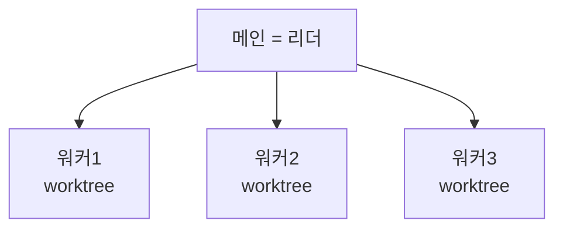

### P61 수 시간 노하우 — [생성 프롬프트]
```
A sleek mission-control dashboard with gauges: a context fuel gauge, a cache
timer, a token budget meter, a loop/resume indicator — conveying "keep it running
for hours". (스타일 프리픽스). NO readable text/numbers (use abstract dials).
```

### P63 라이브 데모 — [스크린샷]
- 진행 중인 sprint 대시보드 화면 + LIVE 표시 캡처. (생성 X)

---

## [마무리]

### P65 3 레버 종합 — [Mermaid]
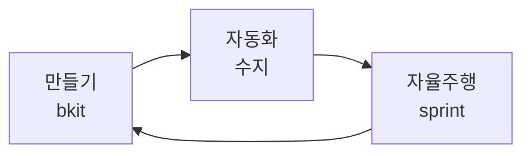

---

## 요약 (제작 방식별)
- **[Mermaid] 14장**: P13, P23, P33, P35, P37, P39, P41, P47, P49, P51, P55, P57, P59, P65
- **[생성 프롬프트] 13장**: P1, P3, P5, P7, P9, P11, P17, P19, P21, P25, P27, P45, P61
- **[스크린샷] 6장**: P15, P29, P31, P43, P53, P63
