# 이미지 제작 가이드 — 페이지별 생성 프롬프트

> 버전: **B · 스크립트 합성 (ACTIVE)**. **표준**(렌더 파이프라인·스타일/포토 프리픽스·푸터·프롬프트 표준)은 `슬라이드-디자인-시스템.md` **§22**. 회귀용 BAKED = `legacy-baked/`. 전체 = `VERSIONS.md`.
> **이 문서 = 페이지별 특화** — 각 페이지의 생성 프롬프트·텍스트 레이어 좌표. 페이지는 계속 추가·수정한다.
> **모든 생성 프롬프트는 16:9 (1920×1080 가로)로 그린다 — 4:3·정사각 금지.** (생성기가 자꾸 4:3로 빠지므로 프롬프트마다 명시.)
> **자기완결 원칙 (MUST):** 각 페이지 프롬프트는 그 자체로 완결돼야 한다 — 공통사항(스타일/포토 프리픽스·16:9·네거티브)을 `[포토 프리픽스]` 같은 참조로 두지 말고 **매 페이지에 전부 인라인**한다. 생성기는 공통 규칙을 기억 못 하고, 따로 붙이면 유실되기 쉽다. 한 페이지 = 복붙 한 번으로 완성.
> **머메이드·스크린샷도 '입력값'이다:** 머메이드 코드는 *도식 구조를 생성기에 이해시키는 입력*으로 프롬프트 안에 품고(머메이드 블록은 보존), 스크린샷은 *생성 시 함께 넣는 레퍼런스 입력*으로 전제한다. 보조 태그: **[생성 프롬프트·도식]**(머메이드 입력) · **[생성 프롬프트·실화면 입력]**(스크린샷 입력).
> **bake-first 기본 (MUST):** 모든 생성 프롬프트는 **슬라이드 텍스트(한글 포함)를 이미지에 함께 굽는다** — `NO text`·`배경만 생성` 금지. 굽는 것이 1순위(레이아웃 레퍼런스 겸용). 텍스트는 "배경/일러스트 먼저 → 그 위에 이 텍스트만 깨끗한 별도 타이포 레이어로" 형식으로 지정한다. **한글이 깨질 때만** 그 텍스트를 지우고 각 페이지의 좌표/타이포 스펙으로 `render_slides.py` 복원.

---

## [챕터 1 · 오프닝]  *(홀짝 페어 룰 적용 — 디자인 시스템 §11 매핑)*

> 모드 표기: 표지=포토+다크오버레이 / divider=다크 / 홀수사진=포토 풀블리드 / 짝수설명=라이트(보통 이미지 없음).

### P1 표지 — [생성 프롬프트] · 포토+다크오버레이 · 컨셉="혼자서 팀처럼"
```
A single founder standing confidently and FACING THE CAMERA straight on, calm
assured expression with a confident warm smile, direct eye contact, positioned on the RIGHT side of the frame.
Behind and around them, their light and shadow fan out into several translucent,
softly glowing AI-agent silhouettes, each busy with a different task, so one person
reads as a whole team. Warm ivory and
charcoal scene, soft coral/amber rim light, cinematic depth (foreground founder →
mid translucent agents → soft background). Subject occupies the RIGHT 30-40%; keep
the LOWER-LEFT and BOTTOM thirds quiet and darker for the title.
Compose the background first, then add ONLY these texts as a clean separate
typographic layer in the lower-left (warm off-white, generous spacing):
title line "1인 창업자 분들을 위한 바이브코딩과 에이전트 활용법",
then on two smaller lines "KAIST OverEdge" and "2026.07.07 · 덥덥덥 대표이사 김태형".
Do NOT render any other words, labels, captions or the concept name in the image.
Flat 2.5D editorial illustration (Anthropic/Claude aesthetic), warm ivory base + coral #D97757 accent, soft simple shapes, generous whitespace, premium and restrained. NOT photorealistic, NO 3D render, NO isometric, NO glassmorphism, NO neon. no watermark, no garbled extra text, no fake logos. Strict 16:9 aspect ratio, 1920×1080 landscape — NOT 4:3, NOT square..
```
- **bake-first**: 텍스트는 위 프롬프트대로 이미지에 함께 생성(1순위). 한글이 깨질 때만 슬라이드 텍스트 제거 → 스크립트 복원. 스크립트 합성 좌표: title.cover 본명조 96px `#FBFAF6` @x:120 y:760(2~3줄) · 메타 2줄 body 36px @x:120 y:908("KAIST OverEdge") / y:952("2026.07.07 · 덥덥덥 대표이사 김태형") · `photo.scrim.full` · 페이지번호 생략.
- 대안 컨셉(자유 각색 가능): 1인 관제실 / AI 인프라 위에 선 사람 / 새벽 출항+에이전트 별자리. 모두 좌하단 비우기 + 피사체 우측 30~40% 동일 골격.

### P2 챕터 divider — [생성 프롬프트] · 다크 + 드라마틱 이미지 (기본)
- **섹션 타이틀은 드라마틱한 다크 이미지를 기본 포함**(강렬한 인상). 사진/시네마틱 일러스트를 **우측**에, 좌측은 어둡게 비워 텍스트. 스크립트가 좌측 스크림 자동 적용 → `backgrounds/P2.png`로 저장.
```
A cinematic, dramatic dark scene symbolizing stepping into a new era: a lone figure
silhouetted in a vast doorway/threshold of warm light cutting into deep darkness
(near-black #141417), single warm coral (#E85C34) light accent. Subject/light on the
RIGHT half; keep the LEFT half deep and empty for title text. Moody, low-key, premium.
Compose the background first, then add ONLY these texts as a clean separate typographic layer on the LEFT, warm off-white, generous spacing: a large number "1" on top, then the title "AI 시대, 관점의 전환", then a smaller subtitle "AI를 쓰는 시대에서, AI 위에 사업을 올리는 시대로.". Do NOT render any other words, labels or captions.
Natural photorealistic photograph, realistic lighting and true-to-life colors (no stylized color grading, no warm tone overlay, no filter), high resolution, full bleed, no watermark, no garbled extra text, no fake logos. Strict 16:9 aspect ratio 1920×1080 landscape (NOT 4:3, NOT square).
```
- **bake-first**: 위처럼 텍스트 포함해 생성(1순위 — 레이아웃 레퍼런스 겸용). 깨지면 슬라이드 텍스트만 제거 → 스크립트 divider 레이어로 복원. 스크립트 합성 좌표(final/P2 메트릭): number "1" 본명조 290px `#F87145` @x:120 baseline y:708 · title.divider "AI 시대, 관점의 전환" 본명조 120px `#F4F4F1` @x:120 y:747 · **subtitle** "AI를 쓰는 시대에서, AI 위에 사업을 올리는 시대로." 36px `#C8C8C4` @x:120 y:893.
- 각 Part 시작 divider도 동일 구조(드라마틱 이미지 + 번호 + 제목 + 서브타이틀).

### P3 시대의 이름 — [생성 프롬프트] · 포토(3분할)
```
A triptych split into three equal vertical panels, full bleed, photorealistic:
left = the internet era (90s-2000s desktop web, cables, server rooms);
middle = the mobile era (smartphones, apps, people on phones);
right = the AI era (a modern AI/agent workspace, screens with subtle holographic UI).
Natural realistic colors in each panel (no stylized tone overlay).
Separate the three panels with thin clean ivory (#F0EEE6) dividing lines.
Keep the bottom 25% simpler/darker for a text scrim. Natural photorealistic photograph, realistic lighting and true-to-life colors (no stylized color grading, no warm tone overlay, no filter), high resolution, full bleed, no watermark, no garbled extra text, no fake logos. Strict 16:9 aspect ratio 1920×1080 landscape (NOT 4:3, NOT square).
Then add a single short line "당신은 OO 시대에 살고 있습니다." as a clean typographic
layer, BOTTOM-CENTER, warm off-white over a bottom scrim.
```
- 패널 구분선(§8.8): 오버레이 6px `#F0EEE6` @x:640/1280 (3분할 경계) 권장.
- 텍스트 레이어(옵션, 이 페이지는 사용): "당신은 OO 시대에 살고 있습니다." — title/subtitle 56px/600 `#FBFAF6` 가운데 정렬, baseline y:980, `photo.scrim.bottom`. (텍스트 빼고 사진만 가도 됨.)

### P4 설명 — 라이트 (텍스트 레이어 중심, 기본 이미지 없음)
- **레이아웃**: `layout.two-column` 아닌 단일 본문(라이트 모드, 배경 `#FFFFFF` 순백). 카피 원문 = 구성안 P4.
- **텍스트 레이어 (좌표/타이포 — 디자인시스템 §3.2·§5)**:
  - title "AI 위에 사업을 올려라" — Pretendard 64px/700 `#1B1B1D` @x:120 y:120
  - body 불릿 3개(+서브 2개) — Pretendard 36px/400 `#1B1B1D`, 서브불릿 body.sm 30px @BODY BOX(x:120 y:360 w:1680), 항목간격 20px, 마커 코랄 점 10px `#D97757`. 서브불릿은 들여쓰기·30px로 위계 분리.
  - "사고의 전환" 줄은 **NO/YES 대비 강조**: "AI 기능을 붙인 앱"=muted/취소 느낌, "AI 인프라 위에 설계한 사업"=코랄 강조.
  - 키워드 하이라이트(≤2): "경쟁자가 아니라 인프라", "서비스는 우리가 더 잘 만든다" → 형광 배경 `#F8C6AE`(§8.2)
  - 푸터 `주식회사 덥덥덥 · ww-w.ai` `#6E6D72` @x:120 y:1020 (임의 도메인 생성 금지) · 페이지번호=현재 번호만 @x:1800 y:1020(전체 수 X)
- (옵션) 우상단 소형 액센트 일러스트가 필요하면(본문 영역 침범 금지, x≥1000 상단):
```
A small minimal flat 2.5D illustration of a service sitting ON TOP of an AI-infrastructure
layer, coral (#D97757) key element on warm ivory base, contained in the upper-right,
lots of whitespace. Flat 2.5D editorial illustration (Anthropic/Claude aesthetic), warm ivory base + coral #D97757 accent, soft simple shapes, generous whitespace, premium and restrained. NOT photorealistic, NO 3D render, NO isometric, NO glassmorphism, NO neon. no watermark, no garbled extra text, no fake logos. Strict 16:9 aspect ratio, 1920×1080 landscape — NOT 4:3, NOT square..
```

### P5 새 생활권 — [생성 프롬프트] · 포토(4분할)
```
Four equal vertical panels, full bleed, photorealistic, showing the evolution of
mobility: walking → bicycle → automobile → airplane. Consistent realistic style,
natural true-to-life colors (no tone overlay), sense of expanding range/scale.
Separate the four panels with thin clean ivory (#F0EEE6) dividing lines.
Natural photorealistic photograph, realistic lighting and true-to-life colors (no stylized color grading, no warm tone overlay, no filter), high resolution, full bleed, no watermark, no garbled extra text, no fake logos. Strict 16:9 aspect ratio 1920×1080 landscape (NOT 4:3, NOT square).
```
- 패널 구분선(§8.8): 오버레이 6px `#F0EEE6` @x:480/960/1440 (4분할 경계) 권장.
- 텍스트 레이어(옵션): 필요하면 짧은 한 줄(상/하 × 좌/센터) + 그 모서리에만 스크림. 없으면 사진만(큰 다크 밴드 X). 푸터·페이지번호 없음(포토).

### P6 설명 — 라이트 (텍스트 + 액센트 일러스트 **기본 포함**)
- **레이아웃**: 단일 본문(라이트, 순백). 카피 원문 = 구성안 P6.
- **텍스트 레이어**:
  - title "새 생활권 = 새 사업 기회" — 64px/700 `#1B1B1D` @x:120 y:120
  - body 불릿 3개 — 36px @BODY BOX(x:120 y:360 w:1680), 항목간격 20px, 마커 코랄
  - 핵심 질문 "걷기 시대엔 불가능했지만, 자동차 시대엔 되는 사업은?" → §8.4 KEY MESSAGE 박스(48px/600) 하단, 또는 클레이 강조 `#BC4319`
  - 푸터 `주식회사 덥덥덥 · ww-w.ai` `#6E6D72` @x:120 y:1020 (임의 도메인 금지) · 페이지번호 현재값만 @x:1800 y:1020
- **액센트 일러스트 (기본 포함)** — 우상단(x≥1000), 본문 비침범:
```
A small warm flat 2.5D illustration: a new mobility era opening up new businesses —
a stylized landscape where new roads, suburbs and service spots emerge as a city
expands. Coral (#D97757) for the key new elements, warm ivory base, lots of
whitespace, contained in the upper-right. Flat 2.5D editorial illustration (Anthropic/Claude aesthetic), warm ivory base + coral #D97757 accent, soft simple shapes, generous whitespace, premium and restrained. NOT photorealistic, NO 3D render, NO isometric, NO glassmorphism, NO neon. no watermark, no garbled extra text, no fake logos. Strict 16:9 aspect ratio, 1920×1080 landscape — NOT 4:3, NOT square..
```

### P7 자율주행 — [생성 프롬프트] · 포토 풀블리드
```
Interior of a self-driving electric car, driver relaxed with hands off the wheel,
car confidently heading toward a destination on an open road, autopilot vibe,
photorealistic, natural true-to-life colors. Natural photorealistic photograph, realistic lighting and true-to-life colors (no stylized color grading, no warm tone overlay, no filter), high resolution, full bleed, no watermark, no garbled extra text, no fake logos. Strict 16:9 aspect ratio 1920×1080 landscape (NOT 4:3, NOT square). no dashboard numbers.
```
- 텍스트 레이어(옵션): 없으면 사진만.

### P8 설명 — 라이트 (텍스트 + 액센트 일러스트 **기본 포함**)
- **레이아웃**: 단일 본문(라이트, 순백). 카피 원문 = 구성안 P8.
- **텍스트 레이어**:
  - title "자율주행은 '내 일하는 방식'이다" — 64px/700 `#1B1B1D` @x:120 y:120
  - body 불릿 4개(3·4번째 = 분신·군단, 코랄·하이라이트 강조) — 36px @BODY BOX(x:120 y:360 w:1680), 항목간격 20px, 마커 코랄
  - 키워드 강조: "나의 페르소나를 심어 분신"(하이라이트 #F8C6AE) · "10~50배 일하는, 나를 복제한 군단"(코랄)
  - 푸터 `주식회사 덥덥덥 · ww-w.ai` `#6E6D72` @x:120 y:1020 (임의 도메인 금지) · 페이지번호 현재값만 @x:1800 y:1020
- **액센트 일러스트 (기본 포함)** — 우상단(x≥1000), 본문 비침범:
```
A small flat 2.5D editorial illustration (Anthropic/Claude aesthetic): one founder
figure at the front whose identical persona is replicated into a small legion of
translucent clones/avatars fanning out behind, each busy at a tiny desk/task in
parallel — conveying "one me, multiplied 10–50×". Warm ivory base + coral (#D97757)
accent on the lead figure (clones fade to lighter tints), soft simple shapes, slight
depth, generous whitespace, contained in the upper-right.
NOT photorealistic, NO 3D render, NO isometric, NO glassmorphism, NO neon.
Strict 16:9 aspect ratio, 1920×1080 landscape — NOT 4:3, NOT square.
no watermark, no garbled extra text, no fake logos.
```

### P9 자비스 — [생성 프롬프트] · 포토 풀블리드
```
A futuristic personal AI assistant as a glowing holographic interface in a dim
room — floating translucent panels, ambient data, a calm omnipresent helper
attending to tasks on its own. Photorealistic cinematic render, natural colors
(the hologram itself glows warm amber; no overall tone filter on the room).
Full bleed 16:9. Natural photorealistic photograph, realistic lighting and true-to-life colors (no stylized color grading, no warm tone overlay, no filter), high resolution, full bleed, no watermark, no garbled extra text, no fake logos. Strict 16:9 aspect ratio 1920×1080 landscape (NOT 4:3, NOT square).
```
- 텍스트 레이어(옵션): 없으면 사진만. 푸터·페이지번호 없음(포토).
- ⚠️ 특정 영화 IP(아이언맨/JARVIS 상표·디자인) 직접 묘사 금지 — **일반적인 "홀로그램 AI 비서"** 컨셉으로만 생성.

### P10 설명 — 라이트 (텍스트 레이어 중심 + 옵션 아이콘 3개)
- **레이아웃**: `layout.three-column`(라이트). 카피 원문 = 구성안 P10.
- **텍스트 레이어 (좌표/타이포)**:
  - title "이제 곧, 1인 창업가의 자비스" — 64px/700 `#1B1B1D` @x:120 y:120
  - 리드문(자비스 정의 1~2줄) — subtitle 40px/500 `#57565A` @x:120 y:300
  - 3 레버 3분할 컬럼 @x:120 / 688 / 1256, 각 w:544, same top y:460:
    · 컬럼 라벨 "① 만들기" / "② 자동화" / "③ 자율주행" (서비스명 제외) — subtitle 40px/500, 번호는 코랄 `#D97757`
    · 각 컬럼 설명 — body.sm 30px/400 `#57565A`, 라벨 아래 16px 갭
  - 한 줄 메시지 "AI 인프라 위에서, 혼자 팀처럼 — 오늘 당신의 자비스를 만든다." → §8.4 KEY MESSAGE 박스 하단(y:900 부근)
  - 푸터 `주식회사 덥덥덥 · ww-w.ai` `#6E6D72` @x:120 y:1020 (임의 도메인 생성 금지) · 페이지번호=현재 번호만 @x:1800 y:1020(전체 수 X)
- (옵션) 컬럼 상단용 **심플 아이콘 3종**(동일 스타일로 1장에 나란히 생성 후 분리, 각 컬럼 라벨 위 x:120/688/1256 @y:380):
```
Three minimal line icons in a row, identical style, coral (#D97757) on warm ivory
(#F0EEE6): (1) building/creating an app, (2) automating an operations workflow,
(3) an autopilot/steering-wheel-released self-driving symbol. Flat, iconic, even
spacing, lots of whitespace. Flat 2.5D editorial illustration (Anthropic/Claude aesthetic), warm ivory base + coral #D97757 accent, soft simple shapes, generous whitespace, premium and restrained. NOT photorealistic, NO 3D render, NO isometric, NO glassmorphism, NO neon. no watermark, no garbled extra text, no fake logos. Strict 16:9 aspect ratio, 1920×1080 landscape — NOT 4:3, NOT square..
```

---

## [기초] LLM 원리  *(구성안 P11–29와 1:1 · 홀짝 미적용)*

> **제작 방식 태그 = 구성안 "비주얼"의 실체.** 각 페이지가 (a) 실제 생성 이미지인지 (b) 코드 도식인지 (c) 캡처인지 (d) 이미지 없이 텍스트 레이어만인지 구분.
> - **[생성 프롬프트]** = AI가 그리는 배경/일러스트 (아래 영문 프롬프트 그대로 사용).
> - **[생성 프롬프트·도식]** = 머메이드 구조를 입력으로 생성하는 도식 일러스트.
> - **[생성 프롬프트·실화면 입력]** = 실제 스크린샷을 입력으로 함께 넣어 생성/정리.
> - **[라이트·텍스트 레이어]** = 생성 이미지 없음. 콘텐츠=스크립트가 얹는 텍스트. 구성안의 "비주얼" 줄은 *선택적 액센트 일러스트 주석*일 뿐(없어도 됨).

### 기초 공통 — 라이트 2단 콘텐츠 페이지 스펙 (P12–P27 · divider P11 제외)
**섹션 1 콘텐츠 페이지(P4·P6·P8·P10)와 동일 포맷. 풀 일러스트 1장 금지** — 라이트 배경 + 제목·본문 **텍스트 레이어**(스크립트 합성) + 우측 컬럼에 contained된 일러스트/도식. 아래 상수는 전 기초 페이지 공통, 각 페이지는 *다른 점만*(title 문구·body 매핑·강조·우측 비주얼) 지정.
- **레이아웃**: `layout.two-column`(라이트, §13) · 배경 `#FFFFFF` 순백. 좌=텍스트 `x:120 w:828` · 우=비주얼 `x:972 w:828` (gutter 24).
- **텍스트 레이어 (§3.2·§5·§7 — 스크립트 `render_slides.py` 합성):**
  - title — Pretendard **64px/700** `#1B1B1D` `@x:120 y:120` (길면 2줄)
  - (리드 있으면) subtitle **40px/500** `#57565A` `@x:120 y:300`
  - body 불릿 — **36px/400** `#1B1B1D` @좌컬럼 BODY BOX `x:120 y:360 w:828`; 서브불릿 **30px** `#57565A` 들여쓰기 left 48px; 마커 코랄 점 10px `#D97757`; 항목간격 20px
  - 키워드 하이라이트(≤2) `#F8C6AE`(§8.2) · 강한 부정/경고 = 클레이 `#BC4319` · 한 줄 결론 = KEY MESSAGE 박스 **48px/600** 중앙(§8.4)
  - 푸터 `주식회사 덥덥덥 · ww-w.ai` `#6E6D72` `@x:120 y:1020` (임의 도메인 생성 금지) · 페이지번호 현재값만 2자리 `@x:1800 y:1020`
- **우측 비주얼**: 각 페이지 프롬프트로 생성하되 **우측 컬럼(x:972 w:828)에 contained**. 프롬프트가 풀블리드 프레이밍이면 끝에 `composition: subject contained in the RIGHT HALF; keep the LEFT HALF empty negative space (for text)` 를 덧붙인다. 도식 중심 페이지(P13·P14·P18·P22·P28)는 **본문 하단 풀폭 배치 허용**(예외 — 각 페이지에 표기).
- **일러스트 스타일 강제 (전 페이지 공통 · MUST)**: **flat 2.5D 에디토리얼**(Anthropic/Claude 톤) · **warm ivory/베이지 베이스(#F0EEE6·#FFFFFF) + coral #D97757 액센트** · 부드러운 단순 도형 · 넉넉한 여백 · **매트(무광)**. **금지: 3D 렌더 · 광택(glossy) · 유리/네온 · 사실적 음영 · 무지개·다색 남발.** 조각·항목 구분이 필요하면 **코랄 농담 + 뉴트럴(아이보리 톤)만** 쓴다(틸·옐로 등 잡색 X — 단, 컬러로 의미 구분이 본질인 P21 토큰종류만 예외적으로 절제된 다색 허용). 모든 생성 프롬프트에 이 스타일 문구를 반드시 포함.
- **bake-first**: 텍스트 포함 생성 우선(레이아웃 레퍼런스 겸) → 한글 깨지면 슬라이드 타이포만 제거한 `backgrounds/P##.png` + `render_slides.py`로 복원. 일러스트 내재 라벨(예: 예시 단어)은 아트워크로 보존.

### P11 챕터 divider — [생성 프롬프트] · 다크 + 드라마틱 이미지
```
A dramatic dark editorial scene evoking "understanding how AI really works" — abstract neural/token streams flowing through layered depth on the RIGHT side; keep the LEFT and LOWER area calm and deep-dark for large title text. Cinematic, premium, restrained. Flat 2.5D editorial illustration (Anthropic/Claude aesthetic), near-black neutral background (#141417 to #0E0E11), warm coral #D97757 accent glints, soft simple shapes, generous whitespace. NOT photorealistic, NO 3D render, NO isometric, NO glassmorphism, NO neon.
Compose the background first, then add ONLY these texts as a clean separate typographic layer on the LEFT, warm off-white (number in coral, title in a serif typeface / 본명조·Myeongjo style), generous spacing: a large number "2" on top, then the title "AI를 더 잘 알기", then a smaller subtitle "원리의 이해부터 고급 활용까지". Do NOT render any other words, labels or captions.
The number "2" must match a chapter-1 divider in size and placement: number height ≈ 1.6× the title height, placed ABOVE the title with a clear gap — the number must NOT touch or overlap the title. Keep the number/title/subtitle as one left-aligned block, vertically centered.
no watermark, no garbled extra text, no fake logos. Strict 16:9 aspect ratio, 1920×1080 landscape — NOT 4:3, NOT square.
```
- **모든 챕터 divider는 숫자·제목의 크기·위치가 동일해야 한다(P2=기준).** 생성 시 숫자가 너무 크거나 제목에 붙는 실패가 잦으므로 위 비례 지시를 반드시 포함. 확실한 일관성은 스크립트 합성(아래 고정 좌표)이 보장한다.
- **bake-first**: 위처럼 텍스트 포함해 생성(1순위 — 레이아웃 레퍼런스도 됨). 한글이 깨지거나 숫자 크기·위치가 P2와 어긋나면 슬라이드 텍스트만 제거 → `render_slides.py` divider 레이어로 복원. **P11은 이미 SLIDES에 등록됨**(num "2"·title·subtitle, page 11) → 텍스트 제거한 `backgrounds/P11.png`만 넣고 `python3 scripts/render_slides.py` 하면 P2와 픽셀 일치. 스크립트 고정 좌표(final/P2 메트릭): number 본명조 290px `#F87145` @x:120 baseline y:708 · title.divider 본명조 120px `#F4F4F1` @x:120 y:747 · subtitle 36px `#C8C8C4` @x:120 y:893.

### P12 토큰이란 — [생성 프롬프트]
- **스펙(공통 라이트 2단)**: title "토큰이란? (AI가 글을 읽고 쓰는 단위)" · body=구성안 P12(4줄: 최소조각·언어무관/빈도·왜 쪼개나·영어·한글) · 우측 비주얼=아래 프롬프트(영/한 같은 뜻 문장의 토큰 수 비교), 우측 컬럼 contained.
- **예시(실측 — o200k_base / GPT-4o · 같은 뜻, 영어 2개 적게)**:
  - **영어**: `This is KAIST.` → **5토큰** `[This][ is][ KA][IST][.]`
  - **한글**: `여기는 카이스트입니다.` → **7토큰** `[여][기는][ 카][이][스트][입니다][.]`
```
An editorial illustration comparing how the SAME meaning becomes a different number of tokens in two languages. 2 rows stacked, each: the sentence on top → its broken pieces as rounded MATTE tiles below.
Row 1 (English) "This is KAIST." → 5 tiles: This / is / KA / IST / .
Row 2 (Korean) "여기는 카이스트입니다." → 7 tiles: 여 / 기는 / 카 / 이 / 스트 / 입니다 / .
Make it visually obvious that the Korean row has MORE tiles than the English row (same meaning, more tokens). Tiles in warm ivory/cream tones with coral (#D97757) accents only — NOT rainbow, NOT multi-hue, NO glossy, flat matte. Flat 2.5D editorial illustration (Anthropic/Claude aesthetic), warm ivory base + coral #D97757 accent, soft simple shapes, generous whitespace, premium and restrained. NOT photorealistic, NO 3D render, NO isometric, NO glassmorphism, NO neon. no watermark, no fake logos. Strict 16:9 aspect ratio, 1920×1080 landscape — NOT 4:3, NOT square. composition: subject contained in the RIGHT HALF; keep the LEFT HALF empty negative space (for text).
```
- 위 문장·조각 라벨은 **일러스트의 일부로 함께 그린다**(아트워크 내재 라벨 — 보존 대상). 한글이 같은 뜻인데 조각이 더 많다는 대비가 한눈에.

### P13 수십만 토큰 → 딱 한 토큰 (실제 LLM 원리 개념도) — [생성 프롬프트]
- **스펙(라이트 · 도식 중심)**: title "수십만 토큰을 넣어 '딱 한 토큰'을 만든다" @x:120 y:120 · body=구성안 P13 핵심 2불릿 + KEY MESSAGE "백만을 넣어 하나를 얻는다 — 그걸 끝없이 반복"(§8.4) · **비주얼=원리 개념도, 본문 하단 풀폭 배치(예외)** 좌→우 흐름, 단계 라벨은 텍스트 레이어.
```
A conceptual diagram of how an LLM actually works: on the LEFT a huge dense band/grid of hundreds of thousands of small tokens flowing in as input; this passes through a STACK of many transformer layers (rows of stacked blocks) with faint attention lines connecting tokens across the stack; everything CONVERGES through a funnel shape on the RIGHT into a SINGLE highlighted output token. Emphasize the contrast: massive input → one single token out.
Then add ONLY these Korean texts as a clean, separate, legible typographic layer: top-left title (large, dark #1B1B1D) "수십만 토큰을 넣어 ‘딱 한 토큰’을 만든다"; a coral key line "백만을 넣어 하나를 얻는다 — 그걸 끝없이 반복"; small stage labels "입력(수십만 토큰) · 트랜스포머 레이어 ×N · 출력(토큰 1개)".
Flat 2.5D editorial illustration (Anthropic/Claude aesthetic), warm ivory base + coral #D97757 accent (the single output token in coral), soft simple shapes, clear left-to-right flow, generous whitespace, premium and restrained. Render all Korean text cleanly and legibly. NOT photorealistic, NO 3D render, NO isometric, NO glassmorphism, NO neon. no watermark, no fake logos. Strict 16:9 aspect ratio, 1920×1080 landscape — NOT 4:3, NOT square.
```
- 주: 단계 라벨(입력·레이어·출력)은 필요 시 **텍스트 레이어로**. 상세 원리는 핸드아웃-LLM-추론-원리.md.

### P14 토큰 생성 6단계 — [생성 프롬프트·도식]
- **스펙(라이트 · 도식 중심)**: title "토큰 하나가 만들어지는 전체 그림" @x:120 y:120 · body=한 줄 "핵심은 ⑤확률로 하나 뽑기 + ⑥반복 — 상세는 핸드아웃" · **비주얼=6단계 도식, 본문 하단 풀폭(예외)**.
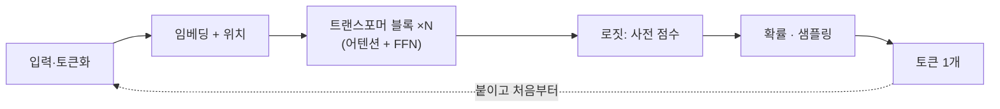
```mermaid
flowchart LR
  A[입력·토큰화] --> B[임베딩 + 위치]
  B --> C["트랜스포머 블록 ×N
(어텐션 + FFN)"]
  C --> D[로짓: 사전 점수]
  D --> E[확률 · 샘플링]
  E --> F[토큰 1개]
  F -. 붙이고 처음부터 .-> A
```
→ 위 머메이드 구조를 입력으로 사용해 생성:
Render the diagram defined by the structure above as a clean editorial diagram illustration. Follow the nodes and arrows EXACTLY. Rounded node cards (corner radius ~16, inner padding ~24) on a warm ivory background, 2px rounded connector lines with filled triangle arrowheads, at most 3 hierarchy levels. Accent the single key node «트랜스포머 블록 ×N (어텐션 + FFN)» in coral #E85C34; all other nodes neutral (soft ivory fill, light border). Render every Korean node label EXACTLY as written in the structure and add NO other words. Flat 2.5D editorial illustration (Anthropic/Claude aesthetic), warm ivory base + coral #D97757 accent, generous whitespace, premium and restrained. NOT photorealistic, NO 3D render, NO isometric, NO glassmorphism, NO neon. no watermark, no fake logos, no extra text beyond the node labels. Strict 16:9 aspect ratio, 1920×1080 landscape — NOT 4:3, NOT square.

- 소개용(전체 그림만). 단계 상세 설명은 슬라이드에서 생략 → 핸드아웃 안내.

### P15 답이 매번 다른 이유 — [생성 프롬프트] · 라이트 액센트 일러스트
- **스펙(공통 라이트 2단)**: title "같은 질문에도 답이 매번 다른 이유" · body=구성안 P15(확률 샘플링 + 운영자 조정 옵션 3종) · 강조 "Temperature / 반복 페널티 / logit bias" 3종을 코랄로(서브불릿) · 우측 비주얼=아래 프롬프트(3갈래 답), 우측 컬럼 contained.
```
A two-column light slide on WHITE (#FFFFFF). RIGHT: one question branching into three slightly different answers (three diverging paths), conveying "same question, slightly different result each time" due to probabilistic sampling. LEFT: room for title and bullets.
Then add ONLY these Korean texts as a clean, separate, legible typographic layer: top-left title (large, dark #1B1B1D) "같은 질문에도 답이 매번 다른 이유"; body "⑤단계에서 확률로 뽑기 때문 — 분포에서 샘플링"; three coral sub-items "Temperature · 반복 페널티 · logit bias (운영자가 API 옵션으로 조정)".
Flat 2.5D editorial illustration (Anthropic/Claude aesthetic), warm ivory base + coral #D97757 accent, soft simple shapes, generous whitespace, premium and restrained. Render all Korean text cleanly and legibly. NOT photorealistic, NO 3D render, NO isometric, NO glassmorphism, NO neon. no watermark, no fake logos. Strict 16:9 aspect ratio, 1920×1080 landscape — NOT 4:3, NOT square.
```

### P16 할루시네이션 — [생성 프롬프트] · 라이트 액센트 일러스트
- **스펙(공통 라이트 2단)**: title "할루시네이션: 왜 '자신 있게' 틀리나" · body=구성안 P16(가장 가까운 다음 토큰을 무조건 채움 → 엉뚱한 값이 가장 가까운 벡터가 되면 할루시네이션) · 강조 "무조건 채워야 한다"·"할루시네이션 발생" 클레이(#BC4319) · 우측 비주얼=아래 프롬프트(그럴듯하나 틀린 답+코랄 경고), 우측 컬럼 contained.
```
A two-column light slide on WHITE (#FFFFFF). RIGHT: an AI confidently presenting a plausible-looking but subtly wrong answer with a small coral warning mark (restrained, not alarmist). LEFT: room for title and bullets.
Then add ONLY these Korean texts as a clean, separate, legible typographic layer: top-left title (large, dark #1B1B1D) "할루시네이션: 왜 ‘자신 있게’ 틀리나"; body "가장 가까운(그럴듯한) 다음 토큰을 무조건 채워야 한다 — ‘모르겠다’ 멈춤이 없음"; a clay (#BC4319) line "엉뚱한 값이 가장 가까운 벡터가 되면 → 할루시네이션 발생".
Flat 2.5D editorial illustration (Anthropic/Claude aesthetic), warm ivory base + coral #D97757 accent, soft simple shapes, generous whitespace, premium and restrained. Render all Korean text cleanly and legibly. NOT photorealistic, NO 3D render, NO isometric, NO glassmorphism, NO neon. no watermark, no fake logos. Strict 16:9 aspect ratio, 1920×1080 landscape — NOT 4:3, NOT square.
```

### P17 확률을 유도한다 (도메인·role·전문용어) — [생성 프롬프트]
- **스펙(공통 라이트 2단)**: title "답을 더 잘 뽑는 법: 확률을 유도한다" · body=구성안 P17(도메인·role·전문용어 서브불릿) · 강조 "분포를 정답 쪽으로 좁히기" 하이라이트 · 우측 비주얼=아래 프롬프트(3직업 모자), 우측 컬럼 contained.
```
A two-column light slide on WHITE (#FFFFFF). RIGHT: the same AI head shown three times, each wearing a different professional hat (doctor, lawyer, marketer), each producing a visibly different colored output stream (conveying role/domain steers probability). LEFT: room for title and bullets.
Then add ONLY these Korean texts as a clean, separate, legible typographic layer: top-left title (large, dark #1B1B1D) "답을 더 잘 뽑는 법: 확률을 유도한다"; a highlighted line "분포를 정답 쪽으로 좁히기"; three coral sub-items "도메인 지식 주입 · role 부여 · 전문 용어 섞어 쓰기".
Flat 2.5D editorial illustration (Anthropic/Claude aesthetic), warm ivory base + coral #D97757 accent, soft simple shapes, generous whitespace, premium and restrained. Render all Korean text cleanly and legibly. NOT photorealistic, NO 3D render, NO isometric, NO glassmorphism, NO neon. no watermark, no fake logos. Strict 16:9 aspect ratio, 1920×1080 landscape — NOT 4:3, NOT square.
```

### P18 stateless (AI는 상태를 기억하지 않는다) — [생성 프롬프트]
- **스펙(공통 라이트 2단)**: title "AI는 상태를 기억하지 않는다 (stateless)" · body=구성안 P18(기억 없음·토큰 뭉치로만 동작 → 매 턴 맥락 다시 입력 → 보통 지난 대화 전체를 그대로) · 강조 "기억이 없다" 클레이·"지난 대화 전체를 다시 입력" 하이라이트 · 우측 비주얼=아래 프롬프트(대화 싸들고), 우측 컬럼 contained.
```
A two-column light slide on WHITE (#FFFFFF). RIGHT: a figure carrying the entire stack of the previous conversation back into a doorway every single turn, because the room behind forgets everything once the door closes (no memory; whole conversation re-sent each turn). LEFT: room for title and bullets.
Then add ONLY these Korean texts as a clean, separate, legible typographic layer: top-left title (large, dark #1B1B1D) "AI는 상태를 기억하지 않는다 (stateless)"; a clay (#BC4319) line "모델은 기억이 없다 — 오직 입력된 토큰 뭉치로만 동작"; a highlighted line "대화를 이어가려면 매 턴 지난 대화 전체를 다시 입력".
Flat 2.5D editorial illustration (Anthropic/Claude aesthetic), warm ivory base + coral #D97757 accent, soft simple shapes, generous whitespace, premium and restrained. Render all Korean text cleanly and legibly. NOT photorealistic, NO 3D render, NO isometric, NO glassmorphism, NO neon. no watermark, no fake logos. Strict 16:9 aspect ratio, 1920×1080 landscape — NOT 4:3, NOT square.
```

### P19 그 입력이 담기는 그릇 = 콘텍스트 윈도우 (한 호출 해부) — [생성 프롬프트·도식]
- **스펙(라이트 · 도식 중심)**: title "그 입력이 담기는 그릇 = 콘텍스트 윈도우" · body=구성안 P19(콘텍스트 윈도우 개념 소개 → system·tools·messages 3밴드) · 비주얼=하단 풀폭 또는 좌도식+우텍스트.
- 도식(세로 3밴드 + 캐시 경계). 텍스트 라벨이 많으니 **bake-first**(아래 프롬프트로 라벨 포함 생성), 깨지면 `render_slides.py`로 라벨만 복원.
```
A clean editorial diagram titled by a layout label, showing "one API call = one long input" as a single tall stacked container split top-to-bottom into THREE labeled bands:
top band "system" (small sub-labels: rules · CLAUDE.md · skills · date),
middle band "tools" (sub-label: schemas),
bottom band "messages" (sub-label: the conversation) — the bottom band is clearly the TALLEST and tinted coral with a small upward "grows each turn" arrow.
The top two bands are tinted TEAL (#1F6E78) — a stable, valuable "cached · reused (cost-saving)" zone, NOT a dead grey; a dashed horizontal "cache boundary" line separates the teal (front/stable) from the coral messages band.
Flat 2.5D editorial illustration (Anthropic/Claude aesthetic), warm ivory base, teal #1F6E78 for the cached bands and coral #D97757 for the growing messages band, soft simple shapes, generous whitespace, premium and restrained. NOT photorealistic, NO 3D render, NO isometric, NO glassmorphism, NO neon. Render the labels (system, tools, messages, "cached · reused", cache boundary) cleanly; no other garbled text, no watermark, no fake logos. Strict 16:9 aspect ratio, 1920×1080 landscape — NOT 4:3, NOT square.
```

### P20 100만 컨텍스트 시대, 하지만 길수록 비싸 — [라이트·텍스트 레이어]
- **레이아웃**: 라이트 단일 본문, 배경 `#FFFFFF`. 우상단(x≥1080)에 소형 비용 곡선 일러스트(본문 비침범). 카피 원문 = 구성안 P20.
- **텍스트 레이어 (좌표/타이포 — 깨지면 이 좌표로 스크립트 복원)**:
  - title "100만 컨텍스트 시대, 하지만 길수록 느리고 비싸다" — Pretendard 64px/700 `#1B1B1D` @x:120 y:120 (최대 2줄, 줄간격 1.2)
  - body 불릿 3개 — Pretendard 36px/400 `#1B1B1D` @BODY BOX(x:120 y:360 w:1680), 항목간격 20px, 마커=코랄 점 10px `#D97757`
  - 키워드 강조: **"제곱"** `#D97757` · "모든 토큰이 모든 앞 토큰을 ×N 레이어 계산" 형광 하이라이트 `#F8C6AE`(§8.2)
  - KEY MESSAGE "컨텍스트 길이를 적극 조절하세요" — §8.4 박스, 48px/600 `#BC4319`(클레이) @x:120 y:880
  - 푸터 `주식회사 덥덥덥 · ww-w.ai` 28px `#6E6D72` @x:120 y:1020 · 페이지번호(현재값만) @x:1800 y:1020
- **생성 프롬프트 (bake-first — 텍스트 포함, 깨지면 위 좌표로 복원)**:
```
A clean light editorial slide on a WHITE (#FFFFFF) background. First compose the illustration in the UPPER-RIGHT only: a small minimal flat 2.5D line chart whose curve rises STEEPLY (quadratic / cost explodes) toward the top-right, with a coral #D97757 warning marker near the top (conveying "subscription expires / API bill spikes"); keep the LEFT and CENTER open for text.
Then add ONLY these Korean texts as a clean, separate, legible typographic layer:
- top-left title (large, dark #1B1B1D): "100만 컨텍스트 시대, 하지만 길수록 느리고 비싸다"
- three bullets below (dark #1B1B1D, small coral round markers): "컨텍스트 윈도우가 100만 토큰까지 커졌다 — 하지만?" / "컨텍스트가 길수록 리소스를 ‘제곱’으로 쓴다 — 모든 토큰이 모든 앞 토큰을 ×N 레이어 계산" / "구독이 빨리 만료되거나 API 요금이 많이 나온다면"
- one coral key line near the bottom (#BC4319): "컨텍스트 길이를 적극 조절하세요"
Flat 2.5D editorial illustration (Anthropic/Claude aesthetic), warm ivory/white base + coral #D97757 accent, soft simple shapes, generous whitespace, premium and restrained. Render all Korean text cleanly and legibly. NOT photorealistic, NO 3D render, NO isometric, NO glassmorphism, NO neon. no watermark, no fake logos. Strict 16:9 aspect ratio, 1920×1080 landscape — NOT 4:3, NOT square.
```

### P21 그래서 캐싱이 비용을 줄인다 — [라이트·텍스트 레이어 + 도식]
- **레이아웃**: 라이트 2단, 배경 `#FFFFFF`. 좌측 Q&A 텍스트(x:120 w:800) + 우측 스택 비교 도식(우측 컬럼 x:972 w:828). 카피 원문 = 구성안 P21.
- **텍스트 레이어 (좌표/타이포)**:
  - title "그래서 캐싱이 비용을 줄인다" — Pretendard 64px/700 `#1B1B1D` @x:120 y:120
  - Q&A 2쌍 @LEFT BOX(x:120 y:340 w:800), 쌍 간격 40px: Q 라인 36px/600 `#1B1B1D`(코랄 `Q.` 마커 `#D97757`) / A 라인 34px/400 `#3A3A3D`, 들여쓰기 40px, 앞에 `→`
  - 키워드 강조: **"캐싱"** 코랄 · "5분 또는 1시간" 형광 하이라이트 `#F8C6AE`
  - 푸터 `주식회사 덥덥덥 · ww-w.ai` 28px `#6E6D72` @x:120 y:1020 · 페이지번호 @x:1800 y:1020
- **도식(우측, 스크립트 오버레이 — 생성 X)**: 두 호출의 입력 스택을 나란히 비교. 반복 앞부분(system·기존 대화)=**틸 `#1F6E78` "캐시·재사용"**, 새 부분만 **코랄 `#D97757`**. rect 밴드 2개 + 라벨 28px. 박스 @x:1010 y:300 w:760 h:520, 라운드 16.

### P22 토큰은 종류별로 값이 다르다 (API 비용) — [생성 프롬프트 + 가격표 텍스트 레이어]
- **레이아웃**: 라이트 2단, 배경 `#FFFFFF`. 좌측 가격표(텍스트 레이어) + 우측 4종 토큰 더미(생성, 우측 컬럼 x:972 w:828). 카피 원문 = 구성안 P22.
- **텍스트 레이어 (좌표/타이포)**:
  - title "토큰은 종류별로 값이 다르다 (API 비용 · Opus 4.8 기준)" — Pretendard 64px/700 `#1B1B1D` @x:120 y:120 (2줄 가능)
  - **가격표(스크립트 레이어 — 가격 갱신 쉽게)** @TABLE(x:120 y:360 w:780): 헤더행 32px/600 `#6E6D72`(종류 / 배수 / 가격), 본문행 5개 34px/400 `#1B1B1D`, 행높이 64px, 구분선 1px `#E5E3DC`:
    - input · ×1 · **$5** / output · ×5 · **$25** / cache write(5분) · ×1.25 · **$6.25** / cache write(1시간) · ×2 · **$10** / cache read · ×0.1 · **$0.50**
  - 강조: **"cache read ×0.1(1/10)"** 행 코랄 `#D97757` · "thinking = output 과금" 캡션 30px `#3A3A3D` @표 하단
  - 푸터 `주식회사 덥덥덥 · ww-w.ai` 28px `#6E6D72` @x:120 y:1020 · 페이지번호 @x:1800 y:1020
- **가격 정확성 주의**: 가격은 시점·모델 따라 바뀜 → 텍스트 레이어로 넣고 발표 직전 현행가 재확인. (확신도: claude-api 레퍼런스 캐시 2026-06-04 기준 — input $5/output $25, cache write 1.25×/2×, cache read 0.1×.)
- **생성 프롬프트 (bake-first — 가격표·텍스트 포함, 깨지면 위 좌표로 복원)**:
```
A clean light editorial slide on a WHITE (#FFFFFF) background, two-column. RIGHT column: four distinct flat 2.5D piles of tokens/coins (input, output, cache, thinking), product-shot style, contained in the right. LEFT column: leave room for a title and a price table.
Then add ONLY these Korean/ASCII texts as a clean, separate, legible typographic layer:
- top-left title (large, dark #1B1B1D): "토큰은 종류별로 값이 다르다 (API 비용 · Opus 4.8 기준)"
- a small 3-column price table below it (1M 토큰당): rows — "input · ×1 · $5" / "output · ×5 · $25" / "cache write(5분) · ×1.25 · $6.25" / "cache write(1시간) · ×2 · $10" / "cache read · ×0.1 · $0.50" (highlight the "cache read" row in coral #D97757)
- a small caption under the table (#3A3A3D): "thinking = output 과금"
Flat 2.5D editorial illustration (Anthropic/Claude aesthetic), warm ivory/white base + coral #D97757 accent, soft simple shapes, generous whitespace, premium and restrained. Render all text cleanly and legibly. NOT photorealistic, NO 3D render, NO isometric, NO glassmorphism, NO neon. no watermark, no fake logos. Strict 16:9 aspect ratio, 1920×1080 landscape — NOT 4:3, NOT square.
```

### P23 새 세션 = 새 프리랜서가 온다 — [생성 프롬프트]
- **레이아웃**: 라이트 2단, 배경 `#FFFFFF`. 좌측 본문(x:120 w:800) + 우측 프리랜서 일러스트(생성, 우측 컬럼 x:972 w:828). 카피 원문 = 구성안 P23.
- **텍스트 레이어 (좌표/타이포)**:
  - title "새 세션 = 새 프리랜서가 온다" — Pretendard 64px/700 `#1B1B1D` @x:120 y:120
  - body 불릿 3개(쥐여줄 3종) — 36px/400 `#1B1B1D` @LEFT BOX(x:120 y:360 w:800), 항목간격 24px, 마커 코랄 점 10px: **매뉴얼**=시스템·CLAUDE.md·rules / **툴**=agent·skill·mcp / **히스토리**=자동으로 안 옴 → 다음 페이지
  - 키워드 강조: **"히스토리는 자동으로 안 온다"** 형광 하이라이트 `#F8C6AE`
  - 푸터 `주식회사 덥덥덥 · ww-w.ai` 28px `#6E6D72` @x:120 y:1020 · 페이지번호 @x:1800 y:1020
- **생성 프롬프트 (bake-first — 텍스트 포함, 깨지면 위 좌표로 복원)**:
```
A clean light editorial slide on a WHITE (#FFFFFF) background, two-column. RIGHT column: a flat 2.5D scene of a new freelancer arriving at a desk on day one, handed a "manual/guide" box and a "tools" box, but the "history / past records" box is empty/missing (conveying a new session re-hands manual & tools but history does not carry over). LEFT column: leave room for title and bullets.
Then add ONLY these Korean texts as a clean, separate, legible typographic layer:
- top-left title (large, dark #1B1B1D): "새 세션 = 새 프리랜서가 온다"
- three bullets (dark #1B1B1D, coral round markers): "매뉴얼 = 시스템 프롬프트·CLAUDE.md·rules" / "툴 = agent·skill·mcp" / "히스토리 = 자동으로 안 옴 → 다음 페이지" (emphasize the last line)
Flat 2.5D editorial illustration (Anthropic/Claude aesthetic), warm ivory/white base + coral #D97757 accent, soft simple shapes, generous whitespace, premium and restrained. Render all Korean text cleanly and legibly. NOT photorealistic, NO 3D render, NO isometric, NO glassmorphism, NO neon. no watermark, no fake logos. Strict 16:9 aspect ratio, 1920×1080 landscape — NOT 4:3, NOT square.
```

### P24 맥락을 이어가는 노하우 — [생성 프롬프트(배경) + 텍스트 레이어]
- **레이아웃**: 라이트, 배경 `#FFFFFF`. 두 노하우 = 세로 적층 채팅 말풍선 카드 2개. 카피 원문 = 구성안 P24.
- **텍스트 레이어 (좌표/타이포 — 프롬프트가 길어 반드시 스크립트 레이어로, 이미지에 굽지 않음)**:
  - title "맥락을 이어가는 노하우" — Pretendard 64px/700 `#1B1B1D` @x:120 y:120
  - **카드 1 (요약·박제)** @x:120 y:300 w:1680 h:300, 라운드 20, 유저 말풍선(코랄 테두리 2px `#D97757`): 소제목 "① 요약·박제" 34px/700 `#D97757` + 프롬프트 예시(구성안 P24 1번 전문) 28px/400 `#1B1B1D`, 줄간격 1.5, 패딩 32px
  - **카드 2 (트랜스크립트 복원)** @x:120 y:640 w:1680 h:220, 동일 스타일: 소제목 "② 트랜스크립트 복원" 34px/700 `#D97757` + 프롬프트 예시(구성안 P24 2번 전문) 28px/400 `#1B1B1D`
  - 푸터 `주식회사 덥덥덥 · ww-w.ai` 28px `#6E6D72` @x:120 y:1020 · 페이지번호 @x:1800 y:1020
- **생성 프롬프트 (bake-first — 말풍선 안에 프롬프트 텍스트 포함; 단 텍스트가 길어 거의 항상 깨짐 → 위 좌표로 스크립트 복원이 정상 경로)**:
```
A clean light editorial slide on a WHITE (#FFFFFF) background. Compose two stacked chat-bubble cards (like a messaging app), soft rounded bubbles with a subtle coral #D97757 accent on the user bubble, generous whitespace.
Then add ONLY these Korean texts as a clean, separate, legible typographic layer:
- top-left title (large, dark #1B1B1D): "맥락을 이어가는 노하우"
- bubble 1 heading (coral #D97757): "① 요약·박제" + its body = the summary/handoff prompt example from 구성안 P24 (rendered in full, dark #1B1B1D)
- bubble 2 heading (coral #D97757): "② 트랜스크립트 복원" + its body = the transcript-restore prompt example from 구성안 P24
Flat 2.5D editorial illustration (Anthropic/Claude aesthetic), warm ivory/white base + coral #D97757 accent, soft simple shapes, premium and restrained. Render all Korean text cleanly and legibly. NOT photorealistic, NO 3D render, NO isometric, NO glassmorphism, NO neon. no watermark, no fake logos. Strict 16:9 aspect ratio, 1920×1080 landscape — NOT 4:3, NOT square.
```

### P25 토큰 비용 절약하기 (체크리스트) — [라이트·텍스트 레이어]
- **레이아웃**: 라이트, 배경 `#FFFFFF`. 좌측 4-체크리스트(x:120 w:1080) + 우상단 소형 4-아이콘(생성, x≥1280, 본문 비침범). 카피 원문 = 구성안 P25.
- **텍스트 레이어 (좌표/타이포)**:
  - title "토큰 비용 절약하기" — Pretendard 64px/700 `#1B1B1D` @x:120 y:120
  - 체크리스트 4항목 @BODY BOX(x:120 y:360 w:1080), 항목간격 28px: 번호 마커=코랄 원 40px `#D97757`(흰 숫자 24px/700) + 본문 36px/400 `#1B1B1D` 들여쓰기 64px — ① output 짧게(재가공은 스크립트) / ② context 크기 모니터링·제어 / ③ cache 안 깨지게(1h 지나면 새 세션) / ④ compact보다 새 세션+트랜스크립트 복구
  - 푸터 `주식회사 덥덥덥 · ww-w.ai` 28px `#6E6D72` @x:120 y:1020 · 페이지번호 @x:1800 y:1020
- **생성 프롬프트 (bake-first — 텍스트 포함, 깨지면 위 좌표로 복원)**:
```
A clean light editorial slide on a WHITE (#FFFFFF) background. RIGHT column: a small set of four flat 2.5D cost-saving icons — (1) a short concise output bar, (2) a context-size gauge, (3) a preserved cache shield, (4) a session-restore arrow — coral #D97757 accents, contained in the right. LEFT: leave room for title and a numbered checklist.
Then add ONLY these Korean texts as a clean, separate, legible typographic layer:
- top-left title (large, dark #1B1B1D): "토큰 비용 절약하기"
- a numbered checklist (coral round numbers ①②③④, dark #1B1B1D body): "① output 짧게 (재가공은 스크립트)" / "② context 크기 모니터링·제어" / "③ cache 안 깨지게 (1시간 지나면 새 세션)" / "④ compact보다 새 세션 + 트랜스크립트 복구"
Flat 2.5D editorial illustration (Anthropic/Claude aesthetic), warm ivory/white base + coral #D97757 accent, soft simple shapes, generous whitespace, premium and restrained. Render all Korean text cleanly and legibly. NOT photorealistic, NO 3D render, NO isometric, NO glassmorphism, NO neon. no watermark, no fake logos. Strict 16:9 aspect ratio, 1920×1080 landscape — NOT 4:3, NOT square.
```
- (트랜스크립트 개념은 강사 구두 + P29 실습에서 클로드코드에 직접 질의.)

### P26 claude-code-token-saver — [라이트·텍스트 레이어 + 실화면 입력]
- **레이아웃**: 라이트 2단, 배경 `#FFFFFF`. 좌측 본문(x:120 w:800) + 우측 스크린샷 카드(강사 첨부, 우측 컬럼 x:972 w:828). 카피 원문 = 구성안 P26.
- **텍스트 레이어 (좌표/타이포)**:
  - title "claude-code-token-saver" — Pretendard 64px/700 `#1B1B1D` @x:120 y:120
  - 서브 "토큰 낭비 자동 감지 → 비용 최대 45%↓" — 36px/600 `#D97757`(코랄) @x:120 y:200 ("45%" 강조)
  - body 불릿 3개 — 36px/400 `#1B1B1D` @LEFT BOX(x:120 y:340 w:800), 항목간격 22px, 마커 코랄 점: **Token Guardian** 캐시 만료 차단 / **/continue** 무료 복원 / **Usage 대시보드·statusline**
  - 도구 박스 `github.com/ww-w-ai/claude-code-token-saver` — 모노 28px `#D97757`, 코랄 테두리 1px 박스 @x:120 y:640 w:760 h:64 라운드 12
  - 푸터 `주식회사 덥덥덥 · ww-w.ai` 28px `#6E6D72` @x:120 y:1020 · 페이지번호 @x:1800 y:1020
- **우측 비주얼 = cc-token-saver 스크린샷(강사 첨부 예정)**: statusline 토큰 카운터 / `/continue` 복원 화면. 카드 테두리 1px `#E5E3DC` 라운드 16 @x:972 y:300 w:828 h:560.
- (씽킹 토큰 개념은 폐지 — 강사 구두로 토큰 개념 소개 시 함께 설명.)

### P27 추가 추천 도구 (AgentRunner·keeph·vmux) — [라이트·텍스트 레이어 + 실화면 입력]
- **레이아웃**: 라이트, 배경 `#FFFFFF`. 가로 3-카드 그리드. 카피 원문 = 구성안 P27.
- **텍스트 레이어 (좌표/타이포)**:
  - title "추가 추천 도구" — Pretendard 64px/700 `#1B1B1D` @x:120 y:120
  - **3개 도구 카드** — 카드 폭 520 h:440, 라운드 16, 테두리 1px `#E5E3DC`, 카드 간격 60px: 카드1 @x:120 / 카드2 @x:700 / 카드3 @x:1280, 공통 y:300. 각 카드: 아이콘/스크린샷 썸네일 상단(y+32, h:200) · 이름 40px/700 `#D97757`(y+260) — AgentRunner / keeph / vmux · 한 줄 설명 28px/400 `#1B1B1D`(y+320, 구성안 P27 각 한 줄)
  - 마무리 한 줄 "스스로 만들어 쓰는 시대 — 오픈소스로 참고하고 더욱 개선해보세요." — 36px/600 `#D97757` 가운데 정렬 @y:800
  - 푸터 `주식회사 덥덥덥 · ww-w.ai` 28px `#6E6D72` @x:120 y:1020 · 페이지번호 @x:1800 y:1020
- **비주얼**: 각 카드 썸네일 = 실화면 스크린샷(강사 첨부 예정) — AgentRunner 메뉴바 픽셀 캐릭터 / keeph 터미널 / vmux 앱 화면.

### P28 정리 — 단 한 개의 토큰이 인공지능의 정체이며 모든 것을 만든다 — [생성 프롬프트] · 라이트
- **레이아웃**: 라이트 hero, 배경 `#FFFFFF`/`#F0EEE6`. 점층 일러스트 풀폭 + 좌측 헤드라인. 카피 원문 = 구성안 P28.
- **텍스트 레이어 (좌표/타이포 — bake-first, 깨지면 이 좌표로 복원)**:
  - eyebrow "정리" — 32px/600 `#D97757`(코랄) @x:120 y:120
  - 메인 헤드라인 "단 한 개의 토큰이 인공지능의 정체이며 모든 것을 만든다" — 본명조 60px/700 `#1B1B1D` @x:120 y:180 (최대 3줄, 줄간격 1.25)
  - 점층 라벨(일러스트 위) "토큰 → 문장 → 문서 → 코드베이스 → 분신 에이전트" — 30px/500 `#3A3A3D`, 좌→우 흐름 위 작은 라벨
  - 마무리 한 줄 "정말 신기하지 않나요?" — 40px/600 `#D97757`(코랄) @x:120 y:760
  - 푸터 없음(hero) · 페이지번호(현재값만) @x:1800 y:1020
- 비주얼=라이트 점층 일러스트: 작은 토큰 하나 → 문장 → 문서 → 거대한 코드베이스 → 스스로 도는 에이전트(분신)로 단계적으로 커지는 좌→우 흐름. bake-first(텍스트 포함), 깨지면 제거→스크립트 복원.
```
A clean light editorial scene on a WHITE / warm ivory background: starting from a single small token/seed on the LEFT, it grows step by step to the RIGHT — first into a sentence, then a document, then a vast sprawling codebase, and finally into a small autonomous agent character that runs on its own (a "digital clone" working by itself) — conveying "one next-token, chosen by probability and repeated, grows into an entire codebase and then an autonomous agent". Warm ivory/white base (#FFFFFF, #F0EEE6), coral #D97757 accent marking the growth, soft simple shapes, generous whitespace, premium and restrained. Flat 2.5D editorial illustration (Anthropic/Claude aesthetic). NOT photorealistic, NO 3D render, NO isometric, NO glassmorphism, NO neon. Keep the LEFT-CENTER calmer for a headline.
Compose the background first, then add ONLY this text as a clean separate typographic layer, warm dark ink, large, left-of-center: "단 한 개의 토큰이 인공지능의 정체이며 모든 것을 만든다" and a smaller line "정말 신기하지 않나요?". Do NOT render any other words or labels.
no watermark, no garbled extra text, no fake logos. Strict 16:9 aspect ratio, 1920×1080 landscape — NOT 4:3, NOT square.
```

### P29 실습 — 내 세션에게 직접 물어보기 — [스크린샷/실화면 입력]
- **레이아웃**: 라이트, 배경 `#FFFFFF`. 좌측 질문 4개(x:120 w:1080) + 우측/하단 터미널 실화면 카드. 카피 원문 = 구성안 P29.
- **텍스트 레이어 (좌표/타이포)**:
  - title "내 세션에게 직접 물어보기" — Pretendard 64px/700 `#1B1B1D` @x:120 y:120
  - 🔧 **실습 칩(§8.6)** — 코랄 pill `#D97757`(흰 글씨 24px "실습") @x:120 y:96 (title 위) 또는 title 우측
  - 질문 4개 @BODY BOX(x:120 y:360 w:1080), 항목간격 24px: 번호 마커=코랄 원 40px `#D97757` + 질문 본문 30px/400 `#1B1B1D` 들여쓰기 64px — ① 트랜스크립트 위치 / ② 플러그인·스킬·에이전트·날짜의 콘텍스트 위치 / ③ 90만 토큰 매 호출 재전송·멀티턴 비용 / ④ cc-token-saver 소스 분석·리포트
  - 푸터 `주식회사 덥덥덥 · ww-w.ai` 28px `#6E6D72` @x:120 y:1020 · 페이지번호 @x:1800 y:1020
- **비주얼 = 터미널 실화면 카드(강사 첨부 입력)** @우측 또는 하단, 카드 테두리 1px `#E5E3DC` 라운드 16:
```
→ 제공한 터미널 스크린샷을 입력으로 사용해 생성 (bake-first — 제목·질문 텍스트 포함, 깨지면 위 좌표로 복원):
A clean light editorial slide on a WHITE (#FFFFFF) background. RIGHT/bottom: present the provided terminal screenshot as a clean close-up terminal card on warm ivory (rounded corners), question text legible.
Then add ONLY these Korean texts as a clean, separate, legible typographic layer:
- top-left title (large, dark #1B1B1D): "내 세션에게 직접 물어보기", with a small coral "실습" pill badge next to it
- a numbered question list (coral round numbers, dark #1B1B1D): "① 현재 세션의 트랜스크립트는 어디에 저장되나요?" / "② 플러그인·스킬·에이전트·오늘 날짜는 콘텍스트의 어디에 담기나요?" / "③ 90만 토큰이면 매 호출마다 다 전송되나요? 멀티턴·툴 콜링 비용은?" / "④ claude-code-token-saver 소스를 분석해 효과·원리를 리포트로"
Flat editorial style, warm ivory/white base + coral #D97757 accent, premium and restrained. Render all Korean text cleanly and legibly. no watermark, no fake logos. Strict 16:9 aspect ratio, 1920×1080 landscape — NOT 4:3, NOT square.
```

---

## [2부] 원리에서 실전으로 — 하네스  *(P30부터 2부 시작)*

### P30 하네스의 핵심 3요소 (가로 타임라인) — [생성 프롬프트·도식] · 2부 도입
- **스펙(라이트 · §13 timeline + three-column)**: 상단 eyebrow "2부 · 원리에서 실전으로"(코랄) · title "하네스의 핵심 3요소" · body=구성안 P30. (2부의 여는 슬라이드 — 원리→실전 전환)
- **메인 비주얼 = 가로 타임라인** (2025 → 26 Q1 → Q2 → Q3 직전): 각 시점 위에 단계가 차례로 쌓이는 형태 —
  - 2025 프롬프트 엔지니어링 → **Q1 ① 콘텍스트 엔지니어링** → **Q2 ② 멀티턴 제어·구현** → **Q3 직전(지금) ③ state 부여·관리**.
  - **'지금=③ state 관리'를 코랄로 강조**(현재 시점 마커). 각 단계 한 줄 설명.
- KEY MESSAGE "좋은 프롬프트 한 줄 → 콘텍스트·멀티턴·state를 설계·운영하기"(§8.4) · 하단에 → Part(bkit·수지·Sprint)로 이어짐.
- (보조) 하네스 루프 머메이드는 '멀티턴 제어' 요소의 작은 보조 일러스트로만.
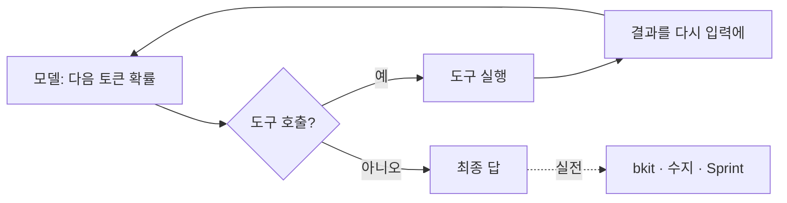
```mermaid
flowchart LR
  M[모델: 다음 토큰 확률] --> T{도구 호출?}
  T -- 예 --> TOOL[도구 실행] --> R[결과를 다시 입력에]
  R --> M
  T -- 아니오 --> A[최종 답]
  A -. 실전 .-> PARTS[bkit · 수지 · Sprint]
```
→ 위 머메이드 구조를 입력으로 사용해 생성:
Render the diagram defined by the structure above as a clean editorial diagram illustration. Follow the nodes and arrows EXACTLY. Rounded node cards (corner radius ~16, inner padding ~24) on a warm ivory background, 2px rounded connector lines with filled triangle arrowheads, at most 3 hierarchy levels. Accent the single key node «모델: 다음 토큰 확률» in coral #E85C34; all other nodes neutral (soft ivory fill, light border). Render every Korean node label EXACTLY as written in the structure and add NO other words. Flat 2.5D editorial illustration (Anthropic/Claude aesthetic), warm ivory base + coral #D97757 accent, generous whitespace, premium and restrained. NOT photorealistic, NO 3D render, NO isometric, NO glassmorphism, NO neon. no watermark, no fake logos, no extra text beyond the node labels. Strict 16:9 aspect ratio, 1920×1080 landscape — NOT 4:3, NOT square.

---

## [챕터 3] 하네스 시대의 개발 자율주행 (bkit)  *(P31–P60 · 홀짝 미적용 · 코랄/아이보리)*

> **공통 스펙**: 라이트 콘텐츠 페이지(설명/도식)는 **[기초] 공통 — 라이트 2단 콘텐츠 페이지 스펙**(이 문서 위쪽)을 그대로 따른다 — 배경 `#FFFFFF`, title Pretendard 64px/700 `#1B1B1D` @x:120 y:120, body 36px/400 @좌컬럼(x:120 w:828), 우측 비주얼 contained(x:972 w:828), 마커 코랄 점 10px `#D97757`, 키워드 하이라이트 `#F8C6AE`, 강한 부정 클레이 `#BC4319`, KEY MESSAGE 박스 48px/600, 푸터 `주식회사 덥덥덥 · ww-w.ai` `#6E6D72` @x:120 y:1020 · 페이지번호 @x:1800 y:1020. 각 페이지는 *다른 점만* 명시.
> **일러스트 스타일(전 페이지 MUST)**: flat 2.5D 에디토리얼(Anthropic/Claude 톤) · warm ivory/베이지(#F0EEE6·#FFFFFF) + coral #D97757 액센트 · 매트(무광) · 금지: 3D·광택·유리/네온·사실 음영·다색 남발. 컬러 의미 구분이 본질인 곳만 절제된 다색 허용.
> **PDF 재현 주의**: 원 PDF(파란 액센트)의 레이아웃은 참고하되 **색은 전부 코랄/아이보리로 치환**. 숫자는 최신(44 스킬·34 에이전트). ⭐ = 생태계 신기술 슬라이드.

### P31 챕터 divider — [생성 프롬프트] · 다크 + 드라마틱 이미지
- P2·P11과 **동일 규격**(숫자·제목 크기·위치 일치). 스크립트 합성 좌표: number 본명조 290px `#F87145` @x:120 baseline y:708 · title.divider 본명조 120px `#F4F4F1` @x:120 y:747 · subtitle 36px `#C8C8C4` @x:120 y:893.
```
A cinematic dark editorial scene evoking "turning a tangled idea into a shippable app": faint coral light threads converging from chaos into a clean structured form on the RIGHT; keep the LEFT and LOWER area deep near-black (#141417 to #0E0E11) for large title text. Premium, restrained. Flat 2.5D editorial illustration (Anthropic/Claude aesthetic), warm coral #D97757 accent glints, soft simple shapes, generous whitespace. NOT photorealistic, NO 3D render, NO isometric, NO glassmorphism, NO neon.
Compose the background first, then add ONLY these texts as a clean separate typographic layer on the LEFT, warm off-white (number in coral, title in a serif/본명조 style): a large number "3" on top (height ≈ 1.6× the title, clear gap, NOT touching the title), then the title "하네스 시대의 개발 자율주행", then a smaller subtitle "bkit". Do NOT render any other words.
no watermark, no garbled extra text, no fake logos. Strict 16:9 aspect ratio, 1920×1080 landscape — NOT 4:3, NOT square.
```

### P32 bkit 소개 — [실화면 입력(스크린샷)] · GitHub 첫 페이지
- **입력 이미지 = 발표자가 당일 직접 캡처한 GitHub repo 첫 페이지 스크린샷** (`github.com/popup-studio-ai/bkit-claude-code`). 생성 이미지 아님 — 실화면 합성.
- 레이아웃: 좌측 텍스트 레이어 + 우측에 스크린샷을 contained 카드(라운드 16, 그림자 약, x:972 w:828)로 배치. 스크린샷 위/아래 여백 균등.
- title 텍스트 레이어 64px/700 `#1B1B1D` @x:120 y:120 "bkit 소개". 리드 subtitle 40px/500 `#57565A` @x:120 y:300 "비개발자를 위한 자율 개발 하네스".
- 소셜 프루프 배지(좌측 본문, 코랄 점 마커): "⭐ 563 stars" · "🍴 150 forks" · "100% 오픈소스 · 무료" — **발표 당일 최신 수치로 갱신**(2026-06-29 기준값).
- KEY MESSAGE 48px/600 "코드를 몰라도, 팀처럼 돌아가는 개발 공정을 한 사람이 굴린다."
- repo URL 모노 28px `#6E6D72`: `github.com/popup-studio-ai/bkit-claude-code`.

### P33 PDCA란? bkit의 핵심 엔진 — [생성 프롬프트·도식] (개념+사이클 도식 통합)
- title 텍스트 레이어 "PDCA란? — bkit이 개발에 적용한 핵심 엔진" @x:120 y:120. 좌측 본문 불릿(코랄 점): "**PDCA = Plan → Do → Check → Act** — 제조업 품질관리의 반복 사이클" / "bkit은 이를 **개발 절차 그 자체로** 적용 — 명령으로 강제" / "감으로 시키면 매번 다른 품질 → **공정으로 쪼개면 매번 같은 품질**(반복 가능)". 우측에 PDCA 순환 도식. KEY MESSAGE "Match Rate 90% 미달이면 자동 개선 반복". 키워드 `매번 같은 품질` 하이라이트 `#F8C6AE`.
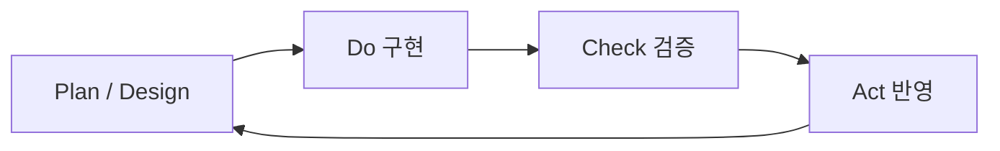
```mermaid
flowchart LR
  P[Plan / Design] --> D[Do 구현] --> C[Check 검증] --> A[Act 반영] --> P
```
→ 위 머메이드 구조를 입력으로 사용해 생성(우측 배치): Render the diagram as a clean editorial circular PDCA loop. Follow nodes and arrows EXACTLY. Rounded node cards (radius ~16, padding ~24) on warm ivory, 2px rounded connector lines with filled arrowheads. Accent the «Plan / Design» node in coral #E85C34; others neutral ivory. Place small command-style labels near each node: "/pdca plan·design" by Plan, "/pdca do" by Do, "/code-review · /pdca analyze" by Check, "/pdca report" by Act. Add a small coral callout near Check: "Match Rate 90% 기준". Render every Korean label EXACTLY. Flat 2.5D editorial illustration, warm ivory base + coral accent, generous whitespace. NOT photorealistic, NO 3D, NO isometric, NO glassmorphism, NO neon. no watermark, no fake logos. Strict 16:9 1920×1080 — NOT 4:3, NOT square. composition: diagram contained in the RIGHT HALF, LEFT HALF for text.

### P35 PDCA 실제 사례: "로그인 기능 만들어줘" — [생성 프롬프트·도식] (5단계 가로 흐름)
- title 텍스트 레이어 "PDCA 실제 사례 — \"로그인 기능 만들어줘\" 한 마디로" @x:120 y:120. 상단 좌측에 요청 말풍선 `"로그인 기능 만들어줘"`(코랄 테두리) + 그 아래 작은 회색 주석 "자연어로 발동 (명시: `/pdca plan 로그인`)". 그 아래 P→D→C→A 4단계 가로 카드, 각 카드에 로그인 예시 산출물 라벨(텍스트 레이어 권장). KEY MESSAGE 하단 "한 마디 → 기획·구현·검증·반영 완결 = 비개발자를 개발자처럼".
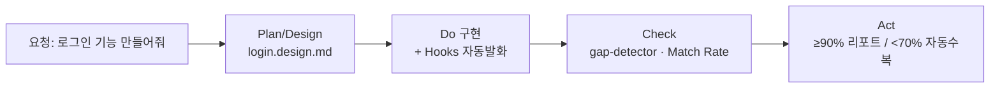
```mermaid
flowchart LR
  R["요청: 로그인 기능 만들어줘"] --> P["Plan/Design<br/>login.design.md"] --> D["Do 구현<br/>+ Hooks 자동발화"] --> C["Check<br/>gap-detector · Match Rate"] --> A["Act<br/>≥90% 리포트 / <70% 자동수복"]
```
→ 위 머메이드 구조를 입력으로 사용해 생성: Render as a clean editorial LEFT-to-RIGHT 5-stage flow. A coral-outlined speech bubble "로그인 기능 만들어줘" starts the flow, then four rounded stage cards labeled P · Plan/Design → D · Do → C · Check → A · Act, connected by 2px rounded arrows with filled arrowheads. Under each card a small example artifact label: "login.design.md" (Plan), "Hooks 자동발화" (Do), "Match Rate 측정" (Check), "≥90% 리포트 / <70% 자동수복" (Act). Accent the speech bubble and the Act card in coral #D97757; the rest soft ivory. Render every Korean label EXACTLY. Flat 2.5D editorial illustration (Anthropic/Claude aesthetic), warm ivory base + coral accent, generous whitespace, premium and restrained. NOT photorealistic, NO 3D render, NO isometric, NO glassmorphism, NO neon. no watermark, no fake logos. Strict 16:9 aspect ratio, 1920×1080 landscape — NOT 4:3, NOT square.

### P36 Sprint 개념 ①: PDCA → Sprint 진화 (메타 컨테이너) — [생성 프롬프트·도식]
- title 텍스트 레이어 "Sprint 개념 ① — PDCA → Sprint 진화 (메타 컨테이너)" @x:120 y:120. 좌측에 단일 PDCA 루프, 큰 코랄 화살표("진화") → 우측에 Sprint 컨테이너(여러 기능 PDCA를 감싼 박스, **컨테이너 선두에 "PRD" 단계 칩** = 단일 PDCA엔 없던 추가). 하단 명령 라벨 `/sprint init … --trust L3` + Trust L0~L4 다이얼. KEY MESSAGE "여러 기능을 한 컨테이너로 — PRD로 왜·누구를 못박고, Trust로 무인 범위 정한다".
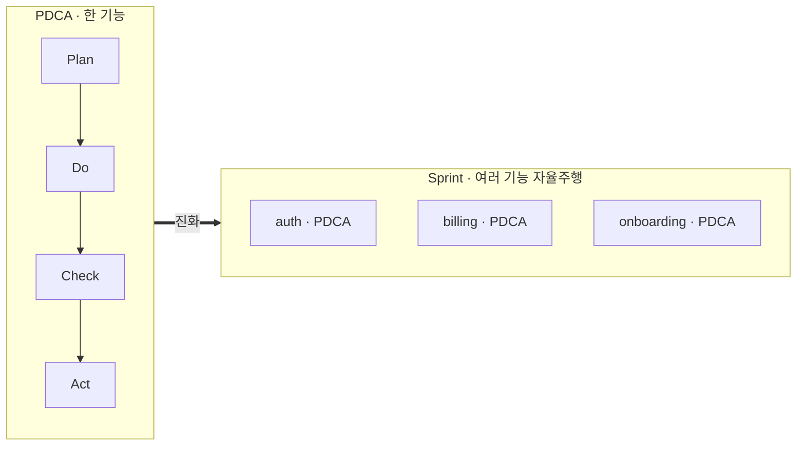
```mermaid
flowchart LR
  subgraph ONE["PDCA · 한 기능"]
    P1[Plan]-->D1[Do]-->C1[Check]-->A1[Act]
  end
  ONE ==진화==> S
  subgraph S["Sprint · 여러 기능 자율주행"]
    F1["auth · PDCA"]
    F2["billing · PDCA"]
    F3["onboarding · PDCA"]
  end
```
→ 위 머메이드 구조를 입력으로 사용해 생성: LEFT side = a single small circular PDCA loop (Plan→Do→Check→Act). A large coral (#D97757) arrow labeled "진화" points RIGHT to a rounded container box labeled "Sprint" that holds three stacked mini PDCA-loop cards labeled "auth", "billing", "onboarding" — conveying "PDCA evolves into Sprint: many features run autonomously under one container". Below, a small command label "/sprint init … --trust L3  →  /sprint start" and a tiny dial marked L0–L4. Accent the big arrow and the Sprint container in coral; loops/cards soft ivory. Render every Korean/label EXACTLY. Flat 2.5D editorial illustration (Anthropic/Claude aesthetic), warm ivory base + coral accent, generous whitespace, premium and restrained. NOT photorealistic, NO 3D render, NO isometric, NO glassmorphism, NO neon. no watermark, no fake logos. Strict 16:9 aspect ratio, 1920×1080 landscape — NOT 4:3, NOT square.

### P40 Sprint 개념 ⑤: 자율주행을 받치는 측정 & 안전벨트 — [생성 프롬프트·도식]
> **현행 = 하이브리드**(P38·P39와 동일 원칙): 게이지 3카드(좌)·iterate 루프+3한계 칩(우)만 이미지 crop(`assets/P40-left.png`·`P40-right.png`), 제목·좌우 헤더·"상태 보존 → /sprint resume" 펄·KEY MESSAGE·푸터는 HTML(crisp). **생성 프롬프트 전문 = `generated/prompts/P40.md`.** (전면 이미지 1회 생성 → 텍스트 crisp 부분만 HTML로 교체.)
- 좌측 = **성공지표 3축**: ① `matchRate`(설계↔구현·기능별·**90%**·자동·PDCA부터) ② `S1·7-Layer dataFlow QA`(기능 간 통합·**목표 100%**·자동·**Sprint 신규**) ③ `제품·성과 지표`(**PRD에서 정의한 항목 평가**·제품별·정량/정성·**PRD 신규**).
- 우측 = **자율주행 로직**: `자동 반복(iterate)`(성공지표 달성이 목표) → 멈춤 **3한계**(iterate 5회 소진 · 예산 1M 초과 · 타임아웃 4h) → `상태 보존 → /sprint resume`.
- title "Sprint 개념 ⑤ — 자율주행을 받치는 측정 & 안전벨트" @x:120 y:120 · KEY MESSAGE "성공지표를 향해 스스로 반복하고, 멈춤 한계가 있어야 자리를 비워도 안전".
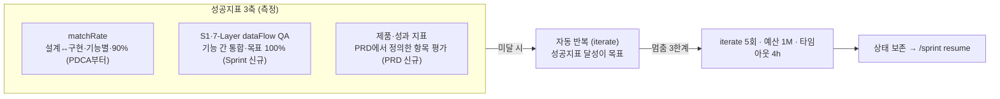
```mermaid
flowchart LR
  subgraph M["성공지표 3축 (측정)"]
    M1["matchRate\n설계↔구현·기능별·90% (PDCA부터)"]
    M2["S1·7-Layer dataFlow QA\n기능 간 통합·목표 100% (Sprint 신규)"]
    M3["제품·성과 지표\nPRD에서 정의한 항목 평가 (PRD 신규)"]
  end
  M -->|미달 시| IT["자동 반복 (iterate)\n성공지표 달성이 목표"]
  IT -->|멈춤 3한계| L["iterate 5회 · 예산 1M · 타임아웃 4h"]
  L --> RS["상태 보존 → /sprint resume"]
```

### P41 Sprint 실제 사례: bkit이 자기 문서를 자율주행으로 (dogfooding) — [생성 프롬프트·도식]
- title 텍스트 레이어 "Sprint 실제 사례 — bkit이 자기 문서를 자율주행으로 만들다" @x:120 y:120. 상단 명령 라벨 `/sprint init v2113-docs-sync --features f0…f9 --trust L4` + 작은 배지 "10 features · Trust L4 완전자동". 본문: 10개 기능(f0~f9)을 묶은 Sprint 컨테이너가 `prd→plan→design→do→iterate→qa→report→archived`를 무인 완주 → 우측에 **아카이브된 산출물 묶음 아이콘**(master-plan·PRD·plan·design·report). "자리 비움(무인)" 아이콘. dogfooding 모티프(bkit이 bkit을 가리키는 순환 화살표). KEY MESSAGE "기능 목록만 줬더니 bkit이 자기 자신을 무인으로 릴리스했다". 하단 캡션 "도구가 도구를 만든 자가 검증".
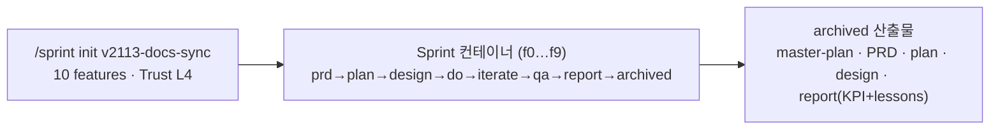
```mermaid
flowchart LR
  CMD["/sprint init v2113-docs-sync\n10 features · Trust L4"] --> S["Sprint 컨테이너 (f0…f9)\nprd→plan→design→do→iterate→qa→report→archived"]
  S --> A["archived 산출물\nmaster-plan · PRD · plan · design · report(KPI+lessons)"]
```
→ 위 머메이드 구조를 입력으로 사용해 생성: A clean editorial slide conveying "bkit builds its own docs autonomously (dogfooding)". TOP: a command bar "/sprint init v2113-docs-sync … --trust L4" with a small badge "10 features · L4". CENTER: a large rounded "Sprint" container holding a row of ten tiny feature chips (f0…f9), with the phase path "prd→plan→design→do→iterate→qa→report→archived" running through it LEFT to RIGHT, unattended (small person-away icon). RIGHT: an "archived" output bundle stack labeled "master-plan · PRD · plan · design · report". Add a subtle circular arrow motif where a small bkit logo points back at itself (self-validation). Convey "the tool built itself, hands-off, and left full evidence". Accent the command bar, the container outline, and the archived bundle in coral #D97757; feature chips soft ivory. Render every label EXACTLY. Flat 2.5D editorial illustration (Anthropic/Claude aesthetic), warm ivory base + coral accent, generous whitespace, premium and restrained. NOT photorealistic, NO 3D render, NO isometric, NO glassmorphism, NO neon. no watermark, no fake logos. Strict 16:9 aspect ratio, 1920×1080 landscape — NOT 4:3, NOT square.

### P42 코딩 전에 '기획서'부터: 혼자가 아니라 팀이 — [생성 프롬프트·도식]
- title 텍스트 레이어 "코딩 전에 '기획서'부터 — 혼자가 아니라 팀이" @x:120 y:120. **3행 구조** (각 행: 왼쪽 라벨 칩 + 오른쪽 작은 도식). 하단 공통 흐름 라벨 "`plan-plus`(불필요 기능 덜기) → `/pdca plan`".
  - Row 1 라벨 "기능 1개": **PM 팀(`pm-lead`)** 4명이 분업해 PRD 작성 — `pm-discovery`(문제발굴)·`pm-strategy`(전략)·`pm-research`(조사)·`pm-prd`(정리). 명령 `/pdca pm`.
  - Row 2 라벨 "기능 N개 (Sprint)": 명령 `/sprint init … --features a,b,c --trust L3` → 내부 **`sprint-master-planner`**가 여러 기능을 "무엇을 먼저·무엇을 같이"의 순서/동시진행 타임라인 = **마스터플랜**으로 정리. (실행 `/sprint start`)
  - Row 3 라벨 "둘 다 공통": 검증된 기획 틀(JTBD·린캔버스 등 43종) → `plan-plus`(YAGNI) → `/pdca plan`.
```
A clean editorial slide on WHITE (#FFFFFF) with THREE horizontal rows, each a left coral label chip + a small right-side diagram.
Row 1 — left chip "기능 1개": a coral-bordered team frame "PM 팀 (pm-lead)" with four small member tags "pm-discovery 문제발굴 · pm-strategy 전략 · pm-research 조사 · pm-prd 정리" producing a document "PRD"; small command tag "/pdca pm".
Row 2 — left chip "기능 N개 (Sprint)": a command tag "/sprint init … --features a,b,c --trust L3" feeding a frame "sprint-master-planner" that produces a small horizontal timeline of feature blocks showing order + parallel rows, labeled "마스터플랜 (무엇을 먼저·무엇을 같이)"; small run tag "/sprint start".
Row 3 — left chip "둘 다 공통": a pill "plan-plus (불필요 기능 덜기 · YAGNI)" → a document "/pdca plan 구체 실행계획"; small caption "검증된 기획 틀 43종 (JTBD·린캔버스 등)".
Accent the two team/planner frames and the command tags in coral #D97757; documents soft ivory. Render every Korean/command label EXACTLY. Flat 2.5D editorial illustration (Anthropic/Claude aesthetic), warm ivory base + coral accent, 2px connectors, generous whitespace, premium and restrained. NOT photorealistic, NO 3D render, NO isometric, NO glassmorphism, NO neon. no watermark, no fake logos. Strict 16:9 aspect ratio, 1920×1080 landscape — NOT 4:3, NOT square.
```

### P43 오버엔지니어링 피하기 — [라이트·텍스트 레이어 + 도식]
- 공통 라이트 2단. title "오버엔지니어링 피하기 — 레벨 + 모델 라우팅". 좌 body: 레벨 3단 "starter(정적) / dynamic(풀스택·BaaS) / enterprise(MSA·K8s)" + "**개인·소규모는 앞 두 칸**, 처음부터 엔터프라이즈는 독" 하이라이트. 하단 1줄 "Output Styles: 레벨별 응답 스타일도 자동 추천". 우측 비주얼=모델 3엔진 도식.
```
A clean light editorial slide on WHITE (#FFFFFF), RIGHT half: three labeled engine/dial icons stacked — "Opus (설계·복잡추론)", "Sonnet (구현·반복)", "Haiku (잡일)" — with a small cost/speed dial; accent "Opus" in coral #D97757, others neutral ivory. LEFT half empty for text. Flat 2.5D editorial illustration (Anthropic/Claude aesthetic), warm ivory base + coral accent, soft shapes, generous whitespace. NOT photorealistic, NO 3D render, NO isometric, NO glassmorphism, NO neon. Render the 3 Korean labels cleanly. no watermark, no fake logos. Strict 16:9 1920×1080 — NOT 4:3, NOT square. composition: contained in the RIGHT HALF, LEFT HALF empty.
```

### P44 앱 종류별 최적 프레임워크 — [생성 프롬프트·도식] (PDF p4 재현·코랄화)
- title 텍스트 레이어 "본격 개발 전, 최적의 프레임워크를 설정한다". 하단 화살표 라벨 "환경 설정(/starter·/dynamic·/enterprise) → PDCA 사이클 진입". (1줄) "dynamic = bkend.ai BaaS 5종으로 로그인·DB·스토리지 즉시".
```
A clean editorial 2-column comparison table on WHITE (#FFFFFF): left column header "mobile-app" with two rows "Expo" (tagged "Tier 1 ★ 최우선 추천" in a coral #D97757 pill) and "Flutter" (tagged "Tier 2 · 대안" neutral); right column header "desktop-app" with rows "Tauri" (caption "3MB, Rust 기반 초경량") and "Electron" (caption "성숙하고 방대한 생태계"). Below the table, a wide coral arrow from a box "환경 설정 (/starter · /dynamic · /enterprise 레벨 선택)" to a box "PDCA 사이클 진입". Flat 2.5D editorial style, warm ivory base + coral accent (only Tier 1 pill + arrow coral), thin 1px table borders, generous whitespace, premium. Render all labels cleanly. NOT photorealistic, NO 3D, NO neon. no watermark, no fake logos. Strict 16:9 1920×1080 — NOT 4:3, NOT square.
```

### P45 ⭐ 31개 에이전트 오케스트레이션 — [생성 프롬프트·도식] (PDF p6 재현·코랄화)
- title 텍스트 레이어 "에이전트를 완벽하게 지휘하는 오케스트레이션" + 서브 "단일 기능 내에서 에이전트들이 동시 다발로 작성·검증". 명령 라벨 "/pdca team my-feature". (1줄) "CC의 subagents + /workflows 위에서 — 캐시 최적화는 핸드아웃".
```
A clean editorial orchestration diagram on WHITE (#FFFFFF): a central dark circle "CTO Lead (Opus)"; an arrow LEFT to a pentagon cluster "PM Team (5 Agents) / 방향 설정"; an arrow RIGHT to a triangle cluster "QA Team (Council) / 교차 검증"; an arrow DOWN to a dense coral (#D97757) node-cloud "Do Swarm / 역할 분담·동시 코드 작성 (Sonnet/Haiku)". Bottom-left small list "단계별 패턴: Plan=Leader · Do=Swarm · Check=Council". Flat 2.5D editorial illustration (Anthropic/Claude aesthetic), warm ivory base + coral accent (only the Do-Swarm cloud is coral; CTO circle dark charcoal), thin connectors, generous whitespace, premium. Render all Korean labels cleanly. NOT photorealistic, NO 3D render, NO isometric, NO glassmorphism, NO neon. no watermark, no fake logos. Strict 16:9 1920×1080 — NOT 4:3, NOT square.
```

### P46 완벽을 향한 3중 검증 — [생성 프롬프트·도식] (PDF p7 확장·코랄화)
- title 텍스트 레이어 "완벽을 향한 3중 검증: 정적 · 동적 · 구조화". 하단 흐름 라벨 "Do → /code-review → /pdca analyze (Sprint면 qa-lead 팀)". 우상단 작은 코랄 프레임 "QA Team: qa-lead → test-planner·test-generator·monitor·debug-analyst + sprint-qa-flow(S1 dataFlow)".
```
A clean editorial slide on WHITE (#FFFFFF) split into three stacked rows, each a verification mode:
Row 1 정적 "/code-review": a magnifier over a code snippet card; caption bullets "코드 정독→문제 사전 탐지 · 품질·버그·보안·성능 · confidence 90%↑만 보고".
Row 2 동적 "/zero-script-qa": a server with Docker logs ([INFO]/[WARN]/[ERROR]) and a rising line from "30%" to "89%"; caption "테스트 코드 0줄 · Docker 로그 실시간 분석".
Row 3 구조화 "/qa-phase": a small test pyramid labeled "L1 단위 · L2 통합 · L3 계약 · L4 시스템 · L5 E2E".
TOP-RIGHT: a small coral-bordered team frame "QA Team (qa-lead)" listing chips "test-planner · test-generator · monitor · debug-analyst · sprint-qa-flow(S1 dataFlow)" — conveying a QA team runs the 3 modes.
Flat 2.5D editorial illustration (Anthropic/Claude aesthetic), warm ivory base + coral #D97757 accent (the 89% line + L-pyramid apex + QA Team frame coral), soft shapes, generous whitespace, premium. Render all Korean/ASCII labels cleanly. NOT photorealistic, NO 3D render, NO isometric, NO glassmorphism, NO neon. no watermark, no fake logos. Strict 16:9 1920×1080 — NOT 4:3, NOT square.
```

### P47 무인일수록 검증이 핵심 — [라이트·텍스트 레이어 + 도식] ★
- 공통 라이트. title "무인일수록 검증이 핵심 — 스스로 재고 스스로 고친다". body: "**설계 먼저(Docs=Code)** → 설계-구현 갭을 matchRate로 측정 → **90% 미만이면 자동 수복(최대 5회)**" / "사람이 못 보는 환경일수록 자동 검증+자가수복이 안전벨트". KEY MESSAGE "품질을 막는 게이트 M1~M10 — 하나라도 미달이면 멈춘다(Sprint면 +S1~S4)". "자동 수복(최대 5회)" 하이라이트.
- 우측 비주얼=자가수복 루프 작은 도식: `A small flat 2.5D loop: gap-detector measures "matchRate" → if below 90% → pdca-iterator auto-fixes → re-measures, looping up to 5× until it passes; coral (#D97757) accent on the passing exit. warm ivory base. NOT photorealistic, NO 3D, NO neon. contained upper-right. Strict 16:9 1920×1080.`

### P48 전문가 에이전트 군단 — [생성 프롬프트·도식]
- title 텍스트 레이어 "전문가 에이전트 군단 — 알맞은 전문가가 자동 투입" @x:120 y:120. 좌측 본문 1줄 "34 에이전트 = 자동 호출되는 전문가팀 · 역할을 다 몰라도 bkit이 부른다". 우측에 중앙 사용자(자연어 한 줄) → 둘레로 전문가 에이전트 카드들이 상황 따라 점등하는 도식.
```
A clean editorial diagram on WHITE (#FFFFFF): a central user node ("자연어 요청") in the middle, surrounded by a ring of specialist-agent cards that light up by context. Cards labeled "enterprise-expert 아키텍처", "infra-architect 인프라", "frontend-architect UI", "bkend-expert 인증·DB·API", "security-architect 보안", "code-analyzer 코드품질", "design-validator 설계검증". A few cards glow coral (#D97757) (the auto-activated ones); the rest soft ivory. Convey "the right expert is auto-summoned by context — you don't need to know all roles". Render every Korean/label EXACTLY. Flat 2.5D editorial illustration (Anthropic/Claude aesthetic), warm ivory base + coral accent, soft shapes, generous whitespace, premium and restrained. NOT photorealistic, NO 3D render, NO isometric, NO glassmorphism, NO neon. no watermark, no fake logos. Strict 16:9 aspect ratio, 1920×1080 landscape — NOT 4:3, NOT square.
```

### P49 레벨에 맞는 탄탄한 아키텍처 — [생성 프롬프트·도식]
- title 텍스트 레이어 "레벨에 맞는 탄탄한 아키텍처 — 무리한 설계 금지" @x:120 y:120. 좌측: 3단 계단(Starter→Dynamic→Enterprise)이 위로 갈수록 깊어지는 모습 + 각 라벨(정적 / BaaS 풀스택 / MSA·K8s·Terraform). 우측: 레벨 무관 공통 기둥 3개 "API-First · Clean Architecture · Convention-first". KEY MESSAGE "처음부터 엔터프라이즈는 독 — 레벨에 맞는 구조를 전문가가 짠다".
```
A clean editorial slide on WHITE (#FFFFFF). LEFT: a 3-step ascending staircase, each step deeper/taller than the last, labeled "Starter 정적", "Dynamic BaaS 풀스택", "Enterprise MSA·K8s·Terraform". RIGHT: three vertical "common foundation" pillars labeled "API-First", "Clean Architecture (레이어 분리)", "Convention-first", supporting all levels. Accent the Enterprise step and the three pillars in coral (#D97757); other steps soft ivory. Convey "architecture scales with level; good structure is enforced at every level". Render every Korean/label EXACTLY. Flat 2.5D editorial illustration (Anthropic/Claude aesthetic), warm ivory base + coral accent, generous whitespace, premium and restrained. NOT photorealistic, NO 3D render, NO isometric, NO glassmorphism, NO neon. no watermark, no fake logos. Strict 16:9 aspect ratio, 1920×1080 landscape — NOT 4:3, NOT square.
```

### P50 bkit이 박제한 개발론 — [라이트·텍스트 레이어]
- 공통 라이트. title "bkit이 박제한 개발론 — 시스템이 강제한다". body 불릿(코랄 점): "**Context Engineering** — 적시에 올바른 컨텍스트(훅+스킬+에이전트)" / "**Docs=Code(설계 우선)** — PRD·설계는 구속력 있는 계약, gap-detector가 matchRate ≥90%로 강제" / "**Convention-first** — 구현 전에 코딩 규칙부터" / "**품질 게이트 M1~M10(+Sprint S1~S4) + Trust 자율성** — 미달이면 멈추고, 다이얼로 무인 범위 결정". KEY MESSAGE "방법론을 사람의 의지가 아니라 시스템이 강제 → 자율주행이 안전". 키워드 `시스템이 강제` 하이라이트 `#F8C6AE`.
- 우상단(x≥1000) 소형 액센트: `A small minimal flat 2.5D illustration of methodology principles being locked/stamped into a system gear, coral (#D97757) on warm ivory, contained upper-right. NOT photorealistic, NO 3D, NO neon. Strict 16:9 1920×1080.`

### P51 막막할 땐 명령 한 줄 — [생성 프롬프트·도식] (PDF p9 재현·코랄화)
- title 텍스트 레이어 "대화만으로 완성되는 9단계 개발 파이프라인". 하단 1줄 "막막할 때 명령 한 번으로 비개발자도 체계적 가이드 즉시 확보".
```
A clean editorial horizontal timeline on WHITE (#FFFFFF): 9 evenly spaced filled dots connected by a single line, labeled "Phase 1" at the far left and "Phase 9" at the far right, with the command "/development-pipeline" set above the line in mono style. Flat 2.5D editorial illustration (Anthropic/Claude aesthetic), warm ivory base + coral #D97757 accent (the dots coral), generous whitespace, premium. Render the labels cleanly. NOT photorealistic, NO 3D render, NO isometric, NO glassmorphism, NO neon. no watermark, no fake logos. Strict 16:9 1920×1080 — NOT 4:3, NOT square.
```

### P52 🔧 실습 — Sprint 기획·설계까지 — [라이트·텍스트 레이어 + 실화면 입력]
- 공통 라이트 2단. title "🔧 실습 — Sprint 기획·설계까지 (빌드 전까지)". 🔧 실습 pill(`#D97757` 흰 글씨) @title 우측. 좌측 3-스텝(번호 코랄 원): ① `/sprint init my-app --features auth,profile,dashboard --trust L1` / ② `/sprint start my-app` → PRD+Plan 자동 후 멈춤(L1) / ③ `/sprint phase my-app --to design` → 설계까지 → **STOP**. 하단 KEY 박스 "관찰: PRD(성공지표 포함)·master-plan(순서/병렬)·design 생성 확인. do/빌드는 자습 시." 우측=생성된 파일 트리 카드.
```
A clean light editorial slide on WHITE (#FFFFFF), RIGHT half: a file-tree card showing generated planning artifacts — "docs/" → "prd.md", "master-plan.md", "auth.design.md", "profile.design.md", "dashboard.design.md" — each with a small green check; a "do/ (빌드)" node greyed out with a "STOP" tag, conveying "planning & design done, build intentionally skipped". LEFT half empty for text. Render the filenames EXACTLY. Flat 2.5D editorial illustration (Anthropic/Claude aesthetic), warm ivory base + coral #D97757 accent (the STOP tag + checks coral/green), generous whitespace, premium. NOT photorealistic, NO 3D render, NO isometric, NO glassmorphism, NO neon. no watermark, no fake logos. Strict 16:9 aspect ratio, 1920×1080 landscape — NOT 4:3, NOT square. composition: contained in the RIGHT HALF, LEFT HALF empty.
```

### P53 코드깎는노인의 bkit 리뷰 소개 — [라이트·텍스트 레이어 + 실화면 입력]
- 공통 라이트. title "직접 데모 대신 — 코드깎는노인의 bkit 리뷰". eyebrow "제3자 검증 · 소셜 프루프". 좌측 텍스트: "개발 유튜버가 직접 써보고 평가" / 링크 `youtube.com/watch?v=EZwffHVx05U` (모노) + QR 코드. KEY MESSAGE "내 말 말고, 직접 써본 개발자의 평가를 보세요". 우측 = **발표자 첨부 영상 스크린샷 2~3장**(contained 카드, 라운드 16, 테두리 1px `#E5E3DC`). 스크린샷 위 글자 삽입 금지.

### P54 bkit 커스텀 가이드 — [라이트·텍스트 레이어]
- 공통 라이트. title "직접 써봤으니, 이제 내 것으로 — bkit 커스텀". body 불릿(코랄 점): "**100% 오픈소스** — 포크해서 내 프로젝트에 맞게" / "**skill-create** — 내 전용 스킬 커스텀 생성" / "**`/btw`** — '나중에' 아이디어 → 향후 스킬 후보 자동 추출(`/btw promote`)" / "기존 스킬·에이전트·훅도 수정·확장". KEY MESSAGE "개선해서 쓰세요 — PR도 환영". 키워드 `오픈소스` 하이라이트.
- 우상단 소형 액센트: `A small flat 2.5D illustration of a base toolkit being forked/extended with a new custom puzzle piece snapping in, coral (#D97757) on warm ivory, contained upper-right. NOT photorealistic, NO 3D, NO neon. Strict 16:9 1920×1080.`

### P55 ai-native-cowork ① — [라이트·텍스트 레이어]
- 공통 라이트. title "우리가 만든 도구 — ai-native-cowork ①". eyebrow "DubDubDub · Claude Code 플러그인 · 오픈소스". body: "AI와 일한 흔적을 **팀이 보는 자산**으로" / "**cowork-insights** — 세션을 주간/월간 리포트(HTML+MD)로 자동 정리 → Jira·Notion·Slack" / "**cowork-commit** — 커밋마다 *왜 이렇게 했는지* 박제 → 좋은 결정 실수로 되돌리지 않게". KEY MESSAGE "이번 주 내가 뭐 했지? — 자동으로 답한다".
- 우측 비주얼: `A small flat 2.5D illustration of work sessions condensing into a shareable report card + a commit tag carrying a "why" note, coral (#D97757) on warm ivory, contained right half. NOT photorealistic, NO 3D, NO neon. Strict 16:9 1920×1080.`

### P56 ai-native-cowork ② — [라이트·텍스트 레이어]
- 공통 라이트. title "ai-native-cowork ② — 스프린트·문서 정합". body: "**cowork-sprint** — 큰 일을 스프린트로 쪼개 무인 실행 (bkit PDCA·전문가팀 방식 차용, 독립 동작)" / "**cowork-doc-init / doc-sync** — 흩어진 문서를 표준 체계로 + 코드와 자동 정합(stale 탐지)". KEY MESSAGE "혼자여도 팀처럼 — 가시성·결정기억·전달이 쌓인다". 하단 1줄 "bkit과 상보적".
- 우측 비주얼: `A small flat 2.5D illustration of scattered docs snapping into a tidy numbered taxonomy + a sprint board, coral (#D97757) on warm ivory, contained right half. NOT photorealistic, NO 3D, NO neon. Strict 16:9 1920×1080.`

### P57 tene ① 개요 — 자율주행을 '눈으로' — [실화면 입력(스크린샷)]
- **입력 = tene studio 개요 대시보드 스크린샷(001, 발표자 첨부)**. title 텍스트 레이어 "bkit 차기 버전 'tene' — 자율주행을 '눈으로' 본다". eyebrow "내 프로젝트 건강검진표". 좌측 텍스트: "자율주행을 시켰으면 → **무엇을 만들었고 어떻게 도나**를 모니터링·분석해야 한다(통제). *이 개념은 수지에도 적용.*" / "폴더 선택 → 자동 전체 스캔 → 언어·프레임워크 / 핫스팟·기술부채 한눈에". 우측에 스크린샷 contained 카드(라운드 16). KEY MESSAGE "안 보이는 자율주행은 통제 불가 — tene가 보이게 한다".

### P58 tene ② 지도들 — [실화면 입력(스크린샷)] · 2×2 그리드
- **입력 = 코드맵(002)·인터페이스(003)·API(004)·데이터(005) 스크린샷 4장**. title 텍스트 레이어 "코드 한 줄 안 읽고 '지도'로 이해". 4장을 **2×2 그리드 카드**로 배치, 각 카드 상단 라벨 + 한 줄 설명:
  - **CodeMap**: 화면→기능→데이터 흐름 마인드맵 (점 누르면 길이 빛남)
  - **Interface**: 화면 트리 + 양방향 경로 추적 (기획서·IA 자동 추출)
  - **API**: '개발자 용어' 쉬운 번역 + **신뢰도 표기**(AI 거짓말 차단)
  - **Data**: ERD + 실제 저장값 안전 미리보기
- 각 스크린샷은 contained, 라운드 12, 테두리 1px `#E5E3DC`. 텍스트 레이어로 라벨/설명만 합성, 스크린샷 위 글자 삽입 금지.

### P59 tene ③ AI 에이전트·협업·금고 — [실화면 입력(스크린샷)]
- **입력 = AI 에이전트 스크린샷(006, 발표자 첨부)**. title 텍스트 레이어 "AI가 그 지도로 정확하게 + 팀공유·금고". 좌측 텍스트 3불릿(코랄 점): "**AI 에이전트** — Claude·Codex·Gemini로 코드에 질문. tene가 '지도'를 **tene MCP**로 먼저 줘서 *적은 토큰·정확*" / "**협업** — 지도·시크릿을 **E2EE** 공유 + 변경 알림 (코드 원본 없이 구조 열람)" / "**시크릿** — API키·비번을 **서버 없이 내 PC에만** 암호화 보관·주입". 우측 스크린샷 contained 카드. KEY MESSAGE "자율주행을 시키되 — 보이게, 분석되게, 안전하게 (→ 수지로 이어짐)".

### P60 마무리: 만들기를 '자율주행'으로 — [생성 프롬프트·실화면 입력] · 라이트 hero
- 라이트 hero. eyebrow "정리" 32px/600 `#D97757` @x:120 y:120. 헤드라인 "만들기를 '자율주행'으로" 본명조 60px/700 @x:120 y:180. 좌측: **여정 회고 한 줄**(작은 화살표 체인 텍스트 레이어) "요청 → PDCA → Sprint 무인 → 검증·자가수복 → 전문가팀 → 보이게(tene)·내 것으로(커스텀·cowork)". 그 아래 3포인트(번호 굵게): "① '감으로 시키기' → 반복 가능한 *개발 자율주행*" / "② 44 스킬·34 에이전트 = Context Engineering OS" / "③ 100% 오픈소스·무료". 하단 **다음 챕터 브리지** "다음 → 에이전트 수지(운영 자동화)" + 콜투액션 "오늘 돌아가서 `/sprint init`으로 첫 자율주행을".
```
A clean light editorial hero slide on WHITE (#FFFFFF). TOP-LEFT: a small horizontal arrow-chain motif of tiny stages (요청 → PDCA → Sprint → 검증 → 팀 → tene) in soft ivory with coral accents on the endpoints, conveying the journey recap. RIGHT half: a dark rounded terminal card (mac traffic-light dots) showing the single line `/sprint init my-app --features ...` with a blinking cursor, rendered exactly and legibly. LEFT half: open space for the headline + three numbered points + a small "다음 → 에이전트 수지" bridge tag. Flat 2.5D editorial illustration (Anthropic/Claude aesthetic), warm ivory/white base + coral #D97757 accent, premium and restrained. NOT photorealistic, NO 3D render, NO isometric, NO glassmorphism, NO neon. Render the terminal command + Korean labels cleanly; no garbled text, no watermark, no fake logos. Strict 16:9 1920×1080 — NOT 4:3, NOT square.
```

---

## [챕터 4] 운영 자율주행 — 에이전트 수지(隨智)  *(P61–P78 · 홀짝 미적용 · 코랄/아이보리 · 세계관 주도)*

> **공통 스펙**: 라이트 콘텐츠 페이지(설명/도식)는 **[기초] 공통 — 라이트 2단 콘텐츠 페이지 스펙**(이 문서 위쪽)을 그대로 따른다 — 배경 `#FFFFFF`, title Pretendard 64px/700 `#1B1B1D` @x:120 y:120, body 36px/400 @좌컬럼(x:120 w:828), 우측 비주얼 contained(x:972 w:828), 마커 코랄 점 10px `#D97757`, 키워드 하이라이트 `#F8C6AE`, KEY MESSAGE 박스 48px/600, 푸터 `주식회사 덥덥덥 · ww-w.ai` `#6E6D72` @x:120 y:1020 · 페이지번호 @x:1800 y:1020. 각 페이지는 *다른 점만* 명시.
> **일러스트 스타일(전 페이지 MUST)**: flat 2.5D 에디토리얼(Anthropic/Claude 톤) · warm ivory(#F0EEE6·#FFFFFF) + coral #D97757 액센트 · 매트(무광) · 금지: 3D·광택·유리/네온·사실 음영·다색 남발.
> **구조(세계관 주도 기-승-전-결)**: 기 P61–65(세계관·왜) · 승 P66–71(능력=세계관의 표현) · 전 P72–76(1인 사업자 사례) · 결 P77–78(비전·연결). **P79+ 미수정**(Part3/마무리).

### P61 챕터 divider — [생성 프롬프트] · 다크 + 드라마틱 이미지
- P2·P11·P31과 **동일 규격**(숫자·제목 크기·위치 일치). 스크립트 합성 좌표: number 본명조 290px `#F87145` @x:120 baseline y:708 · title.divider 본명조 120px `#F4F4F1` @x:120 y:747 · subtitle 36px `#C8C8C4` @x:120 y:893.
```
A cinematic dark editorial scene evoking "a one-person back office that runs itself while you sleep": a calm late-night desk where a quiet assistant keeps soft coral lights running on its own as the founder is away; faint warm coral glints on the RIGHT, keep the LEFT and LOWER area deep near-black (#141417 to #0E0E11) for large title text. Premium, restrained. Flat 2.5D editorial illustration (Anthropic/Claude aesthetic), warm coral #D97757 accent glints, soft simple shapes, generous whitespace. NOT photorealistic, NO 3D render, NO isometric, NO glassmorphism, NO neon.
Compose the background first, then add ONLY these texts as a clean separate typographic layer on the LEFT, warm off-white (number in coral, title in a serif/본명조 style): a large number "4" on top (height ≈ 1.6× the title, clear gap, NOT touching the title), then the title "운영 자율주행", then a smaller subtitle "에이전트 수지 (隨智)". Do NOT render any other words.
no watermark, no garbled extra text, no fake logos. Strict 16:9 aspect ratio, 1920×1080 landscape — NOT 4:3, NOT square.
```

### P62 隨智: 지혜를 따라간다 — 물어보지 않아도 일하는 비서 — [생성 프롬프트] · 라이트
- 공통 라이트 2단. title "隨智 — 지혜를 따라간다" @x:120 y:120. 좌 body=구성안 P62(隨智 정의·"물어보지 않아도 일하는 비서"·동시충족·"이미 시대는 다가오고 있다"). 키워드 "물어보지 않아도 알아서 일하는 비서" 코랄 하이라이트. 우측 비주얼=아래 프롬프트, 우측 컬럼 contained.
```
A two-column light slide on WHITE (#FFFFFF). RIGHT: a calm editorial motif of a quiet companion presence that walks beside a person — a soft figure/orb keeping gentle coral lights as it "follows" the person, conveying "wisdom that follows you" and "a secretary that works without being asked" (it is already doing small tasks on its own). A faint 60-year lineage hint (a small Knowledge-Navigator-style screen in the far background, restrained). LEFT: room for title and bullets.
Then add ONLY these Korean texts as a clean, separate, legible typographic layer: top-left title (large, dark #1B1B1D) "隨智 — 지혜를 따라간다"; a small line "당신의 모든 AI 곁에서 기억을 지키는 사서"; a coral highlighted line "‘물어보면 답하는 AI’가 아니라 ‘물어보지 않아도 알아서 일하는 비서’"; a small caption "이미 시대는 다가오고 있다".
Flat 2.5D editorial illustration (Anthropic/Claude aesthetic), warm ivory base + coral #D97757 accent, soft simple shapes, generous whitespace, premium and restrained. Render all Korean/Hanja text cleanly and legibly. NOT photorealistic, NO 3D render, NO isometric, NO glassmorphism, NO neon. no watermark, no fake logos. Strict 16:9 aspect ratio, 1920×1080 landscape — NOT 4:3, NOT square.
```

### P63 1인 사업자에게 *나만의* 자비스가 필요한 이유 — [생성 프롬프트] · 라이트
- 공통 라이트 2단. title "1인 사업자에게 — 나만의 자비스" @x:120 y:120. 좌 body=구성안 P63(백오피스 없음·운영 발목 · AI 계급 차이 = 증상 · 누구나 누려야 · 1:1 전용 비서). 강조 "AI 전환 여부로 계급 차이" 클레이 `#BC4319` · "나만의 자비스 (1:1)" 코랄. 우측 비주얼=아래.
```
A two-column light slide on WHITE (#FFFFFF). RIGHT: one solo founder at a desk juggling many back-office tasks alone (calendar, mail, invoices, research, customer inquiries) with NO staff — then a single dedicated assistant (1:1) appears beside them, lifting the load; convey "a personal AI staff that used to belong only to big organizations is now in one person's hands". LEFT: room for title and bullets.
Then add ONLY these Korean texts as a clean, separate, legible typographic layer: top-left title (large, dark #1B1B1D) "1인 사업자에게 — 나만의 자비스"; a clay (#BC4319) line "‘AI 전환’ 여부로 새로운 계급 차이가 생긴다"; a body line "어린이부터 노인까지 누구나 똑같이 누려야 한다"; a coral key line "수지는 각 유저에게 1:1 — 나만의 자비스".
Flat 2.5D editorial illustration (Anthropic/Claude aesthetic), warm ivory base + coral #D97757 accent, soft simple shapes, generous whitespace, premium and restrained. Render all Korean text cleanly and legibly. NOT photorealistic, NO 3D render, NO isometric, NO glassmorphism, NO neon. no watermark, no fake logos. Strict 16:9 aspect ratio, 1920×1080 landscape — NOT 4:3, NOT square.
```

### P64 새로운 세계관: 데이터는 내가, 앱은 서버가 — [생성 프롬프트·도식]
- title 텍스트 레이어 "새로운 세계관 — 데이터는 내가, 앱은 서버가" @x:120 y:120. 좌 body=구성안 P64(AI 기억은 흩어진다·영속 도서관 / 핵심 뒤집기 / 컴퓨트=우리·데이터=유저). 우측 = **반전(inversion) 도식** + "컴퓨트=우리 / 데이터=유저" 라벨. 강조 "데이터는 내가 관리, 앱이 서버에서 돈다" 코랄.
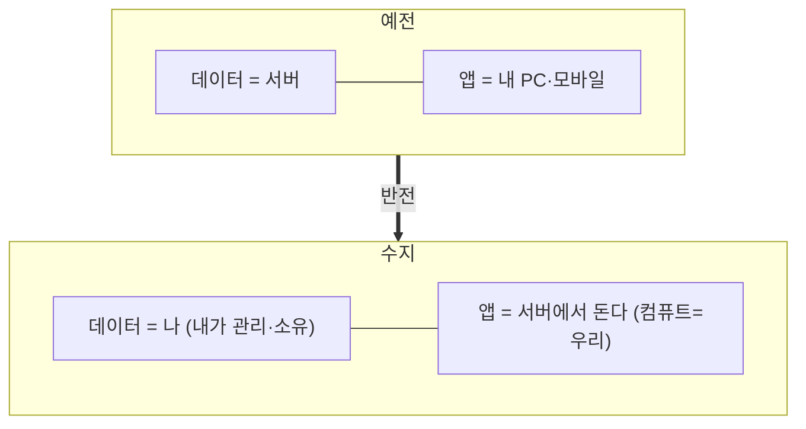
```mermaid
flowchart TB
  subgraph OLD["예전"]
    O1["데이터 = 서버"] --- O2["앱 = 내 PC·모바일"]
  end
  subgraph NEW["수지"]
    N1["데이터 = 나 (내가 관리·소유)"] --- N2["앱 = 서버에서 돈다 (컴퓨트=우리)"]
  end
  OLD ==반전==> NEW
```
→ 위 머메이드 구조를 입력으로 사용해 생성: A clean editorial inversion diagram on WHITE (#FFFFFF). TOP row labeled "예전": "데이터 = 서버" and "앱 = 내 PC·모바일". A big coral (#D97757) arrow labeled "반전" points DOWN to the BOTTOM row labeled "수지": "데이터 = 나 (내가 관리·소유·영속)" and "앱 = 서버에서 돈다 (컴퓨트=우리)". Add a small always-on moon icon "노트북을 닫아도 깨어 있음" and a tiny caption "AI의 기억은 흩어진다 → 영속 도서관". Accent the bottom NEW row and the arrow in coral; the OLD row soft ivory. Render every Korean label EXACTLY. Flat 2.5D editorial illustration (Anthropic/Claude aesthetic), warm ivory base + coral accent, generous whitespace, premium and restrained. NOT photorealistic, NO 3D render, NO isometric, NO glassmorphism, NO neon. no watermark, no fake logos. Strict 16:9 aspect ratio, 1920×1080 landscape — NOT 4:3, NOT square.

### P65 데이터 주권: 내 정보는 내가 쥔다 (5 모드) — [생성 프롬프트·도식]
- title 텍스트 레이어 "데이터 주권 — 내 정보는 내가 쥔다" @x:120 y:120. 좌 body=구성안 P65(앱 종속 끝 / 5 모드 / 완전 격리 DB·메일 미저장 / 자가 호스팅). 우측 = **5 데이터 모드 도서관 비유** 세로 스택(공개=열람실 · 공유=대출증 · 일반=내 도서관 · 개인=개인 서재 · 비밀=금고). KEY MESSAGE "기본은 아무것도 안 나감 — 공유는 명시적 지정만".
```
A clean editorial slide on WHITE (#FFFFFF). RIGHT half: a tidy library/bookshelf metaphor showing FIVE access tiers stacked as labeled shelves — "공개 (열람실)", "공유 (대출증)", "일반 (내 도서관)", "개인 (개인 서재)", "비밀 (금고 서고, 자물쇠)" — the "비밀" shelf has a small lock icon and is the most protected. A small tag "유저마다 완전 격리 DB · 메일은 읽을 때만" and a tiny "내 서버로 옮기기(자가 호스팅)" door. LEFT half: open for title and bullets.
Then add ONLY these Korean texts as a clean, separate, legible typographic layer: top-left title (large, dark #1B1B1D) "데이터 주권 — 내 정보는 내가 쥔다"; bullets "앱에 데이터 종속되던 시대는 끝", "5 모드: 공개·공유·일반·개인·비밀", "유저마다 완전 격리 DB · 자가 호스팅 가능"; a coral key line "기본은 아무것도 안 나감 — 공유는 명시적 지정만".
Accent the "비밀" lock shelf and the key line in coral #D97757; other shelves soft ivory. Flat 2.5D editorial illustration (Anthropic/Claude aesthetic), warm ivory base + coral accent, soft simple shapes, generous whitespace, premium and restrained. Render all Korean text cleanly and legibly. NOT photorealistic, NO 3D render, NO isometric, NO glassmorphism, NO neon. no watermark, no fake logos. Strict 16:9 aspect ratio, 1920×1080 landscape — NOT 4:3, NOT square.
```

### P66 수지란: 다섯 얼굴 + 3층 세계관 — [생성 프롬프트·도식]
- title 텍스트 레이어 "수지란 — 나를 아는 한 존재의 다섯 얼굴" @x:120 y:120. 좌측 = 다섯 얼굴 칩(사서=평생 서재 · 앱스토어=세상에 닿는 손 · 시간=닫아도 도는 운영 · 편재=내 곁의 자비스 · 페르소나=당신을 개선). 우측 = **3층 모델 세로 스택**(나 → 정보 → 앱). KEY MESSAGE "정보가 앱에 속하는 게 아니라, 앱이 정보를 빌려 쓴다".
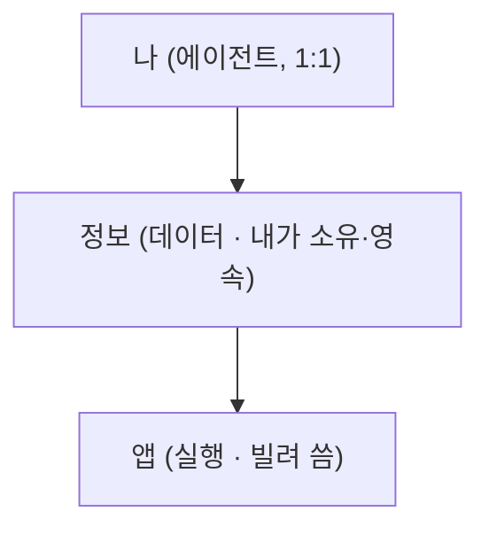
```mermaid
flowchart TB
  ME["나 (에이전트, 1:1)"] --> INFO["정보 (데이터 · 내가 소유·영속)"]
  INFO --> APP["앱 (실행 · 빌려 씀)"]
```
→ 위 머메이드 구조를 입력으로 사용해 생성: A clean editorial slide on WHITE (#FFFFFF). LEFT half: five small labeled face-chips for Sooji's roles — "① 지식 사서 — 나를 아는 평생 서재", "② 실세계 앱스토어 — 세상에 닿는 손", "③ 시간 비서 — 닫아도 도는 운영", "④ 어디서나 같은 수지 — 내 곁의 자비스", "⑤ 페르소나 진화 — 당신을 개선". RIGHT half: a vertical 3-layer stack following the structure EXACTLY — top "나 (에이전트, 1:1)", middle "정보 (데이터·내가 소유·영속)", bottom "앱 (실행·빌려 씀)" — connected top-to-bottom by 2px arrows; a small coral callout "앱이 정보를 빌려 쓴다". Accent the "정보" layer and the callout in coral #D97757; other layers soft ivory. Render every Korean label EXACTLY. Flat 2.5D editorial illustration (Anthropic/Claude aesthetic), warm ivory base + coral accent, generous whitespace, premium and restrained. NOT photorealistic, NO 3D render, NO isometric, NO glassmorphism, NO neon. no watermark, no fake logos. Strict 16:9 aspect ratio, 1920×1080 landscape — NOT 4:3, NOT square.

### P67 ① 지식 사서 = 나를 아는 평생 서재 — [생성 프롬프트·도식]
- title 텍스트 레이어 "① 지식 사서 — 나를 아는 평생 서재" @x:120 y:120. 좌측 본문=구성안 P67("도서관은 검색이 아니라 탐색" / 뜻으로 찾기 / 합치기·연결 / 90일 복구). 우측 = 사서가 흩어진 종이를 한 서재로 모으고, "뜻으로 찾기"(환불↔돈 돌려받기) 말풍선. KEY MESSAGE "쓸수록 나를 더 아는 서재 — 페르소나의 토대".
```
A clean editorial slide on WHITE (#FFFFFF). RIGHT half: a friendly librarian figure consolidating scattered loose papers (customer notes, quotes, ideas) into ONE tidy bookshelf; a small search bubble shows "‘환불’이라 안 적고 ‘돈 돌려받기’라 적어도 찾아준다" (search by meaning, not exact words). A subtle "쓸수록 나를 더 안다" growth arc. LEFT half: open for title and bullets.
Then add ONLY these Korean texts as a clean, separate, legible typographic layer: top-left title (large, dark #1B1B1D) "① 지식 사서 — 나를 아는 평생 서재"; a small line "도서관은 검색이 아니라 탐색이다"; bullets "뜻으로 찾기 · 비슷한 문서 합치기 · 연결 지도", "지워도 90일 복구 · 저장은 항상 물어보고"; a coral key line "쓸수록 나를 더 아는 서재 — 페르소나의 토대".
Accent the search bubble and the key line in coral #D97757; shelves soft ivory. Flat 2.5D editorial illustration (Anthropic/Claude aesthetic), warm ivory base + coral accent, soft simple shapes, generous whitespace, premium and restrained. Render all Korean text cleanly and legibly. NOT photorealistic, NO 3D render, NO isometric, NO glassmorphism, NO neon. no watermark, no fake logos. Strict 16:9 aspect ratio, 1920×1080 landscape — NOT 4:3, NOT square.
```

### P68 ② 실세계 앱스토어 = 세상에 닿는 손 (가입·키 0) — [생성 프롬프트·도식]
- title 텍스트 레이어 "② 실세계 앱스토어 — 세상에 닿는 손" @x:120 y:120. 좌측 1줄 "찾아서(find_app) → 바로 실행(run_app) · 설치·키 0 · 22 앱 / 일상이 다 연결돼야 가치가 창발". 우측 = **11 분류 앱 그리드**. KEY MESSAGE "큰 조직만 갖던 '실세계 창구'를 한 사람의 손에".
```
A clean editorial slide on WHITE (#FFFFFF). RIGHT half: a grid of small app-tiles grouped into categories (like a phone app store), each tile a simple coral-accented icon + Korean label: 날씨 · 미세먼지 · 인구혼잡도 · 학교급식 · 학교정보 / 지하철도착 · 대중교통길찾기 · 주유소가격 / 카카오맵 · 부동산 / 주식검색 · 전자공시 · 네이버뉴스 / 법령검색 · 맞춤법 · 날짜계산 · 공연정보. Convey "find an app → run it, no install, no API key — the real world in one hand". LEFT half: open for title and a key line.
Then add ONLY these Korean texts as a clean, separate, legible typographic layer: top-left title (large, dark #1B1B1D) "② 실세계 앱스토어 — 세상에 닿는 손"; a small line "찾아서 → 바로 실행 (설치·키 0) · 22 앱"; a coral key line "큰 조직만 갖던 ‘실세계 창구’를, 한 사람의 손에".
Flat 2.5D editorial illustration (Anthropic/Claude aesthetic), warm ivory base + coral #D97757 accent (a few featured tiles coral, rest soft ivory), soft simple shapes, generous whitespace, premium and restrained. Render all Korean labels cleanly and legibly. NOT photorealistic, NO 3D render, NO isometric, NO glassmorphism, NO neon. no watermark, no fake logos. Strict 16:9 aspect ratio, 1920×1080 landscape — NOT 4:3, NOT square.
```

### P69 ③ 시간 비서 = 닫아도 도는 운영 — [생성 프롬프트·도식]
- title 텍스트 레이어 "③ 시간 비서 — 닫아도 도는 운영" @x:120 y:120. 좌측 본문=구성안 P69(헤드리스 자동화·"고용한 비서" / 예약 자동화 / 알림이 조용히 사라지지 않는다 / 토큰 0). 강조 "자리에 없을 때도 혼자 일한다"·"토큰 0" 코랄. 우측 = 예약 루프 + 알림 도식.
```
A clean editorial slide on WHITE (#FFFFFF). RIGHT half: a "set once, runs forever" automation motif — a calendar/clock feeding a recurring schedule loop that runs on a server with a small moon/laptop-closed icon (runs even while you sleep), and a push-notification bell. IMPORTANT: even when there is nothing to send, a small note card reads "이번 주 새 동향 없음" (the alert never silently disappears). A small "토큰 0" tag near the loop. LEFT half: open for title and bullets.
Then add ONLY these Korean texts as a clean, separate, legible typographic layer: top-left title (large, dark #1B1B1D) "③ 시간 비서 — 닫아도 도는 운영"; bullets "당신이 자리에 없을 때도 자기 권한으로 혼자 일한다 (고용한 비서)", "반복 작업을 예약 → 자고 있어도 무인 실행"; a highlighted line "알림이 조용히 사라지지 않는다 · 백 번 돌아도 토큰 0".
Accent the automation loop, the "이번 주 새 동향 없음" note, the "토큰 0" tag and the bell in coral #D97757. Flat 2.5D editorial illustration (Anthropic/Claude aesthetic), warm ivory base + coral accent, soft simple shapes, generous whitespace, premium and restrained. Render all Korean text cleanly and legibly. NOT photorealistic, NO 3D render, NO isometric, NO glassmorphism, NO neon. no watermark, no fake logos. Strict 16:9 aspect ratio, 1920×1080 landscape — NOT 4:3, NOT square.
```

### P70 ④ 어디서나 같은 수지 = 내 곁의 자비스 (편재성) — [생성 프롬프트·도식]
- title 텍스트 레이어 "④ 어디서나 같은 수지 — 내 곁의 자비스" @x:120 y:120. 중앙 = 수지(하나) → 둘레로 ChatGPT·Claude·모바일이 같은 한 곳을 바라봄. KEY MESSAGE "호스트는 창문일 뿐, 수지는 모든 창문 뒤의 지속하는 존재".
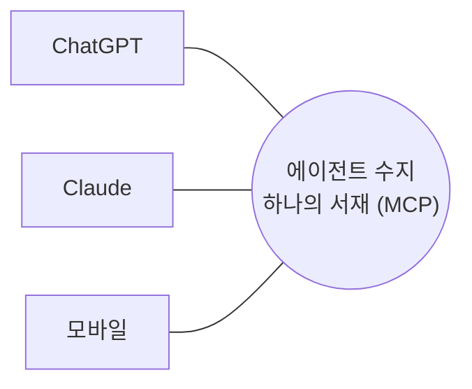
```mermaid
flowchart LR
  H1[ChatGPT] --- S
  H2[Claude] --- S
  H3[모바일] --- S
  S(("에이전트 수지\n하나의 서재 (MCP)"))
```
→ 위 머메이드 구조를 입력으로 사용해 생성: A clean editorial hub-and-spoke diagram on WHITE (#FFFFFF). A central coral (#D97757) hub node "에이전트 수지 — 하나의 서재 (MCP 서버)"; three host nodes around it — "ChatGPT", "Claude", "모바일" — all connected to the SAME central hub, conveying "open it anywhere, it's the same Sooji". Add a small caption "호스트는 창문일 뿐, 수지는 그 뒤의 지속하는 존재" and a tiny "무료로 시작 (MCP로 붙여서)" tag. Accent the central hub in coral; host nodes soft ivory. Render every Korean label EXACTLY. Flat 2.5D editorial illustration (Anthropic/Claude aesthetic), warm ivory base + coral accent, generous whitespace, premium and restrained. NOT photorealistic, NO 3D render, NO isometric, NO glassmorphism, NO neon. no watermark, no fake logos. Strict 16:9 aspect ratio, 1920×1080 landscape — NOT 4:3, NOT square.

### P71 ⑤ 페르소나의 진화 = 당신을 개선한다 — [생성 프롬프트] · 라이트
- 공통 라이트 2단. title "⑤ 페르소나의 진화 — 당신을 개선한다" @x:120 y:120. 좌 body=구성안 P71(매일 facet 갱신 / 쓸수록 좋아지는 복리 / 안전 원칙 / "단골 카페 사장님" 비유). 강조 "경쟁사는 스킬을 개선, 수지는 당신을 개선" 코랄. 우측 = 복리 성장 도식.
```
A two-column light slide on WHITE (#FFFFFF). RIGHT: a "compound growth of understanding-you" motif — a rising curve where each day's small facets (관심사·관계·리듬) stack up, and the assistant greets the founder like a regular ("단골 카페 사장님이 ‘오늘도 아아 드시죠?’ 하고 먼저 묻는" warmth). Small toggle icons hint "보고·수정·끌 수 있음" (consent/transparency) and a tiny lock "비밀·개인은 분석 제외". LEFT: room for title and bullets.
Then add ONLY these Korean texts as a clean, separate, legible typographic layer: top-left title (large, dark #1B1B1D) "⑤ 페르소나의 진화 — 당신을 개선한다"; bullets "매일 대화·이력을 facet으로 분해 → 페르소나 갱신", "추천이지 침묵 실행 아님 · 비밀/개인은 분석 제외"; a coral key line "경쟁사는 스킬을 개선, 수지는 당신을 개선한다".
Flat 2.5D editorial illustration (Anthropic/Claude aesthetic), warm ivory base + coral #D97757 accent, soft simple shapes, generous whitespace, premium and restrained. Render all Korean text cleanly and legibly. NOT photorealistic, NO 3D render, NO isometric, NO glassmorphism, NO neon. no watermark, no fake logos. Strict 16:9 aspect ratio, 1920×1080 landscape — NOT 4:3, NOT square.
```

### P72 전(轉): 1인 사업자의 하루를 수지에게 (위임이란) — [생성 프롬프트] · 라이트
- 공통 라이트 2단. title "1인 사업자의 하루를 수지에게" @x:120 y:120. 좌 body=구성안 P72(여러 얼굴을 한 흐름으로 / 위임 예문 2개 / 백오피스 직원 자리). 위임 예문은 코랄 테두리 말풍선 카드 2개(텍스트 레이어). KEY MESSAGE "결과를 말하면 과정은 수지가".
```
A two-column light slide on WHITE (#FFFFFF). RIGHT: two coral-bordered speech-bubble request cards stacked, each a natural-language delegation, with small icons showing how Sooji chains multiple faces (서재 + 실세계 앱 + 시간 + 페르소나) into one flow for a solo founder. LEFT: room for title.
Then add ONLY these Korean texts as a clean, separate, legible typographic layer: top-left title (large, dark #1B1B1D) "1인 사업자의 하루를 수지에게"; bubble 1 "오늘 내 스케줄을 확인하고, 동선에 맞춰 점심 식당을 예약한 뒤 지수에게 초대 메일을 보내줘."; bubble 2 "안 가본 곳으로, 적당한 예산에 맞춰 색다른 커플 여행을 계획해줘."; a coral key line "1인 사업자에게 없는 ‘백오피스 직원’ — 그 자리를 수지가".
Flat 2.5D editorial illustration (Anthropic/Claude aesthetic), warm ivory base + coral #D97757 accent, soft simple shapes, generous whitespace, premium and restrained. Render all Korean text cleanly and legibly. NOT photorealistic, NO 3D render, NO isometric, NO glassmorphism, NO neon. no watermark, no fake logos. Strict 16:9 aspect ratio, 1920×1080 landscape — NOT 4:3, NOT square.
```

### P73 사례 ①: 1인 사업자의 어느 하루 — [생성 프롬프트·도식]
- title 텍스트 레이어 "사례 ① — 1인 사업자의 어느 하루" @x:120 y:120. 가로 타임라인(아침 7시→이동→고객 미팅→오후(가계부)→밤), 각 시점에 백서 위임 말풍선. KEY MESSAGE "노트북을 닫아도 수지는 깨어 있다".
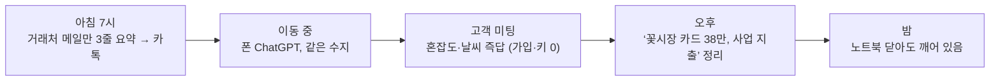
```mermaid
flowchart LR
  M["아침 7시\n거래처 메일만 3줄 요약 → 카톡"] --> C["이동 중\n폰 ChatGPT, 같은 수지"] --> L["고객 미팅\n혼잡도·날씨 즉답 (가입·키 0)"] --> A["오후\n‘꽃시장 카드 38만, 사업 지출’ 정리"] --> N["밤\n노트북 닫아도 깨어 있음"]
```
→ 위 머메이드 구조를 입력으로 사용해 생성: A clean editorial LEFT-to-RIGHT day timeline on WHITE (#FFFFFF) for a SOLO FOUNDER, five rounded stage cards following the structure EXACTLY: "아침 7시 — 거래처 메일만 골라 3줄 요약을 카톡으로 (자고 있어도)", "이동 중 — 폰 ChatGPT, 같은 수지가 어제 막힌 제안서를 챙긴다", "고객 미팅 — 장소 혼잡도·날씨 즉답 (가입·키 없이)", "오후 — ‘꽃시장 카드 38만 원, 사업 지출’ 가계부 정리 (개인/사업 분리)", "밤 — 노트북 닫아도 깨어 있음". Connected by 2px rounded arrows. A small sun→moon arc above. Accent the last card "밤" in coral #D97757; others soft ivory. Render every Korean label EXACTLY. Flat 2.5D editorial illustration (Anthropic/Claude aesthetic), warm ivory base + coral accent, generous whitespace, premium and restrained. NOT photorealistic, NO 3D render, NO isometric, NO glassmorphism, NO neon. no watermark, no fake logos. Strict 16:9 aspect ratio, 1920×1080 landscape — NOT 4:3, NOT square.

### P74 사례 ②: 시장·경쟁사 모니터링을 위임 — [생성 프롬프트·도식]
- title 텍스트 레이어 "사례 ② — 시장·경쟁사 모니터링을 위임" @x:120 y:120. 상단 요청 말풍선 "우리 분야 경쟁사 뉴스를 매주 월요일 아침에 모아서 보내줘"(코랄 테두리). 그 아래 가로 흐름: 뉴스·블로그 리서치 → 공시·주식 사실확인 → 문서 저장 → 다음에 뜻으로 검색·회수. KEY MESSAGE "리서치 외주 없이도 '시장 조사 담당자' 한 명".
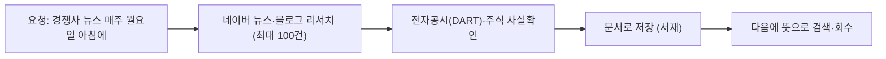
```mermaid
flowchart LR
  R["요청: 경쟁사 뉴스 매주 월요일 아침에"] --> N["네이버 뉴스·블로그 리서치 (최대 100건)"] --> D["전자공시(DART)·주식 사실확인"] --> S["문서로 저장 (서재)"] --> Q["다음에 뜻으로 검색·회수"]
```
→ 위 머메이드 구조를 입력으로 사용해 생성: A clean editorial LEFT-to-RIGHT flow on WHITE (#FFFFFF). A coral-outlined speech bubble "우리 분야 경쟁사 뉴스를 매주 월요일 아침에 모아서 보내줘" starts the flow, then four rounded stage cards following the structure EXACTLY: "네이버 뉴스·블로그 리서치 (최대 100건)" → "전자공시(DART)·주식 사실확인" → "문서로 저장 (서재)" → "다음에 뜻으로 검색·회수", connected by 2px rounded arrows. Add a small note "새 소식 없는 주엔 ‘이번 주 새 동향 없음’이라고 분명히 — 조용히 건너뛰지 않는다". Accent the speech bubble and the "문서로 저장" card in coral #D97757; others soft ivory. A small caption "리서치 외주 없이도 ‘시장 조사 담당자’ 한 명". Render every Korean label EXACTLY. Flat 2.5D editorial illustration (Anthropic/Claude aesthetic), warm ivory base + coral accent, generous whitespace, premium and restrained. NOT photorealistic, NO 3D render, NO isometric, NO glassmorphism, NO neon. no watermark, no fake logos. Strict 16:9 aspect ratio, 1920×1080 landscape — NOT 4:3, NOT square.

### P75 사례 ③: 반복 운영·돈 관리를 예약으로 — [생성 프롬프트] · 라이트
- 공통 라이트 2단. title "사례 ③ — 반복 운영·돈 관리를 예약으로 (자리를 비워도)" @x:120 y:120. 좌 body=구성안 P75(즉시 감시 '계약·입금' / 인보이스 말일 알림 / 정기 지출 자동 / 연말정산 한마디). 강조 "토큰 0" 코랄. 우측 = 3종 예약 카드 + 주간 루프 도식.
```
A two-column light slide on WHITE (#FFFFFF) for a SOLO FOUNDER. RIGHT: three stacked recurring-automation cards — (1) an instant watch rule "제목에 ‘계약·입금’ 메일 오면 즉시 카톡", (2) an invoice reminder "A사 인보이스 매월 말일 · 3일 전·당일 아침", (3) a fixed-cost auto-record "매월 5일 임대료·20일 구독" — all feeding a weekly server loop with a laptop-closed/moon icon (runs unattended); a "토큰 0" tag near the loop, and a small "연말엔 ‘올해 사업 지출 요약’ 한마디" note. LEFT: room for title and bullets.
Then add ONLY these Korean texts as a clean, separate, legible typographic layer: top-left title (large, dark #1B1B1D) "사례 ③ — 반복 운영·돈 관리를 예약으로 (자리를 비워도)"; bullets "‘계약·입금’ 메일은 즉시 · 인보이스 말일 알림", "정기 지출 자동 기록 → 연말정산 한마디로 표 완성"; a coral key line "한 번 시켜두면, 휴가를 가도 운영이 돈다 (토큰 0)".
Flat 2.5D editorial illustration (Anthropic/Claude aesthetic), warm ivory base + coral #D97757 accent, soft simple shapes, generous whitespace, premium and restrained. Render all Korean text cleanly and legibly. NOT photorealistic, NO 3D render, NO isometric, NO glassmorphism, NO neon. no watermark, no fake logos. Strict 16:9 aspect ratio, 1920×1080 landscape — NOT 4:3, NOT square.
```

### P76 실습 — 수지 연결하고 첫 운영 1건 위임 — [생성 프롬프트·실화면 입력]
- **레이아웃**: 라이트, 배경 `#FFFFFF`. 좌측 따라하기 3스텝 + 관찰 포인트(x:120 w:1080) + 우측/하단 `sooji_start`·`get_overview` 실화면 카드(강사 첨부 입력). 카피 원문 = 구성안 P76. 🔧 **실습 칩(§8.6)** 코랄 pill @x:120 y:96.
- **텍스트 레이어**: title "수지 연결하고 첫 운영 1건 위임" Pretendard 64px/700 `#1B1B1D` @x:120 y:120 · 스텝 3개(코랄 원 번호 ①②③) + 택1 4안 + 관찰 포인트 3개 30px/400 `#1B1B1D`. 푸터·페이지번호 공통.
```
→ 제공한 `sooji_start`·`get_overview` 화면 스크린샷을 입력으로 사용해 생성 (bake-first — 제목·스텝 텍스트 포함, 깨지면 위 좌표로 복원):
A clean light editorial slide on a WHITE (#FFFFFF) background. RIGHT/bottom: present the provided Sooji screenshots (`sooji_start`, `get_overview` dashboard) as clean close-up app cards on warm ivory (rounded corners), text legible.
Then add ONLY these Korean texts as a clean, separate, legible typographic layer:
- top-left title (large, dark #1B1B1D) "수지 연결하고 첫 운영 1건 위임", with a small coral "실습" pill badge next to it
- a numbered 3-step list (coral round numbers): "① MCP 연결 → sooji_start 1회 호출" / "② get_overview로 대시보드 확인" / "③ 운영 1건 위임 — 미팅/견적검색/실세계 앱/예약 중 택1"
- three small observation chips "가입·키 없이 즉답?", "뜻으로 검색?", "닫아도 도는 예약?"
Flat editorial style, warm ivory/white base + coral #D97757 accent, premium and restrained. Render all Korean text cleanly and legibly. no watermark, no fake logos. Strict 16:9 aspect ratio, 1920×1080 landscape — NOT 4:3, NOT square.
```

### P77 결(結): 수지를 '눈으로' 본다 + 안전하게 — [생성 프롬프트·실화면 입력]
- **레이아웃**: 라이트 2단. 좌측 본문 3불릿(보이게·분석되게·안전하게) + 우측 `/connected` 대시보드 실화면 카드(강사 첨부, 우측 컬럼 x:972 w:828). 카피 원문 = 구성안 P77. KEY MESSAGE "나만의 자비스를 시키되 — 보이게, 분석되게, 안전하게".
- title 텍스트 레이어 "수지를 ‘눈으로’ 본다 + 안전하게" 64px/700 `#1B1B1D` @x:120 y:120. 강조 "보이게·분석되게·안전하게" 코랄. 푸터·페이지번호 공통.
```
→ 제공한 수지 `/connected` 대시보드 스크린샷을 입력으로 사용해 생성 (bake-first — 제목·불릿 포함, 깨지면 좌표로 복원):
A clean light editorial slide on a WHITE (#FFFFFF) background. RIGHT: present the provided Sooji dashboard screenshot (`/connected` — library, schedule, automations, activity at a glance) as a clean app card on warm ivory, rounded corners, legible.
Then add ONLY these Korean texts as a clean, separate, legible typographic layer: top-left title (large, dark #1B1B1D) "수지를 ‘눈으로’ 본다 + 안전하게"; three coral-marked bullets "보이게 — 서재·일정·예약·활동 대시보드", "분석되게 — 활동 기록 감사 추적", "안전하게 — 메일 저장 안 함 · 비밀 금고 · 칸 분리"; a coral key line "나만의 자비스를 시키되 — 보이게, 분석되게, 안전하게".
Flat 2.5D editorial illustration (Anthropic/Claude aesthetic), warm ivory/white base + coral #D97757 accent, premium and restrained. Render all Korean text cleanly and legibly. NOT photorealistic, NO 3D render, NO isometric, NO glassmorphism, NO neon. no watermark, no fake logos. Strict 16:9 aspect ratio, 1920×1080 landscape — NOT 4:3, NOT square.
```

### P78 마무리: 1인 창업가의 자비스, 그리고 그 너머 — [생성 프롬프트] · 라이트 hero
- 라이트 hero. eyebrow "정리" 32px/600 `#D97757` @x:120 y:120. 헤드라인 "1인 창업가의 자비스, 그리고 그 너머" 본명조 60px/700 @x:120 y:180. 좌측: **세계관 회고 한 줄**(작은 화살표 체인) "데이터는 내가 → 앱은 서버가 → 어디서나 같은 수지 → 물어보지 않아도 일한다". 그 아래 3 레버 회고(① 만들기 bkit / **② 자동화 수지** / ③ 자율주행 Sprint, ②를 코랄 강조). 하단 **다음 챕터 브리지** "다음 → Sprint (수 시간 무인 바이브코딩)" + 콜투액션 "수지를 MCP로 연결, 오늘 첫 운영 한 건을 위임".
```
A clean light editorial hero slide on WHITE (#FFFFFF). TOP-LEFT: a small horizontal arrow-chain motif of tiny stages (데이터는 내가 → 앱은 서버가 → 어디서나 같은 수지 → 물어보지 않아도 일한다) in soft ivory with coral accents on the endpoints, conveying the worldview recap. RIGHT half: a calm "a personal AI staff now in one founder's hands" motif — a quiet desk where a small assistant keeps coral lights on, a moon (laptop closed) and a recurring-schedule loop, premium and restrained. LEFT half: open space for the headline + a three-lever recap (① 만들기(bkit) · ② 자동화(수지) · ③ 자율주행(Sprint), with ② emphasized) + a small "다음 → Sprint" bridge tag.
Then add ONLY these Korean texts as a clean separate typographic layer, warm dark ink, large, left-of-center: "1인 창업가의 자비스, 그리고 그 너머", and a smaller coral line "② 자동화까지 채웠다 — 다음은 Sprint". Do NOT render other words.
Flat 2.5D editorial illustration (Anthropic/Claude aesthetic), warm ivory/white base + coral #D97757 accent, premium and restrained. NOT photorealistic, NO 3D render, NO isometric, NO glassmorphism, NO neon. Render Korean labels cleanly; no garbled text, no watermark, no fake logos. Strict 16:9 aspect ratio, 1920×1080 landscape — NOT 4:3, NOT square.
```

---

## [Part 3] Sprint

### P79 한 기능 vs 연쇄 — [생성 프롬프트·도식]
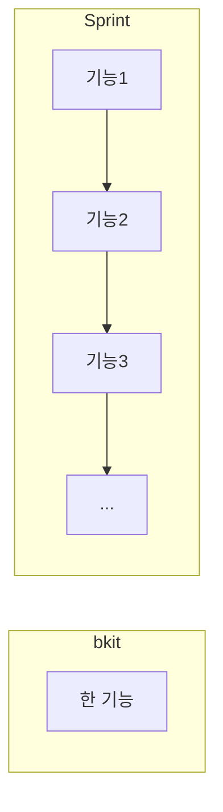
```mermaid
flowchart LR
  subgraph bkit
    F[한 기능]
  end
  subgraph Sprint
    F1[기능1] --> F2[기능2] --> F3[기능3] --> F4[...]
  end
```
→ 위 머메이드 구조를 입력으로 사용해 생성:
Render the diagram defined by the structure above as a clean editorial diagram illustration. Follow the nodes and arrows EXACTLY. Rounded node cards (corner radius ~16, inner padding ~24) on a warm ivory background, 2px rounded connector lines with filled triangle arrowheads, at most 3 hierarchy levels. Accent the whole «Sprint» chain (기능1→기능2→기능3→…) in coral as a connected conveyor; keep the «bkit» single block neutral. Render every Korean node label EXACTLY as written in the structure and add NO other words. Flat 2.5D editorial illustration (Anthropic/Claude aesthetic), warm ivory base + coral #D97757 accent, generous whitespace, premium and restrained. NOT photorealistic, NO 3D render, NO isometric, NO glassmorphism, NO neon. no watermark, no fake logos, no extra text beyond the node labels. Strict 16:9 aspect ratio, 1920×1080 landscape — NOT 4:3, NOT square.

### P81 자율주행 3대 조건 — [생성 프롬프트·도식]
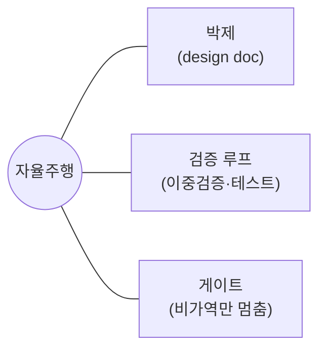
```mermaid
flowchart LR
  G((자율주행)) --- A["박제
(design doc)"]
  G --- B["검증 루프
(이중검증·테스트)"]
  G --- C["게이트
(비가역만 멈춤)"]
```
→ 위 머메이드 구조를 입력으로 사용해 생성:
Render the diagram defined by the structure above as a clean editorial diagram illustration. Follow the nodes and arrows EXACTLY. Rounded node cards (corner radius ~16, inner padding ~24) on a warm ivory background, 2px rounded connector lines with filled triangle arrowheads, at most 3 hierarchy levels. Accent the single key node «자율주행» in coral #E85C34; all other nodes neutral (soft ivory fill, light border). Render every Korean node label EXACTLY as written in the structure and add NO other words. Flat 2.5D editorial illustration (Anthropic/Claude aesthetic), warm ivory base + coral #D97757 accent, generous whitespace, premium and restrained. NOT photorealistic, NO 3D render, NO isometric, NO glassmorphism, NO neon. no watermark, no fake logos, no extra text beyond the node labels. Strict 16:9 aspect ratio, 1920×1080 landscape — NOT 4:3, NOT square.

### P83 운영 원리 — [생성 프롬프트·도식]
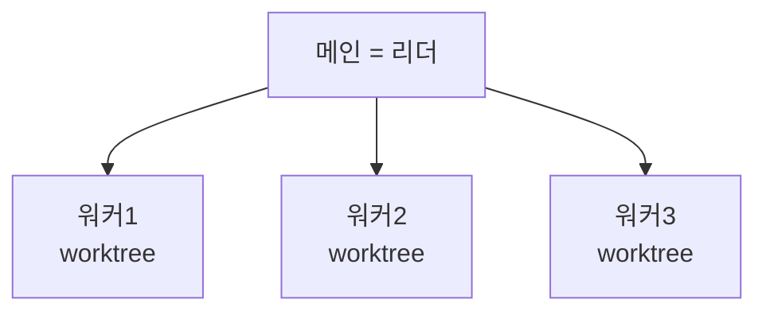
```mermaid
flowchart TD
  L[메인 = 리더] --> W1["워커1
worktree"]
  L --> W2["워커2
worktree"]
  L --> W3["워커3
worktree"]
```
→ 위 머메이드 구조를 입력으로 사용해 생성:
Render the diagram defined by the structure above as a clean editorial diagram illustration. Follow the nodes and arrows EXACTLY. Rounded node cards (corner radius ~16, inner padding ~24) on a warm ivory background, 2px rounded connector lines with filled triangle arrowheads, at most 3 hierarchy levels. Accent the single key node «메인 = 리더» in coral #E85C34; all other nodes neutral (soft ivory fill, light border). Render every Korean node label EXACTLY as written in the structure and add NO other words. Flat 2.5D editorial illustration (Anthropic/Claude aesthetic), warm ivory base + coral #D97757 accent, generous whitespace, premium and restrained. NOT photorealistic, NO 3D render, NO isometric, NO glassmorphism, NO neon. no watermark, no fake logos, no extra text beyond the node labels. Strict 16:9 aspect ratio, 1920×1080 landscape — NOT 4:3, NOT square.

### P85 수 시간 노하우 — [생성 프롬프트]
```
A sleek mission-control dashboard with gauges: a context fuel gauge, a cache
timer, a token budget meter, a loop/resume indicator — conveying "keep it running
for hours". Flat 2.5D editorial illustration (Anthropic/Claude aesthetic), warm ivory base + coral #D97757 accent, soft simple shapes, generous whitespace, premium and restrained. NOT photorealistic, NO 3D render, NO isometric, NO glassmorphism, NO neon. no watermark, no garbled extra text, no fake logos. Strict 16:9 aspect ratio, 1920×1080 landscape — NOT 4:3, NOT square.. NO readable text/numbers (use abstract dials).
```

### P87 라이브 데모 — [생성 프롬프트·실화면 입력]
- 진행 중인 sprint 대시보드 화면 + LIVE 표시 캡처. (생성 X)
```
→ 제공한 sprint 대시보드 스크린샷을 입력으로 사용해 생성:
Input: the provided screenshot of a running sprint dashboard. Present it as a crisp framed product screenshot on warm ivory, with a small coral "LIVE" pill badge (a 6px dot + the word LIVE) in the upper area. Keep dashboard content faithful to the input; do not invent fake text or logos. no watermark, no garbled extra text. Strict 16:9 aspect ratio, 1920×1080 landscape — NOT 4:3, NOT square.
```

---

## [마무리]

### P89 3 레버 종합 — [생성 프롬프트·도식]
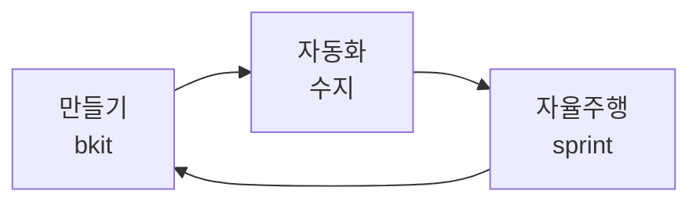
```mermaid
flowchart LR
  B["만들기
bkit"] --> A["자동화
수지"] --> P["자율주행
sprint"] --> B
```
→ 위 머메이드 구조를 입력으로 사용해 생성:
Render the diagram defined by the structure above as a clean editorial diagram illustration. Follow the nodes and arrows EXACTLY. Rounded node cards (corner radius ~16, inner padding ~24) on a warm ivory background, 2px rounded connector lines with filled triangle arrowheads, at most 3 hierarchy levels. Accent all three lever nodes (만들기·자동화·자율주행) in coral as one closed loop. Render every Korean node label EXACTLY as written in the structure and add NO other words. Flat 2.5D editorial illustration (Anthropic/Claude aesthetic), warm ivory base + coral #D97757 accent, generous whitespace, premium and restrained. NOT photorealistic, NO 3D render, NO isometric, NO glassmorphism, NO neon. no watermark, no fake logos, no extra text beyond the node labels. Strict 16:9 aspect ratio, 1920×1080 landscape — NOT 4:3, NOT square.

---

## 요약 (제작 방식별)

> 기초 = P11–29. 실전 도입(하네스 P30). **챕터3 bkit = P31–60** · 챕터4 수지 = P61–78 · Part3 Sprint = P79–88 · 마무리 = P89–90.

- **[생성 프롬프트·도식]**: *기초* P14(6단계)·P30(하네스) / *챕터3* P33(PDCA 개념+사이클 도식), P35(PDCA 사례·로그인 흐름), P36(Sprint 개념①·진화), P37(개념②·PRD5부), P38(개념③·7-Layer QA), P39(개념④·Trust 다이얼), P40(Sprint 개념⑤·측정/안전), P41(Sprint 사례·dogfooding v2.1.13), P42(기획 파이프라인), P44(앱 프레임워크), P45(⭐31에이전트), P46(3중검증), P48(전문가 에이전트), P49(레벨 아키텍처), P51(파이프라인 타임라인) / *Part2* P63, P65, P67 / *Part3* P79, P81, P83, P89 / *마무리* P89
- **[생성 프롬프트] 필수(일러스트)**: *오프닝* P1, P3, P5, P7, **P9(자비스)** / *기초* P11(divider), P12, **P13**, P15, P16, P17, P18, P19, P22, P23, P24, **P28** / *챕터3* **P31(divider·다크)**, P60(마무리 hero) / *Part2* P61, P85
- **[실화면 입력(스크린샷)]**: *기초* P26, P27, P29 / *챕터3* P32(GitHub 첫페이지), P52(실습 파일트리), P53(코드깎는노인 리뷰 스샷), P57(tene 개요), P58(tene 지도 4장), P59(tene AI에이전트), P60(설치 터미널) / *Part2* P70 / *Part3* P88
- **[라이트·텍스트 레이어]** (생성 이미지 없음 또는 우측 소형 액센트, 콘텐츠=텍스트): *오프닝* P4, P6, P8, P10 / *기초* P20, P21, P25 / *챕터3* P43, P47(★자가수복), P50(개발론), P54(커스텀), P55·P56(cowork)

> 오프닝 변경(2026-06-27): 구 P2→**P2 챕터 divider(다크)**, 구 P9(3 레버)→**P9 자비스 + P10 3 레버 텍스트**.
> 챕터3 재구성(2026-06-29): bkit 흐름을 **P31–60**으로 박제. **챕터4(에이전트 수지) = P61–78** deep 박제(agent-sooji 소스 기반, 기-승-전-결). Part3(Sprint) = **P79–88** · 마무리 = **P89–90**(연속, 공번 없음). 추후 Part3를 챕터5로 통일 시 재번호. 상세 = 핸드아웃 3부작.
